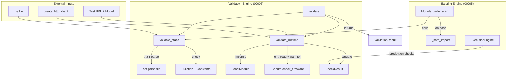

# Implementation Plan: Module Validation Engine

**Branch**: `00006-module-validation-engine` | **Date**: 2026-03-04 | **Spec**: [spec.md](spec.md)

## Summary

Build a two-phase validation engine for extension modules: (1) AST-based static analysis verifies syntax, required function signature, and manifest constants without executing the file; (2) runtime verification loads and invokes the module with test inputs, validates the return value, and enforces a timeout. The engine is a pure function returning a structured `ValidationResult` (FR-011). Its static phase replaces the loader's runtime inspection, becoming the canonical validator reused by Feature 00005's module loader at startup (FR-012). Ships a factory function for scraping-compliant HTTP clients so standalone callers need not construct their own (FR-009).

## Technical Context

**Source Document**: [docs/tech-context.md](../../docs/tech-context.md)

**Language/Version**: Python 3.11+
**Primary Dependencies**: FastAPI, Pydantic v2, httpx, structlog (stdlib: `ast`, `importlib`)
**Storage**: N/A — pure function, no database persistence (FR-011)
**Testing**: pytest + pytest-asyncio
**Target Platform**: Linux server (Docker container, `python:3.11-slim`)
**Project Type**: web (FastAPI backend + React frontend)
**Performance Goals**: Static validation < 1 second for valid modules (SC-001)
**Constraints**: Runtime timeout default 30s (FR-007). File size limit default 100 KB (FR-004). Single-user concurrency (V1).
**Scale/Scope**: Single-user homelab product. Concurrent validations out of scope.

## Instructions Check

*GATE: Must pass before Phase 0 research. Re-check after Phase 1 design.*

| Principle | Status | Notes |
|---|---|---|
| I. Self-Contained Deployment | PASS | Pure engine utility. No external services, ports, or new containers. |
| II. Extension-First Architecture | PASS | AST validation without execution (FR-001). Contract hard-coded for V1 (FR-002). Error boundary catches `SystemExit` (FR-007). Static phase reusable by loader (FR-012). Uses `importlib` for loading, never `exec()`/`eval()`. |
| III. Responsible Scraping | PASS | FR-010: runtime uses host-provided HTTP client. FR-009: engine ships `create_http_client()` factory for standalone callers. |
| IV. Type Safety & Validation | PASS | `ValidationResult`, `PhaseResult`, `ValidationError` are Pydantic models. `ValidationErrorCode` is a strict `Literal` type. All new code targets `mypy --strict`. Structured logging via `structlog`. |
| V. Test-First Development | PASS | Spec provides 5 acceptance scenarios, 6 edge cases, 5 measurable criteria. Test fixtures for valid/defective modules planned. |
| Technology Stack | PASS | Uses stdlib `ast` and `importlib`. No new technology categories. |

**Pre-Research Result**: PASS
**Post-Design Result**: PASS

## Architecture Decisions

### AD-1: AST-Based Static Analysis Without Execution

`ast.parse()` (with `type_comments=False`) analyzes module files structurally — walking `Module.body` for `FunctionDef` and `Assign`/`AnnAssign` nodes — without importing or executing. The existing loader (00005) validates post-import; the new validator catches syntax/structure issues pre-execution. `SyntaxError` from `ast.parse()` gives syntax checking for free (only `SYNTAX_ERROR` is reported in that case — further checks require a valid AST). AST cannot verify runtime behavior — that's the runtime phase's job.

### AD-2: Two-Phase Validation Pipeline

Strict order: Static → Runtime. Runtime skipped if static fails (FR-005). Verdict is pass only when both pass (FR-008). Fail-fast at the cheapest phase — static analysis is near-instant with no I/O.

### AD-3: Reusable Static Validator — Loader Integration (FR-012)

`validate_static(file_path, ...)` is a standalone public function in `validator.py`. The loader calls it before `_safe_import()`, replacing the post-import `_validate_module()` which is removed. Integration: `scan()` → `validate_static()` → if fail, register inactive with errors (joined via `"; "` separator for `last_error` field) → if pass, `_safe_import()` → register active.

### AD-4: State-Free Engine (FR-011)

Pure function: `validate(file_path, ...) → ValidationResult`. No database interaction. Persistence is the caller's responsibility — API layer, loader, and tests all call the same function.

### AD-5: File Pre-Validation (FR-004)

Before AST parsing: check file exists, size ≤ limit, UTF-8 decodable, non-empty. Rejects binary/huge/corrupt files before the parser runs.

### AD-6: Comprehensive Error Collection (FR-003)

Static phase collects **all** issues in one pass (not just the first). Each maps to a `ValidationError` with a closed-enum code and human-readable message.

### AD-7: Runtime Phase Uses Existing Patterns

Runtime loads via `importlib`, invokes `check_firmware()` via `asyncio.to_thread()` + `asyncio.wait_for(timeout=timeout_seconds)`, catches `SystemExit`, validates return with `CheckResult.model_validate()`. Same patterns as 00005's executor but without DB persistence. Both `validate()` and `validate_runtime()` accept an explicit `timeout_seconds: int = 30` parameter — no database read, preserving FR-011 purity.

## Layer-by-Layer Change Map

### Domain Model Layer

| File | Change |
|---|---|
| `backend/src/models/validation_result.py` | **NEW** — `ValidationResult`, `PhaseResult`, `ValidationError`, `ValidationErrorCode` Pydantic models |
| `backend/src/models/__init__.py` | Export new validation models |

### Engine Layer

| File | Change |
|---|---|
| `backend/src/engine/validator.py` | **NEW** — `validate_static()`, `validate_runtime()`, `validate()` functions |
| `backend/src/engine/__init__.py` | Export validation functions and `create_http_client` |
| `backend/src/engine/loader.py` | **MODIFY** — Integrate `validate_static()` into scan flow; call before `_safe_import()`. Map `ValidationError` items to the existing error format for registry persistence. Keep or deprecate `_validate_module()`. |

### No Changes

- **Database**: No migrations. No schema changes.
- **API Routes**: No new endpoints. The validation engine is an engine-level utility.
- **Frontend**: No UI changes.
- **Services**: No new services. API integration is deferred to Feature 00007 (Module Management API).

## Project Structure

### Source Code

```
backend/src/engine/validator.py    # NEW — validation engine
backend/src/models/validation_result.py  # NEW — result types
backend/src/engine/loader.py       # MODIFY — integrate static validator
backend/src/engine/__init__.py     # MODIFY — add exports
backend/src/models/__init__.py     # MODIFY — export validation models
backend/tests/test_engine/test_validator.py  # NEW — tests
backend/tests/fixtures/            # NEW — test fixture modules
```

## High-Level Architecture



Data Model: [data-model.md](data-model.md) — Pydantic models only; no DB tables.
API Contracts: N/A — no API surface in this feature.
