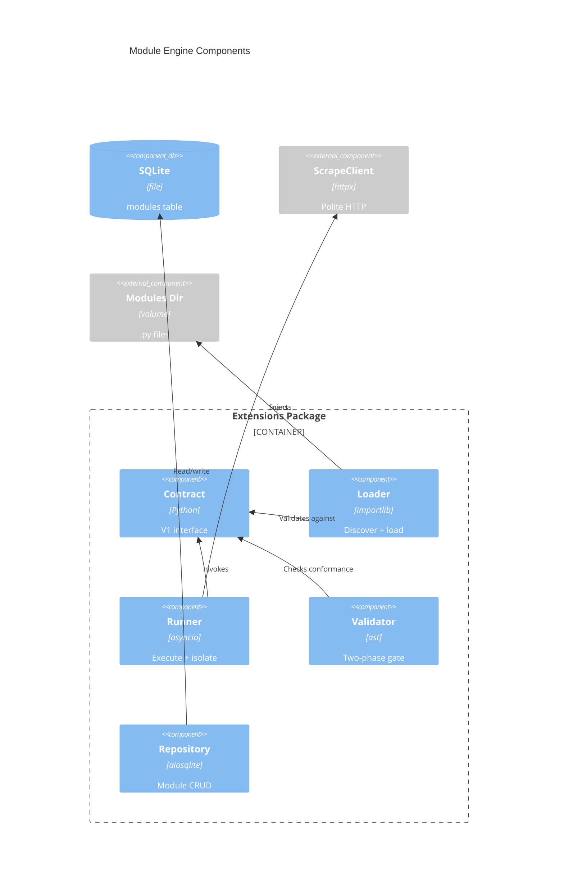

# Implementation Plan: Module Engine & Contract

**Branch**: `00007-module-engine-contract` | **Date**: 2026-06-10 | **Spec**: [spec.md](spec.md)

## Summary

**Goal**: Implement the extension module engine — authoring contract, importlib loader, error-bounded runner, two-phase validator, and module schema extension.
**Approach**: Build the `backend/src/binocular/extensions/` package with contract, loader, runner, validator, and repository modules; extend the modules table via migration 0003.
**Key Constraint**: Modules execute unsandboxed in-process (ADR-0005); all scraping goes through host-provided ScrapeClient (ADR-0006).

## Technical Context

**Language/Version**: Python 3.13
**Primary Dependencies**: FastAPI, aiosqlite, Pydantic, httpx, structlog, ast (stdlib), importlib (stdlib), asyncio (stdlib)
**Storage**: SQLite via aiosqlite, raw SQL, numbered migration runner
**Testing**: pytest + pytest-asyncio, httpx.AsyncClient
**Target Platform**: Linux Docker container (python:3.13-slim)
**Project Type**: web
**Project Mode**: brownfield
**Performance Goals**: Module execution timeout 30s default; concurrent async I/O
**Constraints**: mypy --strict, unsandboxed in-process execution, ScrapeClient injection
**Scale/Scope**: Single user, 5-50+ devices, ~10-20 modules

## Instructions Check

| Principle | Status | Evidence |
|-----------|--------|----------|
| I. Honest Failure | PASS | Error boundary surfaces structured failures, never silent |
| II. Polite by Default | PASS | ScrapeClient injection enforces polite scraping |
| III. Data Ownership | PASS | SQLite-only storage, no external deps |
| IV. Least-Privilege | PASS | Unsandboxed documented as trust boundary |
| V. Type Safety | PASS | mypy --strict required for all new code |
| VI. Set-and-Forget | PASS | Broken modules cannot crash core process |
| Source Code Layout | PASS | Extensions under backend/src/binocular/extensions/ |

## Architecture



## Architecture Decisions

| ID | Decision | Options Considered | Chosen | Rationale |
|----|----------|--------------------|--------|-----------|
| AD-001 | Contract definition approach | typing.Protocol / ABC / module-level constants | Module-level constants + function | Simpler for module authors — no class required; V1 contract is narrow (one function + two constants); see ADR-0005 |
| AD-002 | CheckResult type | dict / dataclass / Pydantic model | Pydantic model | Type safety, serialization, validation — consistent with project conventions |
| AD-003 | Sync vs async module execution | Direct async call / asyncio.to_thread | asyncio.to_thread + asyncio.wait_for | Modules may use blocking code; to_thread prevents event loop blocking; wait_for enforces timeout |
| AD-004 | ValidationResult structure | Flat pass/fail / per-phase results | Per-phase with per-check detail | AI-friendly output requires granular error info with line numbers and fix suggestions |

## Data Model Summary

| Entity | Key Fields | Relationships | Notes |
|--------|------------|---------------|-------|
| Module (extended) | +version: TEXT, +author: TEXT, +file_path: TEXT, +is_official: INTEGER, +status: TEXT | has_many: Device (existing) | ALTER TABLE adds engine columns to E006 seed table |

**Detail**: Migration 0003 extends existing `modules` table

## API Surface Summary

N/A — no API surface. E007 provides internal Python APIs (contract, loader, runner, validator, repository) consumed by downstream epics (E009, E010).

## Testing Strategy

| Tier | Tool | Scope | Mock Boundary | Install |
|------|------|-------|---------------|---------|
| Unit | pytest + pytest-asyncio | Contract types, loader discovery, runner error boundary, AST validator, repository CRUD | ScrapeClient (mock), filesystem (tmp_path), aiosqlite (in-memory) | configured |
| Integration | pytest + pytest-asyncio | Loader → Runner → Validator pipeline with real .py fixtures | ScrapeClient (mock), filesystem (tmp_path) | configured |
| Security | Ruff (bandit rules) | Static analysis of extensions package | — | configured |
| Coverage | pytest-cov | ≥80% line coverage for extensions/ | — | configured |

## Error Handling Strategy

| Error Category | Pattern | Response | Retry |
|----------------|---------|----------|-------|
| Module Exception | Error boundary catch | Structured CheckResult with error detail | No |
| Module SystemExit | Error boundary catch | Structured CheckResult with error detail | No |
| Module Timeout | asyncio.wait_for | TimeoutError → structured failure result | No |
| AST Parse Error | Fail-fast | ValidationResult Phase 1 failure with line number | No |
| Module Load Failure | Fail-fast | Structured error with missing attributes listed | No |
| File I/O Error | Fail-fast | Structured error with path and OS error | No |

## Integration Points

| Spec Reference | System/Service | Technical Approach | Contract |
|----------------|----------------|--------------------|----------|
| IP-001 E002 | RepositoryBase | ModuleRepository extends RepositoryBase | `from binocular.db.repository import RepositoryBase` |
| IP-002 E005 | ScrapeClient | Injected into ModuleRunner.run() | `from binocular.scraping import ScrapeClient` |
| IP-003 E006 | modules table | Migration 0003 ALTER TABLE | Append-only numbered migration |
| IP-004 E009 | ModuleLoader/Validator/Repo | Public exports from extensions package | `from binocular.extensions import ...` |
| IP-005 E010 | ModuleRunner | Runner executes loaded modules | `from binocular.extensions import ModuleRunner` |
| IP-006 E011/E016 | Authoring contract | Modules implement contract interface | `check_firmware()` + constants |

## Risk Mitigation

| Risk (from spec) | Likelihood | Impact | Mitigation | Owner |
|-------------------|------------|--------|------------|-------|
| Contract stability — V1 changes break modules | Low | High | Keep contract narrow (1 function, 2 constants); version field in contract.py for future negotiation | extensions/contract.py |
| Timeout calibration — too short/long | Medium | Medium | Configurable via BINOCULAR_MODULE_TIMEOUT with 30s default; document tuning guidance | extensions/runner.py, config.py |
| AST validation completeness | Medium | Low | Phase 2 runtime proof catches semantic errors; structured results guide authors to fix | extensions/validator.py |

## Requirement Coverage Map

| Req ID | Component(s) | File Path(s) | Notes |
|--------|--------------|--------------|-------|
| TR-001 | Contract | backend/src/binocular/extensions/contract.py | Protocol + constants + CheckResult type |
| TR-002 | Loader | backend/src/binocular/extensions/loader.py | importlib.util.spec_from_file_location, no sys.modules |
| TR-003 | Runner | backend/src/binocular/extensions/runner.py | try/except Exception + SystemExit |
| TR-004 | Runner | backend/src/binocular/extensions/runner.py | asyncio.wait_for wrapping asyncio.to_thread |
| TR-005 | Runner | backend/src/binocular/extensions/runner.py | ScrapeClient parameter injection |
| TR-006 | Validator | backend/src/binocular/extensions/validator.py | ast.parse + NodeVisitor for contract checks |
| TR-007 | Validator | backend/src/binocular/extensions/validator.py | Runtime proof execution with return type check |
| TR-008 | Validator | backend/src/binocular/extensions/validator.py | ValidationResult with per-check detail, line numbers, fix suggestions |
| TR-009 | Migration | backend/src/binocular/db/migrations/0003_modules_engine.sql | ALTER TABLE modules ADD COLUMN for each new field |
| TR-010 | Repository | backend/src/binocular/extensions/repository.py | CRUD operations extending RepositoryBase |
| TR-011 | All | backend/src/binocular/extensions/ | mypy --strict passing |

## Project Structure

### Source Code

```text
backend/src/binocular/
+ extensions/                    # New package
+ extensions/__init__.py         # Public API exports
+ extensions/contract.py         # V1 authoring contract, CheckResult, constants
+ extensions/loader.py           # Module discovery and importlib loading
+ extensions/runner.py           # Error-bounded execution with timeout
+ extensions/validator.py        # Two-phase validation (AST + runtime)
+ extensions/repository.py      # Module CRUD repository
+ db/migrations/0003_modules_engine.sql  # ALTER TABLE migration
~ config.py                      # Add MODULE_TIMEOUT setting

backend/tests/
+ extensions/                    # Test package
+ extensions/__init__.py
+ extensions/test_contract.py    # Contract type tests
+ extensions/test_loader.py      # Loader discovery/loading tests
+ extensions/test_runner.py      # Error boundary/timeout tests
+ extensions/test_validator.py   # AST + runtime validation tests
+ extensions/test_repository.py  # CRUD tests
+ extensions/fixtures/           # Test module .py fixtures
+ extensions/fixtures/valid_module.py
+ extensions/fixtures/missing_function.py
+ extensions/fixtures/missing_constant.py
+ extensions/fixtures/syntax_error.py
+ extensions/fixtures/slow_module.py
+ extensions/fixtures/raising_module.py
+ extensions/fixtures/systemexit_module.py
```

**Brownfield Notes**:
- **Patterns to reuse**: RepositoryBase (db/repository.py), ScrapeClient (scraping/client.py), Settings (config.py), structlog logging
- **Tests to extend**: Existing pytest + pytest-asyncio setup, conftest.py patterns
- **Naming conventions**: snake_case modules, PascalCase classes, structlog for logging

## Implementation Hints

- **[HINT-001]** Order: Create contract.py first — loader, runner, and validator all depend on it
- **[HINT-002]** Gotcha: importlib loaded modules must NOT be inserted into sys.modules — use throwaway ModuleType instances
- **[HINT-003]** Constraint: asyncio.to_thread wraps sync module code; asyncio.wait_for wraps the to_thread call for timeout — two layers required
- **[HINT-004]** Gotcha: AST NodeVisitor must handle both module-level function definitions and async function definitions for check_firmware
- **[HINT-005]** Constraint: Migration 0003 uses ALTER TABLE ADD COLUMN (SQLite supports this) — cannot use ALTER TABLE MODIFY or DROP COLUMN
