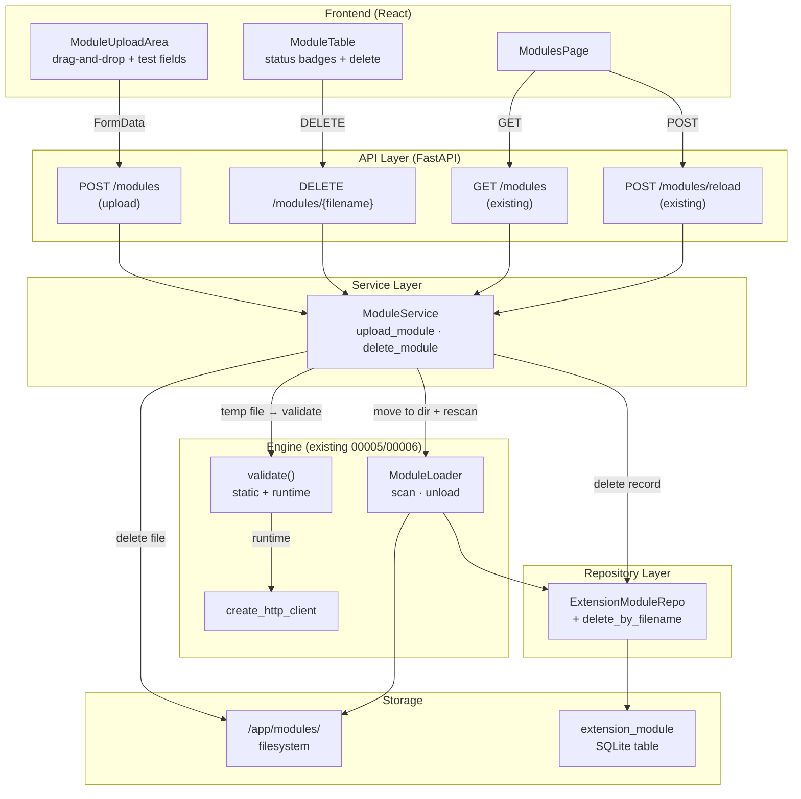

# Implementation Plan: Module Management (API & UI)

**Branch**: `00007-module-management` | **Date**: 2026-03-05 | **Spec**: [spec.md](spec.md)

## Summary

Add two new backend endpoints — `POST /api/v1/modules` (upload with two-phase validation) and `DELETE /api/v1/modules/{filename}` (file removal + registry cleanup) — and replace the frontend Modules page placeholder with a fully functional module management UI: always-visible upload area (drag-and-drop + file picker), module table with Active/Inactive status badges, inline error display for inactive modules, delete confirmations, Reload button, and empty state. Builds on the validation engine (00006), module loader/registry (00005), and existing `GET /modules` + `POST /modules/reload` endpoints.

## Technical Context

**Source Document**: [docs/tech-context.md](../../docs/tech-context.md)

**Language/Version**: Python 3.11+
**Primary Dependencies**: FastAPI, Pydantic v2, aiosqlite, httpx, structlog (backend); React 18, TypeScript strict, TanStack Query v5, React Hook Form, Tailwind CSS (frontend)
**Storage**: SQLite (WAL mode) — no schema changes; `extension_module` table from 00005 is reused as-is
**Testing**: pytest + pytest-asyncio + httpx.AsyncClient (backend); Vitest + React Testing Library (frontend)
**Target Platform**: Linux server (Docker container, `python:3.11-slim`)
**Project Type**: web (FastAPI backend + React frontend)
**Performance Goals**: Upload + validation + list refresh < 3 s on local network (SC-001). Module list renders < 2 s (SC-005).
**Constraints**: Self-contained Docker deployment. Single-user concurrency (V1). Max module file size 100 KB.
**Scale/Scope**: Single-user homelab. < 50 modules.

## Instructions Check

*GATE: Must pass before Phase 0 research. Re-check after Phase 1 design.*

| Principle | Status | Notes |
|---|---|---|
| I. Self-Contained Deployment | PASS | No external services. Module files in existing `/app/modules/` Docker volume. Single-port architecture preserved. |
| II. Extension-First Architecture | PASS | Reuses `validate()` from 00006, `ModuleLoader` from 00005. `importlib`-based loading. Underscore-prefix protection for system modules. |
| III. Responsible Scraping | PASS | Runtime validation uses host-provided `httpx.Client` via `create_http_client()` (AD-5). |
| IV. Type Safety & Validation | PASS | Upload responses use Pydantic `ValidationResult`. Error envelope with `VALIDATION_FAILED` code. All new code targets `mypy --strict`. |
| V. Test-First Development | PASS | 4 user stories with acceptance scenarios. API integration tests for upload/delete. Frontend component tests for upload area, table, and delete flow. |
| Technology Stack | PASS | No new technology categories. Uses existing FastAPI `UploadFile`, Pydantic, React Hook Form, TanStack Query. |

**Pre-Research Result**: PASS
**Post-Design Result**: PASS

## Architecture Decisions

### AD-1: Temp-File Validation Pipeline

Uploaded content is written to a `tempfile.NamedTemporaryFile` (same directory as modules for atomic `os.replace()`). The existing `validate()` pipeline operates on file paths, so the temp file is passed through `validate_static()` and optionally `validate_runtime()`. Only after all requested phases pass is the file atomically moved to the modules directory. On failure, the temp file is deleted. This prevents invalid/partial files from ever appearing in the modules directory.

### AD-2: Upload-Then-Rescan Registration

After saving a validated module, `ModuleLoader.scan()` is called to pick up the new file. The scan re-validates statically (fast, <1s for a single file) and imports the module. This reuses the established registration flow from 00005 rather than duplicating registration logic in the upload handler. The minor redundancy in re-validation is acceptable given the simplicity gain.

### AD-3: Delete = File Remove + Registry Delete + Unload

The delete flow: (1) verify filename is not underscore-prefixed (system module protection), (2) remove the `.py` file from disk, (3) delete the registry entry via `ExtensionModuleRepo.delete_by_filename()`, (4) remove from `ModuleLoader`'s in-memory registry via a new `unload(filename)` method. Returns HTTP 204 No Content.

### AD-4: System Module Protection via Underscore Prefix

Both upload and delete endpoints check `filename.startswith('_')`. Uploads with underscore-prefixed filenames are rejected (FR-002). Delete attempts on underscore-prefixed modules return HTTP 400 (FR-012). No database flag needed — the convention is purely filename-based.

### AD-5: Runtime Validation Uses Existing Engine

The upload endpoint's optional runtime validation reuses `validate_runtime()` from the validation engine (00006). The host-provided HTTP client is created via `create_http_client()`. The test URL and device model are passed as parameters. This enforces all responsible scraping rules (Principle III) through the centralized client.

### AD-6: Frontend Modules Page — Complete Replacement

The current `ModulesPage.tsx` displays DeviceType cards (Feature 00003 placeholder). This feature replaces the entire page content with real extension module management. The DeviceType CRUD remains accessible on the Dashboard/Inventory page. New components: `ModuleUploadArea` (drag-and-drop zone + optional test fields), `ModuleTable` (list with status badges, error tooltips, delete buttons), and updated `ModulesPage` orchestrator.

### AD-7: Multipart Upload — FormData (Not JSON)

The upload endpoint accepts `multipart/form-data` (FastAPI `UploadFile` + `Form()` parameters). The frontend uses `FormData` and must NOT set the `Content-Type` header (the browser adds the boundary automatically). The `apiFetch` helper needs a variant that skips the JSON content-type for multipart requests.

### AD-8: Error Code — VALIDATION_FAILED

A new `VALIDATION_FAILED` error code is added to the `ErrorCode` literal type. Upload rejection responses use this code and include the full `ValidationResult` (per-phase, per-error details) in the response body. This is distinct from `VALIDATION_ERROR` (generic input validation) and `MODULE_ERROR` (runtime execution failures).

## Layer-by-Layer Change Map

### API Schema Layer

| File | Change |
|---|---|
| `backend/src/api/schemas/modules.py` | **MODIFY** — Add `ModuleUploadResponse` (wraps `ModuleResponse` + `ValidationResult`), `ModuleUploadErrorDetail` schema |
| `backend/src/api/schemas/errors.py` | **MODIFY** — Add `VALIDATION_FAILED` to `ErrorCode` literal |

### API Route Layer

| File | Change |
|---|---|
| `backend/src/api/routes/modules.py` | **MODIFY** — Add `POST /api/v1/modules` (upload) and `DELETE /api/v1/modules/{filename}` (delete) endpoints |

### Service Layer

| File | Change |
|---|---|
| `backend/src/services/module_service.py` | **MODIFY** — Add `upload_module()` and `delete_module()` methods |
| `backend/src/services/exceptions.py` | **MODIFY** — Add `UploadRejectedError` with `ValidationResult` payload |

### Repository Layer

| File | Change |
|---|---|
| `backend/src/repositories/extension_module_repo.py` | **MODIFY** — Add `delete_by_filename()` method |

### Engine Layer

| File | Change |
|---|---|
| `backend/src/engine/loader.py` | **MODIFY** — Add `unload(filename)` method to remove from in-memory registry |

### Frontend API Layer

| File | Change |
|---|---|
| `frontend/src/api/types.ts` | **MODIFY** — Add `ExtensionModule`, `ValidationResult`, `PhaseResult`, `ValidationError` types; add `VALIDATION_FAILED` to `ApiErrorCode` |
| `frontend/src/api/client.ts` | **MODIFY** — Add `listModules()`, `uploadModule()` (FormData), `deleteModule()`, `reloadModules()` functions |
| `frontend/src/api/queryKeys.ts` | **MODIFY** — Add `modules` query key factory |

### Frontend Feature Layer

| File | Change |
|---|---|
| `frontend/src/features/modules/ModulesPage.tsx` | **REWRITE** — Replace DeviceType card management with module management orchestrator |
| `frontend/src/features/modules/ModuleUploadArea.tsx` | **NEW** — Drag-and-drop upload zone with optional test URL/model fields |
| `frontend/src/features/modules/ModuleTable.tsx` | **NEW** — Module list table with status badges, error tooltips, delete buttons |
| `frontend/src/features/modules/hooks.ts` | **REWRITE** — Replace DeviceType hooks with `useModules()`, `useUploadModule()`, `useDeleteModule()`, `useReloadModules()` |
| `frontend/src/features/modules/ModuleCard.tsx` | **REMOVE** — Replaced by `ModuleTable` |

### Test Layer

| File | Change |
|---|---|
| `backend/tests/test_api/test_module_upload.py` | **NEW** — Upload endpoint: valid module, invalid extension, duplicate filename, underscore prefix, structural failure, runtime failure, missing test fields |
| `backend/tests/test_api/test_module_delete.py` | **NEW** — Delete endpoint: successful delete, system module rejection, not-found handling |
| `backend/tests/test_services/test_module_upload_service.py` | **NEW** — Service-level upload and delete tests |
| `frontend/tests/features/ModulesPage.test.tsx` | **NEW** — Module list rendering, upload flow, delete confirmation, empty state, error display |

### No Changes

- **Database**: No migrations. `extension_module` table from 00005 is sufficient.
- **Engine validator**: Reused as-is — `validate()`, `validate_static()`, `validate_runtime()` are called by the service layer.
- **Engine executor**: Not modified — firmware check execution is unchanged.
- **Main app startup**: No changes — router already registered, lifespan already scans modules.

## Project Structure

### Documentation (this feature)

```text
specs/00007-module-management/
├── spec.md
├── research.md
├── plan.md              # This file
├── quickstart.md
└── contracts/
    └── openapi.yaml     # New upload + delete endpoints
```

### Source Code (repository root)

```text
backend/
├── src/
│   ├── api/
│   │   ├── schemas/
│   │   │   ├── modules.py         # MODIFY — upload response + error schemas
│   │   │   └── errors.py          # MODIFY — VALIDATION_FAILED code
│   │   └── routes/
│   │       └── modules.py         # MODIFY — POST upload + DELETE endpoints
│   ├── services/
│   │   ├── module_service.py      # MODIFY — upload_module + delete_module
│   │   └── exceptions.py          # MODIFY — UploadRejectedError
│   ├── repositories/
│   │   └── extension_module_repo.py  # MODIFY — delete_by_filename
│   └── engine/
│       └── loader.py              # MODIFY — unload method
├── tests/
│   ├── test_api/
│   │   ├── test_module_upload.py  # NEW
│   │   └── test_module_delete.py  # NEW
│   └── test_services/
│       └── test_module_upload_service.py  # NEW
frontend/
├── src/
│   ├── api/
│   │   ├── types.ts               # MODIFY — ExtensionModule + validation types
│   │   ├── client.ts              # MODIFY — module API functions
│   │   └── queryKeys.ts           # MODIFY — module query keys
│   └── features/
│       └── modules/
│           ├── ModulesPage.tsx     # REWRITE
│           ├── ModuleUploadArea.tsx  # NEW
│           ├── ModuleTable.tsx      # NEW
│           └── hooks.ts            # REWRITE
├── tests/
│   └── features/
│       └── ModulesPage.test.tsx   # NEW
```

**Structure Decision**: Web application (frontend + backend). All backend changes extend existing modules — no new packages. Frontend replaces the placeholder Modules feature directory content.

## High-Level Architecture



Data Model: N/A — no schema changes. All entities (`extension_module` table, `ValidationResult` Pydantic model, `ExtensionModule` domain model) defined in Features 00005/00006.
API Contracts: [contracts/openapi.yaml](contracts/openapi.yaml) — 2 new endpoints (upload, delete).
