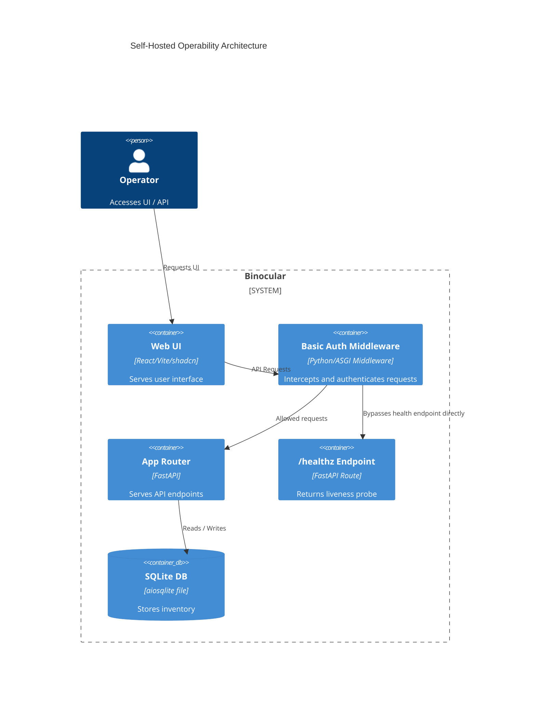

# Implementation Plan: Self-Hosted Operability

**Branch**: `00008-self-hosted-operability` | **Date**: 2026-06-10 | **Spec**: [spec.md](spec.md)

## Summary

**Goal**: Implement zero-config startup, configurable DB path, secret file loading (`_FILE` pattern), optional basic auth, structured log secret masking, and `.env.example` documentation for self-hosted deployments.  
**Approach**: Extend Pydantic Settings, add custom `_FILE` pre-validators, implement Basic Auth ASGI middleware, configure a structlog masking processor, and document settings.  
**Key Constraint**: Basic auth must be off by default and the container liveness probe `/healthz` must remain unprotected.

## Technical Context

**Language/Version**: Python 3.13  
**Primary Dependencies**: FastAPI, Uvicorn, pydantic, pydantic-settings, structlog, aiosqlite  
**Storage**: SQLite  
**Testing**: pytest, pytest-asyncio, pytest-cov  
**Target Platform**: Linux Docker container (`python:3.13-slim`), port 8000  
**Project Type**: web  
**Project Mode**: brownfield  
**Performance Goals**: Negligible middleware checking latency (<1ms), log masking execution <0.1ms per log  
**Constraints**: Zero-config startup with sane defaults, basic auth off by default  
**Scale/Scope**: Single user, private LAN deployment

## Instructions Check

*GATE: Must pass before Phase 0 research. Re-check after Phase 1 design.*

- **Core Principle I (Honest Failure)**: If a configured `_FILE` secret path does not exist or cannot be read, settings initialization will fail fast with a clear traceback, ensuring the container does not start in a broken state.
- **Core Principle III (Data Ownership)**: SQLite database path is configurable via `BINOCULAR_DB_PATH` to support persistent volumes mounted in arbitrary host locations.
- **Core Principle IV (Least-Privilege & Trust Boundary)**: Supports the standard `_FILE` pattern to allow loading credentials from Docker/Kubernetes secrets without exposing them in environment listings. Optional basic auth provides access control for local networks.
- **Core Principle V (Type Safety)**: All configuration classes, middleware classes, and log processors are fully typed, passing `mypy --strict`.
- **Core Principle VI (Set-and-Forget)**: Zero configuration required to start the application (sensible defaults provided for all paths, host, and port).

## Architecture



## Architecture Decisions

| ID | Decision | Options Considered | Chosen | Rationale |
|----|----------|--------------------|--------|-----------|
| AD-001 | Basic Auth Implementation | FastAPI Dependency vs. ASGI Middleware | ASGI Middleware | Protects all API routes and static asset endpoints (UI) uniformly with a single integration point. |
| AD-002 | Secret File Loader | Custom Model Validator vs. Pydantic Settings Source | Custom Model Validator | A `@model_validator(mode="before")` is simpler, has zero external dependencies, and integrates seamlessly with Pydantic's configuration cycle. |
| AD-003 | Log Masking Integration | structlog processor vs. standard logging filter | structlog processor | Integrates directly into the existing structlog shared processors list, ensuring all logged structures (JSON and Console) are cleaned. |

## Data Model Summary

N/A — no persistent data

## API Surface Summary

N/A — no API surface (only middleware interception)

## Testing Strategy

| Tier | Tool | Scope | Mock Boundary | Install |
|------|------|-------|---------------|---------|
| Unit | pytest | Settings `_FILE` loading, basic auth validator, log masking processor | None (isolated unit checks) | configured |
| Integration | pytest | Basic Auth Middleware path block/allow, `/healthz` bypass | None | configured |
| Security | pip-audit | Vulnerability scanning of python package dependencies | — | configured |
| Coverage | pytest-cov | Test coverage measurement for config, auth, and masking | — | configured |

## Error Handling Strategy

| Error Category | Pattern | Response | Retry |
|----------------|---------|----------|-------|
| Missing Secret File | Fail-fast (ValueError in Settings) | Application startup failure (traceback/crash) | No (unrecoverable without config fix) |
| Invalid Basic Auth Credentials | Intercept and return HTTP 401 | 401 Unauthorized with WWW-Authenticate header | Yes (user prompt) |
| Basic Auth enabled without password | Fail-fast (ValueError in Settings) | Application startup failure (crash) | No |

## Integration Points

| Spec Reference | System/Service | Technical Approach | Contract |
|----------------|----------------|--------------------|----------|
| IP-001 | FastAPI App Setup | `app.add_middleware(BasicAuthMiddleware)` registered during FastAPI creation in `app.py`. | [app.py](file:///Users/attila/git/Binocular/backend/src/binocular/app.py) |
| IP-002 | Database Connection | `db/connection.py` uses `get_db_path(settings)` which resolves settings-based custom path. | [connection.py](file:///Users/attila/git/Binocular/backend/src/binocular/db/connection.py) |
| IP-003 | Logging Initialization | `logging.py` registers `mask_secrets_processor` in structlog shared processors. | [logging.py](file:///Users/attila/git/Binocular/backend/src/binocular/logging.py) |

## Risk Mitigation

| Risk (from spec) | Likelihood | Impact | Mitigation | Owner |
|-------------------|------------|--------|------------|-------|
| Exposing auth credentials in logs | Medium | High | Add a global `structlog` masking processor that filters values in the log event dictionary. | logging / masking |
| Bypassing authentication on new routes | Low | High | Standard ASGI Middleware wraps all routes and static routes; explicitly only allow `/healthz`. | auth / middleware |
| Setting empty passwords in basic auth | Medium | Medium | Validate that basic auth is configured with a non-empty password during settings initialization. | config / validation |

## Requirement Coverage Map

| Req ID | Component(s) | File Path(s) | Notes |
|--------|--------------|--------------|-------|
| FR-001 | Settings defaults | [config.py](file:///Users/attila/git/Binocular/backend/src/binocular/config.py) | Sensible defaults for directories, host, port. |
| FR-002 | Database Path config | [config.py](file:///Users/attila/git/Binocular/backend/src/binocular/config.py), [connection.py](file:///Users/attila/git/Binocular/backend/src/binocular/db/connection.py) | Adds `db_path` config and checks it. |
| FR-003 | Secret file loading | [config.py](file:///Users/attila/git/Binocular/backend/src/binocular/config.py) | `@model_validator(mode="before")` processes `*_FILE` suffix. |
| FR-004 | Fail fast on missing file | [config.py](file:///Users/attila/git/Binocular/backend/src/binocular/config.py) | Raises ValueError if target file is missing. |
| FR-005 | Basic Auth middleware | [auth.py](file:///Users/attila/git/Binocular/backend/src/binocular/auth.py), [app.py](file:///Users/attila/git/Binocular/backend/src/binocular/app.py) | Implements optional basic auth middleware. |
| FR-006 | Bypass healthz | [auth.py](file:///Users/attila/git/Binocular/backend/src/binocular/auth.py) | Skips auth check if path == `"/healthz"`. |
| FR-007 | Fail fast on empty basic auth pass | [config.py](file:///Users/attila/git/Binocular/backend/src/binocular/config.py) | Raises ValueError if enabled is true but password empty. |
| FR-008 | Mask secrets in logs | [masking.py](file:///Users/attila/git/Binocular/backend/src/binocular/utils/masking.py), [logging.py](file:///Users/attila/git/Binocular/backend/src/binocular/logging.py) | Global logging secret filter replacement. |
| FR-009 | Env example documentation | [.env.example](file:///Users/attila/git/Binocular/.env.example) | Complete document mapping env parameters. |

## Project Structure

### Source Code

```text
~ backend/src/binocular/
  ~ app.py                 # Register optional basic auth middleware
  ~ config.py              # Add configurable paths, basic auth properties, and _FILE loaders
  ~ logging.py             # Wire structlog masking processor
  + auth.py                # Implement optional BasicAuthMiddleware
  + utils/
    + __init__.py
    + masking.py           # Implement structured log masking processor and set_secrets_to_mask
~ backend/tests/
  + test_auth.py           # Test basic auth middleware intercepting / allowing requests
  + test_masking.py        # Test structlog secret masking processor
  ~ test_logging.py        # Add log masking test setup check
  ~ test_config.py         # Add tests for _FILE secret loading and basic auth validation
~ .env.example             # Add configuration documentation
```

**Patterns to reuse**: Structured logging (`structlog`), FastAPI settings configuration via Pydantic, async DB connection initialization.  
**Tests to extend**: Logging tests in `test_logging.py`, configuration tests in `test_config.py`.  
**Naming conventions**: Snake_case for Python methods/variables, PascalCase for classes, UPPERCASE for environment variables.

## Implementation Hints

- **[HINT-001]** Middleware ordering: Middleware in FastAPI runs in reverse order of addition. Register the basic auth middleware *before* the static files mounting in `app.py` so that requests to both API and static files go through authentication first, but healthz is explicitly bypassed.
- **[HINT-002]** Case-insensitive env variable mapping: Pydantic Settings reads variables like `BINOCULAR_BASIC_AUTH_ENABLED` case-insensitively, but when resolving `*_FILE` environment variables directly via `os.environ` we must check both `BINOCULAR_<FIELD>_FILE` and `<FIELD>_FILE` in uppercase.
- **[HINT-003]** Log Masking: Ensure the structlog processor handles both console and JSON formatting, and works recursively or safely across all string values in the log event dictionary, including formatted exception tracebacks.
