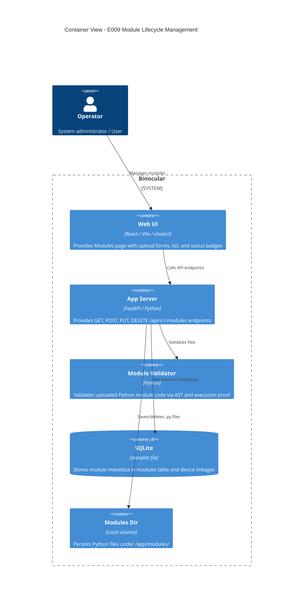

# Implementation Plan: Module Lifecycle Management

**Branch**: `00009-module-lifecycle-management` | **Date**: 2026-06-10 | **Spec**: [spec.md](spec.md)

## Summary

**Goal**: Provide full API endpoints and frontend UI elements to manage (upload, validate, list, disable/enable, delete) extension modules in the Binocular application.  
**Approach**: Create a dedicated `modules` API router in FastAPI. Uploads are validated through `validator.validate_module`, saved under `/app/modules`, and registered in SQLite. The frontend page is updated with module cards, status badges, drag-and-drop file upload, and copy-for-AI error rendering.  
**Key Constraint**: Block deletion of modules currently referenced by one or more devices to maintain system reference integrity.

## Technical Context

**Language/Version**: Python 3.13 (backend), TypeScript 5.x / React 19 (frontend)  
**Primary Dependencies**: FastAPI, Pydantic, aiosqlite, structlog (backend), shadcn/ui, TanStack Query, lucide-react (frontend)  
**Storage**: SQLite files via `aiosqlite` using existing schema defined in migration 0003  
**Testing**: `pytest` + `pytest-asyncio` (backend), `vitest` + React Testing Library (frontend)  
**Target Platform**: Linux container (`python:3.13-slim`), port 8000  
**Project Type**: web  
**Project Mode**: brownfield  
**Performance Goals**: Sub-50ms API response for listing/status changes; non-blocking Phase 2 execution checks  
**Constraints**: Modules directory path is retrieved dynamically from `settings.modules_dir`  
**Scale/Scope**: Typically 1 to 20 extension modules; single operator environment

## Instructions Check

*GATE: Must pass before Phase 0 research. Re-check after Phase 1 design.*

- **Honest Failure**: Compliant. Return detailed structured errors on validation failure.
- **Polite by Default**: Compliant. The module lifecycle itself does not fetch external resources, but the validation routine uses the centralized HTTP client.
- **Data Ownership & Self-Containment**: Compliant. All state is maintained in the single SQLite database.
- **Least-Privilege & Explicit Trust Boundary**: Compliant. Warning is displayed in the UI that modules run unsandboxed with full system permissions.
- **Type Safety & Correctness-First**: Compliant. Code changes must fully pass `mypy --strict` and `tsc` strict analysis.

## Architecture



## Architecture Decisions

| ID | Decision | Options Considered | Chosen | Rationale |
|----|----------|--------------------|--------|-----------|
| AD-001 | Delete Restriction | Soft delete vs Cascade vs Strict Block | Strict Block | Prevent orphan devices with undefined behavior when their source module disappears. |
| AD-002 | Name Collisions | Fail upload vs Unique name generation vs Overwrite | Overwrite | Natural flow for upgrading modules. Overwriting updates the version/author/etc. but preserves existing device links. |

## Data Model Summary

N/A — uses existing database schema and tables (extended by migration 0003).

## API Surface Summary

| Method | Path | Purpose | Auth | Req/Res Types |
|--------|------|---------|------|---------------|
| GET | `/api/v1/modules` | List all registered modules with full metadata | Optional basic auth | `None` / `list[ModuleResponse]` |
| POST | `/api/v1/modules` | Upload and validate a new or updated module | Optional basic auth | Form file (`UploadFile`), Query `run_phase2: bool` / `ModuleResponse` or `422 (ValidationError)` |
| PUT | `/api/v1/modules/{id}` | Update metadata or status of a module | Optional basic auth | `ModuleUpdate` / `ModuleResponse` |
| DELETE | `/api/v1/modules/{id}` | Delete module record and physical file | Optional basic auth | `None` / `204 (Success)` or `400 (In Use)` |

**Detail**: [api.md](contracts/api.md)

## Testing Strategy

| Tier | Tool | Scope | Mock Boundary | Install |
|------|------|-------|---------------|---------|
| Unit | pytest | Test routes, schemas, and file save routines | SQLite connection mocked via pytest fixtures | configured |
| Unit | vitest | Test React component state, upload triggers, clipboard copy | API calls mocked via handlers | configured |
| Integration | pytest | Full upload-validation-save-delete lifecycle | File system writes use temporary directories | configured |
| Security | Ruff / bandit | Code scan for insecure practices | — | configured |
| Coverage | pytest-cov | Ensure coverage exceeds 80% | — | configured |

## Error Handling Strategy

| Error Category | Pattern | Response | Retry |
|----------------|---------|----------|-------|
| Validation Failure | Catch validation result `valid=False` | 422 Unprocessable Entity + full details | No |
| File Write Error | Catch OSError on saving files | 500 Internal Server Error | No |
| Deletion Locked | Count active references from devices | 400 Bad Request + in-use details | No |
| Resource Missing | Handle sqlite row not found | 404 Not Found | No |

## Integration Points

| Spec Reference | System/Service | Technical Approach | Contract |
|----------------|----------------|--------------------|----------|
| E009 Scope | Module Validator | Call `validate_module` from `binocular.extensions.validator` | Python `validate_module` interface |
| E009 Constraints | File System | Read/write files under `settings.modules_dir` using standard Pathlib operations | Local filesystem read/write |

## Risk Mitigation

| Risk (from spec) | Likelihood | Impact | Mitigation | Owner |
|-------------------|------------|--------|------------|-------|
| Security Risk (Unsandboxed code) | Low | High | Standard LAN model, prominent trust boundary warning banner in the upload form UI. | UI / Operator |

## Requirement Coverage Map

| Req ID | Component(s) | File Path(s) | Notes |
|--------|--------------|--------------|-------|
| FR-001 | GET `/api/v1/modules` | `backend/src/binocular/routes/modules.py` | Query database modules table |
| FR-002 | POST `/api/v1/modules` | `backend/src/binocular/routes/modules.py` | Form data file upload endpoint |
| FR-003 | Module Validation | `backend/src/binocular/routes/modules.py` | Uses `validate_module` from extensions |
| FR-004 | File Saving | `backend/src/binocular/routes/modules.py` | Write valid content to `settings.modules_dir` |
| FR-005 | DELETE `/api/v1/modules/{id}` | `backend/src/binocular/routes/modules.py` | Deletes file from disk and deletes SQLite row |
| FR-006 | Reference Prevention | `backend/src/binocular/routes/modules.py` | Query device references before deleting module |
| FR-007 | PUT `/api/v1/modules/{id}` | `backend/src/binocular/routes/modules.py` | Update SQLite status/metadata fields |
| FR-008 | UI Module List | `frontend/src/pages/modules.tsx` | Map module list data query to UI cards |
| FR-009 | UI Upload Form | `frontend/src/components/modules/ModuleUploadForm.tsx` | Upload logic with file picker and status |
| FR-010 | UI Errors & Copy for AI | `frontend/src/components/modules/ModuleUploadForm.tsx` | Show errors inline and copy as Markdown |

## Project Structure

### Source Code

```text
~ backend/src/binocular/
  ~ routes/
    ~ __init__.py           (register new modules router)
    + modules.py            (new modules FastAPI controller)
~ frontend/src/
  + components/modules/
    + ModuleCard.tsx        (component showing individual module status/info)
    + ModuleUploadForm.tsx  (component handling drag-drop, validation, errors, copy-to-clipboard)
    + ModuleStatusBadge.tsx (component displaying active/inactive/error states)
  ~ pages/
    ~ modules.tsx           (mount main UI modules panel)
```

**Brownfield Notes**:
- **Patterns to reuse**: Dependency injection via `DBDep`, error raising style via `HTTPException`.
- **Tests to extend**: Add `tests/routes/test_modules.py` for route coverage.
- **Naming conventions**: CamelCase for React components, snake_case for Python modules and variables.

## Implementation Hints

- **[HINT-001]** Path Traversal: Ensure the filename of the uploaded module is sanitized (e.g. `secure_filename` or just stripping paths) to prevent writing files outside the modules folder.
- **[HINT-002]** Device Reference Check: Use count query `SELECT COUNT(*) FROM devices WHERE module_id = ?` to verify the module isn't in use.
- **[HINT-003]** Re-upload Compatibility: If a module is overwritten, check that the new file still matches AST specifications. Ensure we do not orphan existing devices if the `SUPPORTED_DEVICE_TYPE` remains compatible.
