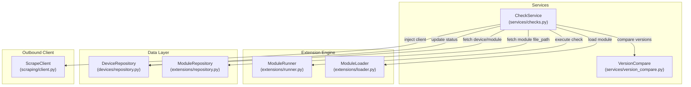

# Implementation Plan: Update Detection & Comparison

**Branch**: `00010-update-detection-comparison` | **Date**: 2026-06-10 | **Spec**: [spec.md](spec.md)

## Summary

**Goal**: Implement the core update detection and version comparison service to check for firmware updates.  
**Approach**: Build `VersionCompare` with a tolerant hybrid parsing algorithm and `CheckService` to orchestrate module execution and device table updates.  
**Key Constraint**: Ensure that all parsing and network failures are isolated within check execution and do not bubble up to crash the system.

## Technical Context

**Language/Version**: Python 3.13  
**Primary Dependencies**: FastAPI, Pydantic, structlog, aiosqlite  
**Storage**: SQLite  
**Testing**: pytest, pytest-asyncio  
**Target Platform**: Linux server, Docker  
**Project Type**: web  
**Project Mode**: brownfield  
**Performance Goals**: Sub-10ms for version parsing and comparison; robust exception safety.  
**Constraints**: Zero external network dependencies for version comparisons; Central HTTP client usage only.  
**Scale/Scope**: Scale to hundreds of devices checked periodically.

## Instructions Check

*GATE: Must pass before Phase 0 research. Re-check after Phase 1 design.*

- **III. Data Ownership & Self-Containment**: PASS. We use the existing local SQLite database volume.
- **V. Type Safety & Correctness-First**: PASS. All files will have type annotations and pass `mypy --strict`.
- **VI. Set-and-Forget Reliability**: PASS. Error boundaries wrap module execution and parsing to prevent core crash.

## Architecture



## Architecture Decisions

Feature-local tradeoffs only. Project-wide architectural decisions belong in standalone ADRs under `specs/adrs/` — reference them by ID (e.g., "See ADR-0001") instead of duplicating here.

| ID | Decision | Options Considered | Chosen | Rationale |
|----|----------|--------------------|--------|-----------|
| AD-001 | Version comparison logic | A. Use `packaging.version`<br>B. Custom hybrid regex parser | B | Many firmware version strings violate SemVer or PEP 440 constraints (e.g. `20260304-01` or suffix-based `v1.2a`). A custom parser provides tolerance and predictable fallbacks. |
| AD-002 | Error handling for check failure | A. Bubble up exceptions<br>B. Catch and record failed `DeviceCheckResult` | B | System reliability (Core Principle VI) requires that scraping timeouts or module exceptions do not crash the background daemon loop. |

## Data Model Summary

N/A — no persistent data

*(No new tables are introduced. We use the existing `devices` and `modules` tables. We will update `devices` columns: `has_update`, `latest_detected_version`, and `last_checked`.)*

## API Surface Summary

N/A — no API surface

*(This epic provides internal services `CheckService` and `VersionCompare` and does not define REST endpoints. downstream epics E012 and E013 will implement the API routes.)*

## Testing Strategy

| Tier | Tool | Scope | Mock Boundary | Install |
|------|------|-------|---------------|---------|
| Unit | pytest | `VersionCompare` edge cases (SemVer, dates, alphas) | — | configured |
| Integration | pytest | `CheckService` database updates and module execution flows | Mock `ModuleRunner` & `ScrapeClient` | configured |
| Security | ruff/bandit | Static analysis and security scanning | — | configured |
| Coverage | pytest-cov | Ensure code coverage is at least 80% | — | configured |

## Error Handling Strategy

| Error Category | Pattern | Response | Retry |
|----------------|---------|----------|-------|
| Module Timeout | Catch `TimeoutError` | Return failed `DeviceCheckResult` with error message | No (handled by scheduler in E013) |
| Scraping Failure | Catch `HTTPError`/`RequestError` | Return failed `DeviceCheckResult` with error message | No (handled by scheduler in E013) |
| Version Parse Error | Fallback to string comparison | Log warning and compare strings lexicographically | No |
| Database Error | Let bubble | Standard database failure | No |

## Integration Points

| Spec Reference | System/Service | Technical Approach | Contract |
|----------------|----------------|--------------------|----------|
| E006 | Device inventory | Access and modify Device table via `DeviceRepository` | `DeviceRepository` methods |
| E007 | Module engine | Load and run module using `ModuleRepository`, `ModuleLoader`, and `ModuleRunner` | `ModuleRunner.run(...)` contract |
| E005 | Central scrape client | Inject CENTRAL `ScrapeClient` into `ModuleRunner` | `ScrapeClient` instance |

## Risk Mitigation

| Risk (from spec) | Likelihood | Impact | Mitigation | Owner |
|-------------------|------------|--------|------------|-------|
| Diverse Version Formats | Medium | Medium | Implement fallback to lexicographical comparison and log parsing warnings. | Developer |
| Concurrent database updates | Low | Low | Rely on standard transaction serializability in aiosqlite; keep database transactions brief. | Developer |

## Requirement Coverage Map

| Req ID | Component(s) | File Path(s) | Notes |
|--------|--------------|--------------|-------|
| FR-001 | VersionCompare | `backend/src/binocular/services/version_compare.py` | Version compare logic |
| FR-002 | VersionCompare | `backend/src/binocular/services/version_compare.py` | Diversified format rules support |
| FR-003 | CheckService | `backend/src/binocular/services/checks.py` | `check_device` orchestration |
| FR-004 | CheckService | `backend/src/binocular/services/checks.py` | Injects Central ScrapeClient and runs modules |
| FR-005 | CheckService | `backend/src/binocular/services/checks.py` | Invokes `VersionCompare` |
| FR-006 | CheckService | `backend/src/binocular/services/checks.py` | Updates `has_update` and `latest_detected_version` |
| FR-007 | CheckService | `backend/src/binocular/services/checks.py` | Updates `last_checked` timestamp |
| FR-008 | CheckService | `backend/src/binocular/services/checks.py` | Error isolation and no update state changes on failure |
| FR-009 | DeviceCheckResult | `backend/src/binocular/services/checks.py` | Event/shape result dataclass |

## Project Structure

### Source Code

```text
~ backend/src/binocular/
  ~ devices/
    ~ repository.py
  + services/
    + __init__.py
    + checks.py
    + version_compare.py
~ backend/tests/
  + services/
    + test_checks.py
    + test_version_compare.py
```

<!-- Brownfield Notes (include only when Project Mode = brownfield or mixed):
**Patterns to reuse**: Standard class-based services with dependencies injected in constructor. Async execution pattern and type safety annotations using Pydantic / dataclasses.
**Tests to extend**: Add unit and integration tests under `backend/tests/services/`.
**Naming conventions**: Use standard snake_case for Python methods and files.
-->

## Implementation Hints

- **[HINT-001]** Version parsing: Strip leading/trailing whitespaces, 'v' prefixes, and parse dotted/dashed segments to numeric lists where possible.
- **[HINT-002]** Device updates: Add a specific database method `update_check_status(device_id, has_update, latest_version, checked_at)` to `DeviceRepository` to avoid open-ended allowed field additions in general updates.
- **[HINT-003]** Check results: Ensure datetime objects are stored or serialized in UTC/ISO-8601 string format.
