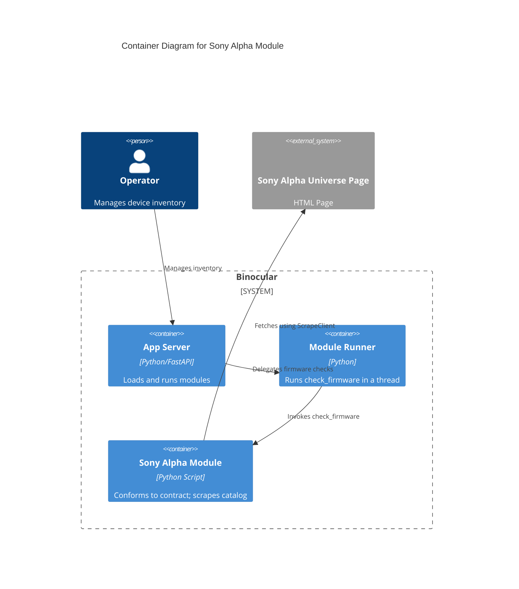

# Implementation Plan: E011 — Official Sony Alpha Module

**Branch**: `00011-official-sony-alpha-module` | **Date**: 2026-06-10 | **Spec**: [spec.md](spec.md)

## Summary

**Goal**: Deliver the first official firmware check module for Sony Alpha camera bodies and lenses.  
**Approach**: Implement `check_firmware` conforming to the V1 contract using the injected `ScrapeClient` executed synchronously inside a worker-thread event loop, parsing embedded catalog JSON from Alpha Universe.  
**Key Constraint**: The module must be synchronous in signature but fetch HTML through the asynchronous `ScrapeClient` wrapper.

## Technical Context

**Language/Version**: Python 3.13  
**Primary Dependencies**: BeautifulSoup4, aiosqlite, structlog, httpx  
**Storage**: N/A  
**Testing**: pytest  
**Target Platform**: Linux Docker container  
**Project Type**: web  
**Project Mode**: brownfield  
**Performance Goals**: N/A  
**Constraints**: Conforms to V1 module contract; run inside `asyncio.to_thread` worker thread using local event loop  
**Scale/Scope**: Single official module for Sony Alpha cameras/lenses  

## Instructions Check

*GATE: Must pass before Phase 0 research. Re-check after Phase 1 design.*

- Met requirements of project-instructions.md:
  - Honest Failure: Returned dict/CheckResult signals failures explicitly with typed error diagnostics, no silent errors.
  - Polite by default: The module fetches only via injected `http_client` (which handles robots.txt, UA, and rate limits).
  - No sandboxing: Code runs in-process as an accepted trust boundary.
  - Type safety: Module and tests pass `mypy --strict`.

## Architecture



## Architecture Decisions

Feature-local tradeoffs only. Project-wide architectural decisions belong in standalone ADRs under `specs/adrs/` — reference them by ID (e.g., "See ADR-0001") instead of duplicating here.

| ID | Decision | Options Considered | Chosen | Rationale |
|----|----------|--------------------|--------|-----------|
| AD-001 | Fetch from async client inside sync check_firmware | Option A: new loop + run_until_complete<br>Option B: asyncio.run()<br>Option C: import requests/urllib | Option A | Option A successfully executes the async client method on a worker thread and avoids loop closed exceptions on app shutdown, while maintaining Central Polite Client enforcement. |
| AD-002 | Catalog data extraction mechanism | Option A: Extract window.firmwareProducts script block<br>Option B: Parse HTML table cells | Option A | Embedded JSON is less fragile and less subject to minor layout changes than raw HTML tables. |

## Data Model Summary

N/A — no persistent data

## API Surface Summary

N/A — no API surface

## Testing Strategy

| Tier | Tool | Scope | Mock Boundary | Install |
|------|------|-------|---------------|---------|
| Unit | pytest | parse_firmware_entries, find_firmware_entry, key normalizations | HTML fixtures, no network | configured |
| Integration | pytest | E2E check_firmware call execution | Mock HTTP responses (FakeScrapeClient) | configured |
| Security | bandit / ruff | Static code scanning | — | configured |
| Coverage | pytest-cov | Verify 80%+ code coverage target of sony_alpha module | — | configured |

## Error Handling Strategy

| Error Category | Pattern | Response | Retry |
|----------------|---------|----------|-------|
| Target page unparseable | fail-fast | Return status = "failed" with diagnostics `error_type: firmware_index_not_found` | no |
| Product model not listed | fail-fast | Return status = "failed" with diagnostics `error_type: product_not_found` | no |
| Product listed but version empty | fail-fast | Return status = "failed" with diagnostics `error_type: firmware_not_available` | no |

## Integration Points

| Spec Reference | System/Service | Technical Approach | Contract |
|----------------|----------------|--------------------|----------|
| E007 | Module contract | Conforms to signature and constants exports | check_firmware(url, model, http_client), MODULE_VERSION, SUPPORTED_DEVICE_TYPE |
| E005 | Scraping client | Calls injected `http_client` for fetching HTML | async get(url) -> Response |

## Risk Mitigation

| Risk (from spec) | Likelihood | Impact | Mitigation | Owner |
|-------------------|------------|--------|------------|-------|
| Page Layout Redesign | Medium | High | Extract window.firmwareProducts JSON script block; return typed error diagnostic code (`firmware_index_not_found`) if missing. | Sony Alpha Module |

## Requirement Coverage Map

| Req ID | Component(s) | File Path(s) | Notes |
|--------|--------------|--------------|-------|
| FR-001 | Sony Module file | `backend/src/binocular/official_modules/sony_alpha.py` | Official module implementing contract constants and check_firmware signature |
| FR-002 | Catalog Parsing | `backend/src/binocular/official_modules/sony_alpha.py` | Parsers for camera and lens catalog lists |
| FR-003 | Model Resolution | `backend/src/binocular/official_modules/sony_alpha.py` | Normalizes and matches model inputs |
| FR-004 | Diagnostics | `backend/src/binocular/official_modules/sony_alpha.py` | Returns typed failed states on errors |
| FR-005 | Golden Tests | `backend/tests/test_official_sony_alpha_module.py` | Pytest fixtures and mock scraping runs |

## Project Structure

### Source Code

```text
  ~ backend/src/binocular/
    + official_modules/
      + __init__.py
      + sony_alpha.py
  ~ backend/tests/
    + fixtures/
      + sony_alpha/
        + alpha_universe_firmware.html
        + unparseable.html
    + test_official_sony_alpha_module.py
```

**Patterns to reuse**: Model key normalization, bracket matching, and regex cleaning from prototype modules.  
**Tests to extend**: Add a new file `test_official_sony_alpha_module.py` using `pytest`.  
**Naming conventions**: Follow standard Python `snake_case` for module helper functions and UPPER_CASE for constants.  

## Implementation Hints

- **[HINT-001]** Gotcha: Running async code in a worker thread. Use `loop = asyncio.new_event_loop()` and `asyncio.set_event_loop(loop)` without calling `loop.close()` to prevent event loop closed errors when clean shutdown occurs.
- **[HINT-002]** Constraint: Do not import direct HTTP libraries like `requests` or `httpx` inside `sony_alpha.py` directly; use the injected `http_client` to scrape target URL.
- **[HINT-003]** Gotcha: Normalization of model names must be robust to spaces, case differences, and the alpha symbol (replace Greek alpha "α" or "Α" with "ALPHA").
