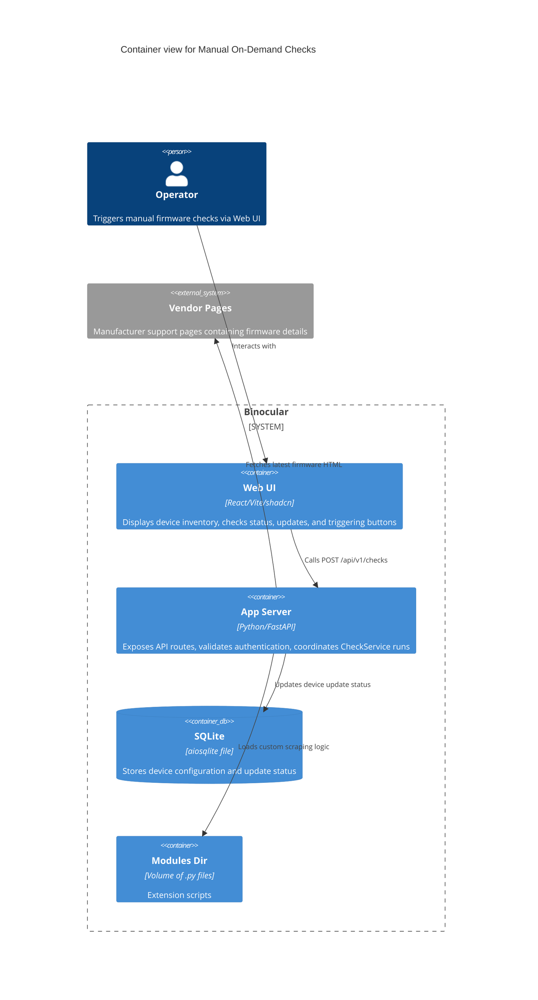

# Implementation Plan: Manual On-Demand Checks

**Branch**: `00012-manual-on-demand-checks` | **Date**: 2026-06-10 | **Spec**: [spec.md](spec.md)

## Summary

**Goal**: Implement manual firmware check triggers for single devices and bulk inventory, displaying side-by-side versions and loading states in the React UI.  
**Approach**: Expose `POST /api/v1/checks/device/{id}` and `POST /api/v1/checks/bulk` endpoints in a new checks router, and hook them up to the React SPA using TanStack Query mutations.  
**Key Constraint**: Ensure backend scraping operations run concurrently and do not block the ASGI/Uvicorn event loop.

## Technical Context

**Language/Version**: Python 3.13 (backend), TypeScript 5.x / React 19 (frontend)  
**Primary Dependencies**: FastAPI, aiosqlite, structlog, TanStack Query, Lucide Icons  
**Storage**: SQLite  
**Testing**: pytest, pytest-asyncio  
**Target Platform**: Linux Docker container  
**Project Type**: web  
**Project Mode**: brownfield  
**Performance Goals**: Async I/O concurrency for bulk checking; sub-100ms API response (excluding scrape duration).  
**Constraints**: Re-use centralized host ScrapeClient to respect robots.txt and pacing.  
**Scale/Scope**: Bulk checks execute concurrently across all registered devices.

## Instructions Check

*GATE: Must pass before Phase 0 research. Re-check after Phase 1 design.*

- **I. Honest Failure**: PASS. Endpoint errors are caught at the module runner boundary and returned as part of `DeviceCheckResult` structure.
- **II. Polite by Default**: PASS. Injected ScrapeClient enforces robots.txt, User-Agent, and domain pacing.
- **III. Data Ownership & Self-Containment**: PASS. Check status is updated in the local SQLite db using the existing `DeviceRepository`.
- **V. Type Safety & Correctness-First**: PASS. Strict Python typings and tsc strict check coverage apply to new code.
- **VI. Set-and-Forget Reliability**: PASS. Failures in manual checks are isolated and will not crash the server process.

## Architecture



## Architecture Decisions

| ID | Decision | Options Considered | Chosen | Rationale |
|----|----------|--------------------|--------|-----------|
| AD-001 | Check concurrency pattern | A. Sequential loop<br>B. Concurrency via `asyncio.gather` | B | Bulk check needs to execute checks in parallel to minimize operator wait time. Reusing async/await allows FastAPI to handle other traffic during checks. |
| AD-002 | Component integration | A. Create dedicated Checks components<br>B. Extend DeviceCard and InventoryPage | B | Reuses existing layouts cleanly, conforming to the existing structure and avoiding redundant components. |

## Data Model Summary

N/A — no persistent data

*(No new tables or schema changes. Check status changes are saved to the existing `devices` table columns: `has_update`, `latest_detected_version`, `last_checked`.)*

## API Surface Summary

| Method | Path | Purpose | Auth | Req/Res Types |
|--------|------|---------|------|---------------|
| POST | `/api/v1/checks/device/{device_id}` | Trigger check on a single device | Optional Basic Auth | Path: `device_id` (int)<br>Res: `DeviceCheckResult` |
| POST | `/api/v1/checks/bulk` | Trigger checks on all devices | Optional Basic Auth | Res: `list[DeviceCheckResult]` |

**Detail**: `specs/00012-manual-on-demand-checks/contracts/`

## Testing Strategy

| Tier | Tool | Scope | Mock Boundary | Install |
|------|------|-------|---------------|---------|
| Unit | pytest | Check endpoints response validation and status codes | Mock `CheckService` | configured |
| Integration | pytest | End-to-end route to service to repo check flow | Mock `ScrapeClient` | configured |
| Security | ruff | Static analysis and type checking | — | configured |
| Coverage | pytest-cov | Verify new files coverage meets the 80% target | — | configured |

## Error Handling Strategy

| Error Category | Pattern | Response | Retry |
|----------------|---------|----------|-------|
| Device Not Found | Catch `ValueError` or missing row | 404 Not Found | No |
| Scraper/Module Run Failure | Catch exception in route or CheckService | 200 OK with `success: false` and `error_message` | No |
| Invalid Auth | Basic auth middleware | 401 Unauthorized | No |

## Integration Points

| Spec Reference | System/Service | Technical Approach | Contract |
|----------------|----------------|--------------------|----------|
| E006 | Device inventory | Fetch and update devices in the DB | `DeviceRepository` CRUD |
| E010 | Update detection service | Trigger firmware scrapes | `CheckService.check_device` |

## Risk Mitigation

| Risk (from spec) | Likelihood | Impact | Mitigation | Owner |
|-------------------|------------|--------|------------|-------|
| Rate limiting from concurrent bulk runs | Medium | Low | Central ScrapeClient applies polite scraping pacing per domain. | Backend Engine |

## Requirement Coverage Map

| Req ID | Component(s) | File Path(s) | Notes |
|--------|--------------|--------------|-------|
| FR-001 | Checks Route | `backend/src/binocular/routes/checks.py` | Single device POST endpoint |
| FR-002 | Checks Route | `backend/src/binocular/routes/checks.py` | Bulk checks POST endpoint |
| FR-003 | Checks Route / Service | `backend/src/binocular/routes/checks.py` | Execute checks concurrently using `asyncio.gather` |
| FR-004 | Checks Route Schema | `backend/src/binocular/routes/checks.py` | Response matches `DeviceCheckResult` schema |
| FR-005 | DeviceCard Trigger | `frontend/src/components/inventory/device-card.tsx` | Trigger button added on the card |
| FR-006 | Inventory Trigger | `frontend/src/pages/inventory.tsx` | Trigger global bulk button in the header |
| FR-007 | UI Loading State | `frontend/src/components/inventory/device-card.tsx` | Spinners and disabled button states during check |
| FR-008 | UI Comparison Layout | `frontend/src/components/inventory/device-card.tsx` | Display current and latest versions side-by-side |

## Project Structure

### Source Code

```text
~ backend/src/binocular/
  ~ routes/
    ~ __init__.py
    + checks.py
~ backend/tests/
  ~ routes/
    + test_checks.py
~ frontend/src/
  ~ components/inventory/
    ~ device-card.tsx
  ~ hooks/
    ~ use-devices.ts
  ~ lib/
    ~ api.ts
  ~ pages/
    ~ inventory.tsx
```

<!-- Brownfield Notes (include only when Project Mode = brownfield or mixed):
**Patterns to reuse**: Standard router pattern using APIRouter from FastAPI and deps injection. Async client fetch and Query mutations on React side.
**Tests to extend**: Add integration testing for checks routes under `backend/tests/routes/test_checks.py`.
**Naming conventions**: Keep casing and folder conventions matching existing codebases.
-->

## Implementation Hints

- **[HINT-001]** Instantiating CheckService: Resolve from request state dependencies: `db` from DBDep, `scrape_client` from request.app.state.scrape_client, and `modules_dir` from request.app.state.settings.modules_dir.
- **[HINT-002]** Loading state: Keep track of which individual device IDs are checking in the frontend TanStack Query cache, or use a local state array.
- **[HINT-003]** Route tags: Apply `tags=["checks"]` to the new APIRouter in `routes/checks.py`.
