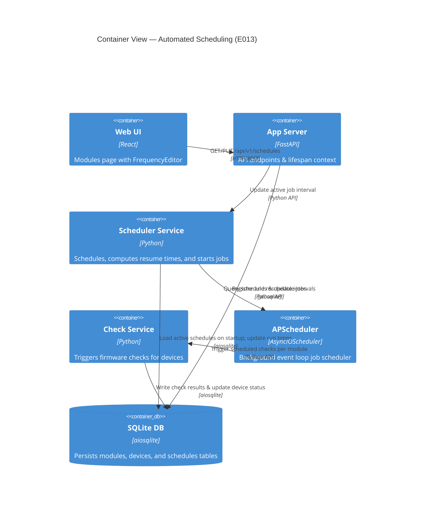

# Implementation Plan: Automated Scheduled Checking (E013)

**Branch**: `00013-automated-scheduled-checking` | **Date**: 2026-06-11 | **Spec**: [spec.md](spec.md)

## Summary

**Goal**: Implement automated background scheduled checks for devices per module with configurable intervals and restart safety using in-process APScheduler.  
**Approach**: Integrate `AsyncIOScheduler` in FastAPI's lifespan, define a SQLite `schedules` table to persist configuration and execution state, and provide REST endpoints and a frontend FrequencyEditor UI to view and update check intervals.  
**Key Constraint**: APScheduler must run in-process, without external database ORM dependencies (using raw SQL/aiosqlite) and resume pending checks cleanly on application restart.

## Technical Context

**Language/Version**: Python 3.13 (backend); TypeScript 5.x / React 19 (frontend)  
**Primary Dependencies**: FastAPI, Uvicorn, aiosqlite, APScheduler 3.x (to be added)  
**Storage**: SQLite (`binocular.db`) via raw `aiosqlite` SQL queries  
**Testing**: pytest, pytest-asyncio, Vitest, React Testing Library  
**Target Platform**: Linux Docker container / Host runtime  
**Project Type**: web  
**Project Mode**: brownfield  
**Performance Goals**: Minimal background processor usage; concurrent check dispatch without thread starvation.  
**Constraints**: Zero-config startup, non-root execution, single-process monolith.

## Instructions Check

*GATE: Must pass before Phase 0 research. Re-check after Phase 1 design.*

- **Core Principles**: Central polite HTTP client must be utilized for checks (via `CheckService` reuse). SQLite used for all state. No root-privileges required.
- **Technology Stack**: Python 3.13 backend, React frontend, standard SQLite storage.
- **Source Code Layout**: Source files placed in `backend/src/` and `frontend/src/`.

## Architecture



## Architecture Decisions

| ID | Decision | Options Considered | Chosen | Rationale |
|----|----------|--------------------|--------|-----------|
| AD-001 | Persistent schedule state | APScheduler SQLAlchemyJobStore vs Custom custom SQL table | Custom SQLite table + Memory JobStore | Prevents introducing SQLAlchemy dependencies (violates ADR-0004); simple startup synchronization works perfectly for 5-50 devices. |
| AD-002 | Checking target | Trigger CheckService per-module vs per-device | Per-module triggering | Aligns with Acceptance Criteria; when a module schedule triggers, the SchedulerService queries all devices linked to that module and runs checks concurrently. |
| AD-003 | Default schedule seeder | AFTER INSERT Trigger on modules table vs Repository-level default insert | AFTER INSERT Trigger on modules table | Ensures clean default schedule creation whenever a module is created, seeded, or uploaded, avoiding duplicate logic in repositories/seeder. |

## Data Model Summary

| Entity | Key Fields | Relationships | Notes |
|--------|------------|---------------|-------|
| Schedule | `id`, `module_id` (FK), `interval_hours`, `last_run` (timestamp), `next_run` (timestamp) | 1-to-1 with `Module` | Persists execution times and intervals for each module. Trigger initialized on Module insertion. |

**Detail**: [data-model.md](data-model.md)

## API Surface Summary

| Method | Path | Purpose | Auth | Req/Res Types |
|--------|------|---------|------|---------------|
| GET | `/api/v1/schedules` | Retrieve all schedules with module name and next execution | Optional Basic Auth | `list[ScheduleResponse]` |
| PUT | `/api/v1/schedules` | Update schedule interval hours for a specific module | Optional Basic Auth | `ScheduleResponse` |

**Detail**: [contracts/schedules.md](contracts/schedules.md)

## Testing Strategy

| Tier | Tool | Scope | Mock Boundary | Install |
|------|------|-------|---------------|---------|
| Unit | pytest | SchedulerService registration, resume calculations, DB operations | Mock CheckService, Mock database connection | `configured` |
| Integration | pytest | Full end-to-end API test and job trigger verification | Mock ScrapeClient | `configured` |
| Security | pip-audit | Backend package scanning | — | `configured` |
| Coverage | pytest-cov | Ensure schedule code reaches 80% coverage | — | `configured` |

## Error Handling Strategy

| Error Category | Pattern | Response | Retry |
|----------------|---------|----------|-------|
| Schedule Update Error | Validate `interval_hours` >= 1 | 400 Bad Request + error message | No |
| Module Not Found | Check module existence | 404 Not Found | No |
| Check Execution Failure | Error boundaries inside triggered jobs | Logged to database, does not crash scheduler | Rescheduled on next interval |

## Integration Points

| Spec Reference | System/Service | Technical Approach | Contract |
|----------------|----------------|--------------------|----------|
| IP-001 | CheckService | SchedulerService calls `check_device` concurrently for all devices matching a module ID | [checks.py](file:///Users/attila/git/Binocular/backend/src/binocular/services/checks.py) |
| IP-002 | FrequencyEditor | React component embedded in Modules page making GET/PUT calls | [modules.tsx](file:///Users/attila/git/Binocular/frontend/src/pages/modules.tsx) |

## Risk Mitigation

| Risk (from spec) | Likelihood | Impact | Mitigation | Owner |
|-------------------|------------|--------|------------|-------|
| Locking contention | Low | Medium | Utilize parameterized writes, limit database transaction times, and configure sqlite `busy_timeout` (5s) with WAL mode. | Database / Check runner |

## Requirement Coverage Map

| Req ID | Component(s) | File Path(s) | Notes |
|--------|--------------|--------------|-------|
| FR-001 | SchedulerService | `backend/src/binocular/services/scheduler.py` | Core scheduler service interface |
| FR-002 | routes/modules | `backend/src/binocular/routes/modules.py` | Added GET /api/v1/schedules |
| FR-003 | routes/modules | `backend/src/binocular/routes/modules.py` | Added PUT /api/v1/schedules |
| FR-004 | DB Migration | `backend/src/binocular/db/migrations/0004_schedules.sql` | AFTER INSERT trigger seeds schedules |
| TR-001 | DB Migration | `backend/src/binocular/db/migrations/0004_schedules.sql` | schedules table schema definition |
| TR-002 | SchedulerService | `backend/src/binocular/services/scheduler.py` | Job executor triggers checks per associated device |

## Project Structure

### Source Code

```text
~ backend/
  ~ src/
    ~ binocular/
      ~ db/
        ~ migrations/
          + 0004_schedules.sql
      ~ routes/
        ~ modules.py (GET/PUT schedules routes)
      ~ services/
        + scheduler.py (SchedulerService class)
      ~ app.py (Lifespan hook to init scheduler)
      ~ config.py (Settings configuration)
~ frontend/
  ~ src/
    ~ components/
      ~ modules/
        + FrequencyEditor.tsx (Frequency control dropdown and save UI)
        ~ ModuleCard.tsx (Display FrequencyEditor per module card)
    ~ lib/
      ~ api.ts (api client function updates)
```

**Patterns to reuse**: aiosqlite raw queries using RepositoryBase, FastAPI DI, React Hooks, shadcn UI styling.  
**Tests to extend**: backend tests under `backend/tests/` to cover `scheduler.py` and API routes, frontend tests.  
**Naming conventions**: standard snake_case for Python, camelCase for TypeScript/React.

## Implementation Hints

- **[HINT-001]** Dependency updates: Remember to add `apscheduler>=3.10.0,<4` to `backend/pyproject.toml`.
- **[HINT-002]** Job ID convention: Register scheduler jobs in APScheduler using `module_{module_id}` as job ID to make rescheduling and updates trivial.
- **[HINT-003]** Startup timezone: Handle timezone parsing carefully when loading stored UTC string timestamps to avoid off-by-hours errors on calculations.

## Compliance Check

- **Core Principles**: Validated. SQLite storage matches the self-contained principle. Raw SQL is used. Central scraping client reuse matches polite default.
- **Technology Stack**: Python 3.13, React, raw SQLite are all utilized.
- **Source Code Layout**: Source files will reside in `backend/src/` and `frontend/src/` feature folders.

