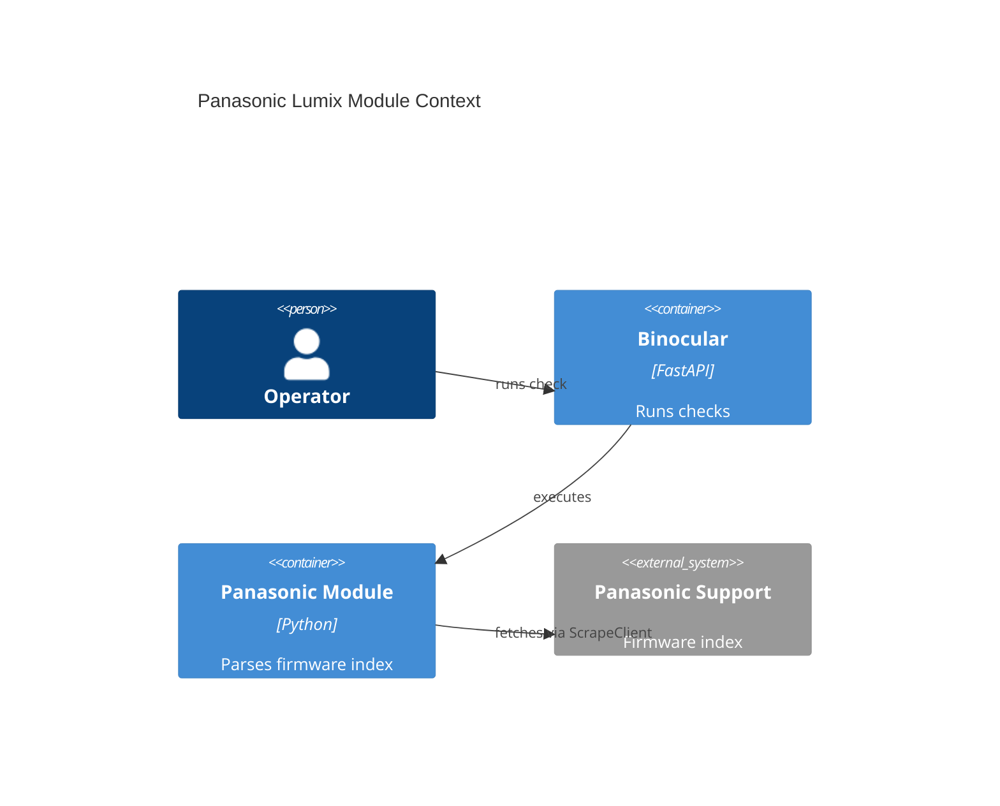

# Implementation Plan — Official Panasonic Lumix Module

## Instructions Check

| Source | Status | Notes |
|--------|--------|-------|
| `project-instructions.md` | PASS | No conflicting project instruction found in this slice. |
| `AGENTS.md` | PASS | SDD lifecycle and gating followed. |
| Artifact conventions | PASS | Required sections and IDs preserved. |

## Technical Context

| Field | Value |
|-------|-------|
| Language / Runtime | Python 3.13 backend |
| Framework / Libraries | FastAPI app, Pydantic extension contract, aiosqlite repositories |
| Project Mode | Brownfield |
| Storage | Existing SQLite module/device metadata only; no schema change |
| External Source | Panasonic global DSC firmware index |
| QC Tools | Ruff, mypy strict, pytest, pytest-cov, pip-audit |

## Architecture Decisions

| ID | Decision | Rationale |
|----|----------|-----------|
| AD-001 | Add `official.panasonic_lumix` as a bundled module using the existing extension contract. | Keeps starter modules consistent and avoids core service changes. |
| AD-002 | Use Panasonic's global DSC firmware index instead of Alpha Universe for version detection. | Alpha Universe has Panasonic picker data but lacks Panasonic firmware versions. |
| AD-003 | Parse bounded table rows and JavaScript link handlers from fixtures. | Mirrors the source shape while avoiding broad unbounded regex behavior. |

## Data Model Summary

N/A — no persistent data model changes. Existing `modules` and `devices` tables store module metadata and check results.

## API Surface Summary

N/A — no API surface changes. Existing `/api/v1/checks/devices/{device_id}` runs the module.

## Architecture



## Source Code Structure

```text
~ backend/src/binocular/official_modules/README.md
+ backend/src/binocular/official_modules/panasonic_lumix.py
+ backend/tests/test_official_panasonic_lumix_module.py
+ backend/tests/fixtures/panasonic_lumix/panasonic_firmware_index.html
+ backend/tests/fixtures/panasonic_lumix/unparseable.html
```

## Testing Strategy

| Tier | Tool | Scope | Mock Boundary | Install |
|------|------|-------|---------------|---------|
| Unit | pytest | Parser, matching, module result behavior | Fixture-backed fake `ScrapeClient` | configured |
| Integration | pytest | Module loads through `ModuleLoader` | Filesystem module loading | configured |
| Static | Ruff + mypy | Style and strict typing for official modules/tests | N/A | configured |
| Security | pip-audit | Dependency vulnerability audit | N/A | configured |
| Coverage | pytest-cov | Full backend suite threshold | N/A | configured |

## Error Handling Strategy

| Failure | Handling |
|---------|----------|
| Firmware index not parseable | Return failed `ModuleCheckResult` with `firmware_index_not_found`. |
| Product absent | Return failed result with `product_not_found`. |
| Listed product has no version | Return failed result with `firmware_not_available`. |
| Download handler absent | Keep source URL as Panasonic index URL while returning version. |

## Integration Points

| Integration | Technical Approach |
|-------------|--------------------|
| E006 module contract | Export `MODULE_METADATA` and async `check_firmware(input, client)`. |
| E007 scraping client | Use only injected `ScrapeClient.fetch()`. |
| E009 version comparison | Return raw latest version string without comparing inside the module. |

## Risk Mitigation

| Risk | Mitigation |
|------|------------|
| Panasonic HTML changes | Fixture tests cover parser shape and visible failures. |
| Grouped aliases missed | Alias expansion unit tests cover slash-separated rows. |
| Wrong source URL assumption | Spec and research document Alpha Universe limitation and Panasonic source selection. |

## Requirement Coverage Map

| Requirement | Components | Files |
|-------------|------------|-------|
| FR-001 | Official module metadata and entrypoint | `backend/src/binocular/official_modules/panasonic_lumix.py` |
| FR-002 | ScrapeClient-only module implementation | `backend/src/binocular/official_modules/panasonic_lumix.py`, `backend/tests/test_official_panasonic_lumix_module.py` |
| FR-003 | Panasonic index parser | `backend/src/binocular/official_modules/panasonic_lumix.py`, `backend/tests/fixtures/panasonic_lumix/panasonic_firmware_index.html` |
| FR-004 | Model alias matching | `backend/src/binocular/official_modules/panasonic_lumix.py`, `backend/tests/test_official_panasonic_lumix_module.py` |
| FR-005 | Visible failures | `backend/src/binocular/official_modules/panasonic_lumix.py`, `backend/tests/test_official_panasonic_lumix_module.py` |
| FR-006 | Official module docs | `backend/src/binocular/official_modules/README.md` |

## Implementation Hints

- **[HINT-001]** Parser: Strip `Ver.` prefixes before returning latest firmware versions.
- **[HINT-002]** Matching: Expand grouped cells by preserving prefix before slash variants.
- **[HINT-003]** Source: Use Panasonic global index by default; Alpha Universe is not firmware-authoritative for Panasonic.
- **[HINT-004]** Safety: Keep direct HTTP imports out of official modules.

## Compliance Check

PASS — Plan is aligned with project instructions and existing architecture.