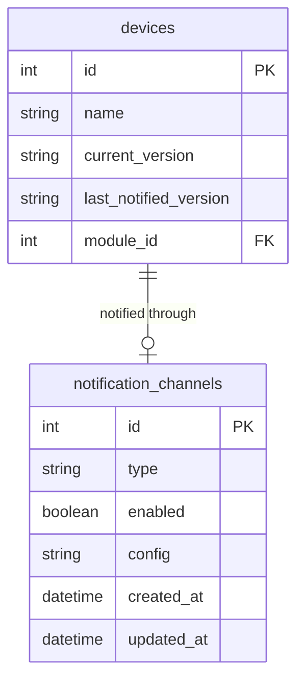

# Data Model: Notification & Alerting

## Entity Relations



## Schema Definitions

### Migration: `0004_notifications.sql`

This migration modifies the `devices` table to add the tracking field and creates the `notification_channels` table.

```sql
-- Alter devices table to add last_notified_version
ALTER TABLE devices ADD COLUMN last_notified_version TEXT DEFAULT NULL;

-- Create notification_channels table
CREATE TABLE notification_channels (
    id INTEGER PRIMARY KEY AUTOINCREMENT,
    type TEXT NOT NULL UNIQUE,
    enabled INTEGER NOT NULL DEFAULT 0,
    config TEXT NOT NULL,
    created_at TIMESTAMP DEFAULT CURRENT_TIMESTAMP,
    updated_at TIMESTAMP DEFAULT CURRENT_TIMESTAMP
);
```

## Entity Details

### Device
- `last_notified_version`: Text representation of the last version that triggered a notification. Nullable.

### NotificationChannel
- `id`: Unique autoincrement integer.
- `type`: Either `'email'` or `'gotify'`. Marked as `UNIQUE` to prevent duplicate configuration rows per channel type.
- `enabled`: Integer boolean (0 or 1) indicating if the channel is active for alerts.
- `config`: Text field storing JSON configuration.
  - Email config structure:
    ```json
    {
      "smtp_host": "smtp.gmail.com",
      "smtp_port": 587,
      "smtp_user": "user@gmail.com",
      "smtp_pass": "app-password",
      "smtp_use_tls": true,
      "from_email": "binocular@example.com",
      "to_email": "operator@example.com"
    }
    ```
  - Gotify config structure:
    ```json
    {
      "server_url": "https://gotify.example.com",
      "app_token": "A1b2C3d4E5f6G7h"
    }
    ```
