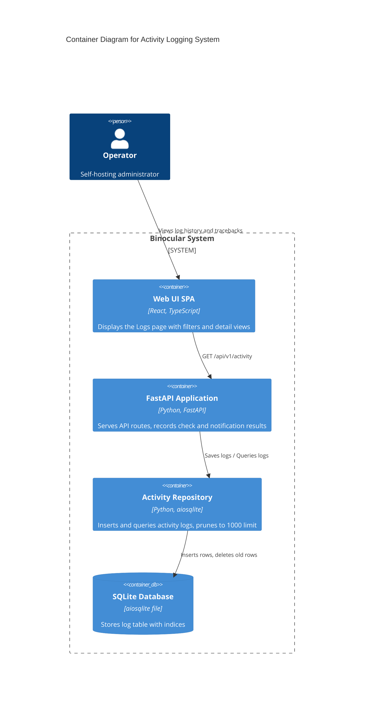

# Implementation Plan: Activity Logging & Visibility

**Branch**: `00015-activity-logging-visibility` | **Date**: 2026-06-11 | **Spec**: [spec.md](spec.md)

## Summary

**Goal**: Implement a size-bounded activity log persisted in SQLite and displayed in the frontend Logs page with filtering, paging, and traceback viewing.  
**Approach**: Create a database migration for `activity_log`, implement `ActivityRepository` with pruning logic on insert, expose GET `/api/v1/activity`, integrate auto-logging inside the check runner and notification services, and create a React Logs viewer.  
**Key Constraint**: The log must not grow indefinitely; it must be capped at exactly 1000 entries using an efficient pruning operation.

## Technical Context

**Language/Version**: Python 3.13 (backend); TypeScript 5.x / React 19 (frontend)  
**Primary Dependencies**: FastAPI, aiosqlite, Pydantic, structlog (backend); React, TanStack Query, Radix UI primitives, shadcn/ui (frontend)  
**Storage**: SQLite (`binocular.db`) via aiosqlite  
**Testing**: pytest, pytest-asyncio (backend); Vitest (frontend)  
**Target Platform**: Linux Docker container / Local host runtime  
**Project Type**: web  
**Project Mode**: brownfield  
**Performance Goals**: Log retrieval API returns within 100ms; log insert and pruning happens asynchronously in background checks without blocking the HTTP main thread.  
**Constraints**: Exactly 1000 entries maximum log retention.

## Instructions Check

*GATE: Must pass before Phase 0 research. Re-check after Phase 1 design.*

| Instruction | Target Rule / Text | Satisfied By |
|-------------|--------------------|--------------|
| I. Honest Failure | Failures must be logged and visible | Check and notification dispatch errors are caught and logged with tracebacks to the database. |
| III. Data Ownership | SQLite persistent storage | Activity logs are stored locally in the single SQLite database file. |
| V. Type Safety | Strict typing and tests | Python typing with mypy --strict; frontend tsc strict check; unit and integration tests. |
| VI. Set-and-Forget | Survive upgrades with no configuration | Pruning algorithm runs transparently; database migrations run automatically. |

## Architecture



## Architecture Decisions

| ID | Decision | Options Considered | Chosen | Rationale |
|----|----------|--------------------|--------|-----------|
| AD-001 | Log Pruning Mechanism | SQL Trigger / Application-level delete after insert | Application-level delete after insert | Keeps pruning logic explicit and testable within python unit tests instead of hidden inside SQLite triggers. |
| AD-002 | Connection Mode | Standard SQLite / Write-Ahead Logging (WAL) | WAL mode | Pre-configured in the core app; enables concurrent reads and serializes writes, eliminating locking issues during simultaneous checks. |
| AD-003 | Traceback Serialization | JSON string / Raw text | Raw text | Simple text field is ideal for displaying traceback stacks directly in the UI panel without serialization overhead. |

## Data Model Summary

| Entity | Key Fields | Relationships | Notes |
|--------|------------|---------------|-------|
| ActivityLogEntry | `id` (INT, PK), `timestamp` (DATETIME), `level` (TEXT), `category` (TEXT), `message` (TEXT), `device_id` (INT, FK), `module_name` (TEXT), `traceback` (TEXT) | Foreign key to `devices(id)` ON DELETE CASCADE | Cascades on device delete to clean up logs automatically. |

**Detail**: `specs/00015-activity-logging-visibility/data-model.md`

## API Surface Summary

| Method | Path | Purpose | Auth | Req/Res Types |
|--------|------|---------|------|---------------|
| GET | `/api/v1/activity` | Fetch paginated, filtered log list | Optional Basic | `None` / `ActivityLogListResponse` |

**Detail**: `specs/00015-activity-logging-visibility/contracts/activity_api.md`

## Testing Strategy

| Tier | Tool | Scope | Mock Boundary | Install |
|------|------|-------|---------------|---------|
| Unit | pytest | Test pruning logic in `ActivityRepository` by inserting 1050 records and asserting count is capped at 1000. | Database is sqlite memory/file | `configured` |
| Integration | pytest | Test `/api/v1/activity` endpoint with level, category, and device ID filtering. | SQLite database fixtures | `configured` |
| Security | Ruff / mypy | Static analysis check for backend type safety. | — | `configured` |
| Coverage | pytest-cov | Verify activity log codebase has >80% test coverage. | — | `configured` |

## Error Handling Strategy

| Error Category | Pattern | Response | Retry |
|----------------|---------|----------|-------|
| API Validation | FastAPI Pydantic parsing | 422 Unprocessable Entity with error detail | No |
| Log Insertion | Catch and log to stderr | Silently fallback to stderr if database is locked/inaccessible (prevents log failures from crashing checks) | No |

## Integration Points

| Spec Reference | System/Service | Technical Approach | Contract |
|----------------|----------------|--------------------|----------|
| FR-002 | CheckService | Insert log on check success/failure | `ActivityRepository.log()` |
| FR-003 | NotifierService | Insert log on notification success/failure | `ActivityRepository.log()` |

## Risk Mitigation

| Risk (from spec) | Likelihood | Impact | Mitigation | Owner |
|-------------------|------------|--------|------------|-------|
| Lock contention under concurrent checks | Low | Medium | Standard SQLite WAL mode serializes writes. Log insertion failures are caught to avoid halting checks. | DB / Repository |
| Large tracebacks bloating DB | Low | Low | Capped 1000 rows limit ensures database size is strictly bounded. | DB / Pruning |

## Requirement Coverage Map

| Req ID | Component(s) | File Path(s) | Notes |
|--------|--------------|--------------|-------|
| FR-001 | DB Migration | `backend/src/binocular/db/migrations/0006_activity_log.sql` | Table creation |
| FR-001 | Repository | `backend/src/binocular/db/activity_repository.py` | Query and insert methods |
| FR-002 | Check Runner | `backend/src/binocular/services/checks.py` | Calls `log()` on check completion/fail |
| FR-003 | Notification Dispatcher | `backend/src/binocular/services/notifier.py` | Calls `log()` on notification attempt |
| FR-004 | API GET Route | `backend/src/binocular/routes/activity.py` | Exposes paginated filtered query |
| FR-005 | API GET Route | `backend/src/binocular/routes/activity.py` | Implements limit and offset params |
| FR-006 | Repository | `backend/src/binocular/db/activity_repository.py` | Pruning logic to exactly 1000 rows |
| FR-007 | UI Nav / Router | `frontend/src/components/layout/Navbar.tsx` | Add menu item |
| FR-008 | UI Logs Table | `frontend/src/components/logs/LogsPage.tsx` | LogsTable component |
| FR-009 | UI Filter Bar | `frontend/src/components/logs/LogsPage.tsx` | Filter controls |
| FR-010 | UI Traceback Drawer | `frontend/src/components/logs/LogsPage.tsx` | Traceback panel dialog |

## Project Structure

### Source Code

```text
~ backend/src/binocular/
  ~ db/
    ~ migrations/
      + 0006_activity_log.sql
    + activity_repository.py
  ~ routes/
    ~ __init__.py
    + activity.py
  ~ services/
    ~ checks.py
    ~ notifier.py
~ frontend/src/
  ~ components/
    + logs/
      + LogsPage.tsx
  ~ App.tsx
```

**Patterns to reuse**: Standard router pattern, parameterized SQL repositories (e.g. `devices`), FastAPI dependencies.  
**Tests to extend**: Add `backend/tests/test_activity.py` for repository and endpoint test coverage.  
**Naming conventions**: Snake case for python, camelCase for components.

## Implementation Hints

- **[HINT-001]** Pruning logic: Perform pruning within the same write transaction as the log insert:
  `DELETE FROM activity_log WHERE id NOT IN (SELECT id FROM activity_log ORDER BY timestamp DESC, id DESC LIMIT 1000)`
- **[HINT-002]** Device Join: JOIN with the `devices` table using a `LEFT JOIN` so that logs with NULL `device_id` (like notification setup or system events) are still displayed in the logs list.
- **[HINT-003]** Async Logging: Inject `ActivityRepository` into `CheckService` and `NotifierService` (or access via a dependency helper) to record events.
- **[HINT-004]** Error Safety: Wrap repository calls inside `CheckService` and `NotifierService` in try/except blocks so that database logging issues can never cause a check execution or notification dispatch to fail.
