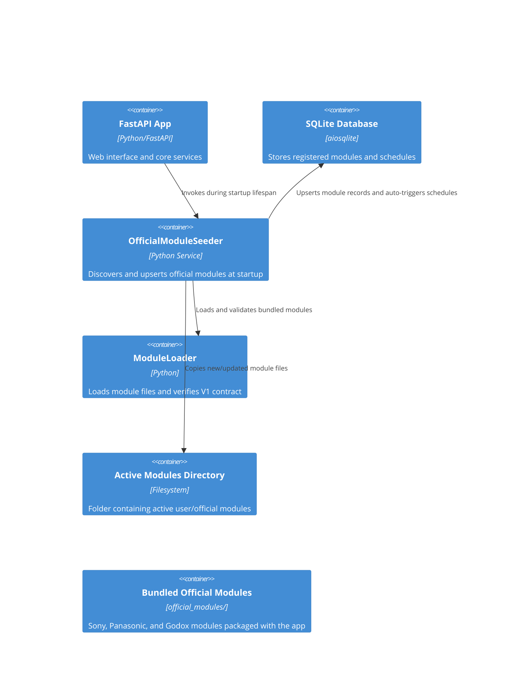

# Implementation Plan: E016 — Automatic Module Seeding & Additional Official Modules

**Branch**: `00016-automatic-module-seeding-additional-official-modules` | **Date**: 2026-06-11 | **Spec**: [spec.md](spec.md)

## Summary

**Goal**: Automatically seed official modules on startup and implement three new official modules (Panasonic Lumix MFT, Panasonic Lumix Lenses, Godox Flashes) with golden fixture tests.  
**Approach**: Write an startup seeder service integrated into FastAPI lifecycle, and author the three modules using synchronous check functions that run async scraping inside worker threads.  
**Key Constraint**: The seeding process must be idempotent, fault-tolerant (failures in individual modules shouldn't crash startup), and avoid downgrading user-customized versions.

## Technical Context

**Language/Version**: Python 3.13  
**Primary Dependencies**: FastAPI, aiosqlite, structlog, beautifulsoup4 (for Godox parsing)  
**Storage**: SQLite  
**Testing**: pytest + pytest-asyncio  
**Target Platform**: Linux server (Docker)  
**Project Type**: single (backend service)  
**Project Mode**: brownfield  
**Performance Goals**: Startup seeding executes in under 1 second.  
**Constraints**: Zero outbound requests allowed outside the central ScrapeClient; strict type-safety (`mypy --strict`).  
**Scale/Scope**: 4 official modules seeded, 3 new modules written, ~10+ tests.

## Instructions Check

*GATE: Must pass before Phase 0 research. Re-check after Phase 1 design.*

| Instruction | Status | Rationale |
|-------------|--------|-----------|
| I. Honest Failure | PASS | Seeder logs all outcomes; modules return explicit error messages via ValueError rather than failing silently. |
| II. Polite by Default | PASS | Modules execute scraping solely through the injected central `http_client`. |
| III. Data Ownership & Self-Containment | PASS | Seeder writes directly to the local SQLite database via the open aiosqlite connection. |
| IV. Least-Privilege & Explicit Trust Boundary | PASS | Modules are loaded and executed in-process. The documentation captures this trust boundary. |
| V. Type Safety & Correctness-First | PASS | All new code is fully type-hinted and must pass `mypy --strict`. Official modules are validated against local HTML fixtures. |
| VI. Set-and-Forget Reliability | PASS | Seeder is idempotent; individual module validation or load failures do not crash the core startup process. |

## Architecture



## Architecture Decisions

| ID | Decision | Options Considered | Chosen | Rationale |
|----|----------|--------------------|--------|-----------|
| AD-001 | Seeder invocation | Cron job vs.Lifespan event | Lifespan event | Ensures official modules are immediately available before the app starts accepting API requests. |
| AD-002 | Idempotency mechanism | Compare file hashes + SemVer | Compare file hashes + SemVer | Avoids rewriting unchanged files; version comparison prevents downgrading user-customized versions. |
| AD-003 | Godox parser tooling | Regex vs. BeautifulSoup4 | BeautifulSoup4 | Godox's paginated layout has deeply nested divs that are fragile to parse with regex alone; BS4 is robust and already a project dependency. |

## Data Model Summary

N/A — no persistent data schema changes. Uses the existing `modules` and `schedules` tables.

## API Surface Summary

N/A — no new API endpoints. Relies on existing `/api/v1/modules` and `/api/v1/schedules`.

## Testing Strategy

| Tier | Tool | Scope | Mock Boundary | Install |
|------|------|-------|---------------|---------|
| Unit | pytest | Parser tests for all three new modules | Mock http_client (returns local HTML fixtures) | configured |
| Integration | pytest | Seeder database inserts, updates, and idempotency logic | Database connection (uses a temporary database) | configured |
| Security | Ruff | Static analysis check | — | configured |
| Coverage | pytest-cov | Verify overall test coverage is >= 80% | — | configured |

## Error Handling Strategy

| Error Category | Pattern | Response | Retry |
|----------------|---------|----------|-------|
| Network / HTTP | ValueError | Propagates error code (e.g. `network_error`) | Retried via core scheduler check |
| Parser failure | ValueError | Propagates error code (e.g. `parse_error`) | No |
| Product missing | ValueError | Propagates error code (e.g. `product_not_found`) | No |
| Seeder load failure | Skip + Log | Logs warning; continues seeding other modules | No |

## Integration Points

| Spec Reference | System/Service | Technical Approach | Contract |
|----------------|----------------|--------------------|----------|
| FR-007 | Panasonic Cameras Page | GET request via central http_client | av.jpn.support.panasonic.com camera index |
| FR-008 | Panasonic Lenses Page | GET request via central http_client | av.jpn.support.panasonic.com lens index |
| FR-009 | Godox Flashes Page | Paginated GET requests via central http_client | www.godox.com flash index |

## Risk Mitigation

| Risk (from spec) | Likelihood | Impact | Mitigation | Owner |
|-------------------|------------|--------|------------|-------|
| Active File Locked or Unwritable | Low | High | Log errors robustly so admins can resolve filesystem permissions; do not crash startup. | SeederService |

## Requirement Coverage Map

| Req ID | Component(s) | File Path(s) | Notes |
|--------|--------------|--------------|-------|
| FR-001 | Lifespan + SeederService | `backend/src/binocular/app.py`, `backend/src/binocular/services/seeder.py` | Discovers bundled modules |
| FR-002 | ASTValidator | `backend/src/binocular/services/seeder.py` | Validates before copying |
| FR-003 | SeederService copy | `backend/src/binocular/services/seeder.py` | Writes to active modules directory |
| FR-004 | ModuleRepository upsert | `backend/src/binocular/services/seeder.py` | Inserts with active status and is_official=1 |
| FR-005 | Idempotency logic | `backend/src/binocular/services/seeder.py` | Compares hash/version before write |
| FR-006 | Error Isolation | `backend/src/binocular/services/seeder.py` | Try-except block per module |
| FR-007 | `panasonic_lumix` module | `backend/src/binocular/official_modules/panasonic_lumix.py` | Implements camera check |
| FR-008 | `panasonic_lumix_lenses` module | `backend/src/binocular/official_modules/panasonic_lumix_lenses.py` | Implements lens check |
| FR-009 | `godox_flashes` module | `backend/src/binocular/official_modules/godox_flashes.py` | Implements paginated flash check |

## Project Structure

### Source Code

```text
~ backend/
  ~ src/
    ~ binocular/
      ~ official_modules/
        + panasonic_lumix.py
        + panasonic_lumix_lenses.py
        + godox_flashes.py
      ~ services/
        + seeder.py
      ~ app.py
  ~ tests/
    + test_seeder.py
    + test_official_panasonic_lumix_module.py
    + test_official_panasonic_lumix_lenses_module.py
    + test_official_godox_flashes_module.py
    ~ fixtures/
      + panasonic_lumix/
        + index.html
      + panasonic_lumix_lenses/
        + index5.html
      + godox_flashes/
        + page_1.html
        + page_2.html
        + page_3.html
```

<!-- Brownfield Notes (include only when Project Mode = brownfield or mixed):
**Patterns to reuse**: Sync check_firmware pattern from `sony_alpha.py` running http requests via loop.run_until_complete.
**Tests to extend**: Add unit/integration tests patterned after `test_official_sony_alpha_module.py`.
**Naming conventions**: standard PEP 8 naming for Python files and variables.
-->

## Implementation Hints

- **[HINT-001]** Thread Loop: Like `sony_alpha.py`, the new modules must create a new event loop inside `check_firmware` via `asyncio.new_event_loop()` to run async requests in the worker thread.
- **[HINT-002]** Idempotent version parsing: Handle potential version string formats safely (e.g. stripping `ver.` or `V` prefix before database upsert or comparison).
- **[HINT-003]** BS4 Dependency: bs4 is already listed in pyproject.toml and is safe to use in `godox_flashes.py`.
- **[HINT-004]** File Hashing: Calculate files' SHA-256 hashes using a block size (e.g., 65536) to prevent excessive memory usage.
- **[HINT-005]** DB schedules trigger: Remember that schedules are inserted automatically by a DB trigger when modules are inserted, so the scheduler will automatically pick them up on startup.
