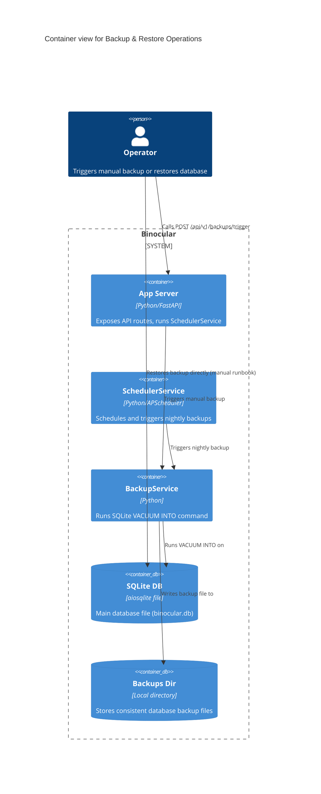

# Implementation Plan: Backup & Restore Operations

**Branch**: `00018-backup-restore-operations` | **Date**: 2026-06-11 | **Spec**: [spec.md](spec.md)

## Summary

**Goal**: Implement scheduled nightly database backup via SQLite `VACUUM INTO` using APScheduler, provide a manual backup trigger endpoint, and document the restore runbook.  
**Approach**: Create a `BackupService` executing the sqlite `VACUUM INTO` command. Integrate this service as a nightly job in `SchedulerService` and add a `POST /api/v1/backups/trigger` endpoint.  
**Key Constraint**: Use `VACUUM INTO` for live-safe, transactionally consistent backups that avoid SQLite WAL-coupling corruption.

## Technical Context

**Language/Version**: Python 3.13 (backend)  
**Primary Dependencies**: FastAPI, aiosqlite, structlog, APScheduler  
**Storage**: SQLite  
**Testing**: pytest, pytest-asyncio  
**Target Platform**: Linux Docker container  
**Project Type**: web  
**Project Mode**: brownfield  
**Performance Goals**: Backup must execute in under 5 seconds and not block other transactions.  
**Constraints**: Perform backup via `VACUUM INTO` to prevent copying incomplete WAL states.  
**Scale/Scope**: Nightly cron-style backup and manual trigger API.

## Instructions Check

*GATE: Must pass before Phase 0 research. Re-check after Phase 1 design.*

- **I. Honest Failure**: PASS. SQLite execution failures or folder creation permission issues are caught, logged via structlog, and returned gracefully.
- **II. Polite by Default**: PASS. SQLite transaction safety is respected by using `VACUUM INTO`, which doesn't disrupt ongoing read/write tasks.
- **III. Data Ownership & Self-Containment**: PASS. Backups are stored locally inside the application's configured data directory to persist on local volume.
- **V. Type Safety & Correctness-First**: PASS. Strict Python type hinting is used for all service and route logic.
- **VI. Set-and-Forget Reliability**: PASS. Any failed backup job does not crash the scheduler or application; error logs notify the operator.

## Architecture



## Architecture Decisions

Feature-local tradeoffs only. Project-wide architectural decisions belong in standalone ADRs under `specs/adrs/` — reference them by ID (e.g., "See ADR-0001") instead of duplicating here.

| ID | Decision | Options Considered | Chosen | Rationale |
|----|----------|--------------------|--------|-----------|
| AD-001 | Backup Command | A. Raw copy of `.db` file<br>B. SQLite `VACUUM INTO` | B | Raw copying while SQLite is running in WAL mode can copy an inconsistent state or miss updates in the WAL/SHM file. `VACUUM INTO` checkpoints and dumps a clean database. |
| AD-002 | Temporary file write | A. Write directly to target file name<br>B. Write to `.tmp` file and rename on success | B | Ensures that if a backup fails (e.g. out of disk space), we don't leave a corrupted or partial backup file at the final path. |

## Data Model Summary

N/A — no persistent data

*(No database tables are introduced for backups. Backup files are stored in the local filesystem under the configured path.)*

## API Surface Summary

| Method | Path | Purpose | Auth | Req/Res Types |
|--------|------|---------|------|---------------|
| POST | `/api/v1/backups/trigger` | Trigger a manual live-safe backup | Basic Auth (if enabled) | Res: `{ success: bool, backup_file: str }` |

**Detail**: `specs/00018-backup-restore-operations/contracts/`

## Testing Strategy

| Tier | Tool | Scope | Mock Boundary | Install |
|------|------|-------|---------------|---------|
| Unit | pytest | Test `BackupService` with temporary directory databases | None | configured |
| Integration | pytest | Test POST `/api/v1/backups/trigger` route | Mock database connection if needed, otherwise use temporary DB | configured |
| Security | ruff / bandit | Verify type annotations and check for path traversal vulnerabilities | — | configured |
| Coverage | pytest-cov | Verify new files coverage meets 80% target | — | configured |

## Error Handling Strategy

| Error Category | Pattern | Response | Retry |
|----------------|---------|----------|-------|
| Database Exception | Catch `aiosqlite.Error` inside `BackupService` | HTTP 500: "Backup failed: [details]" | No |
| Directory Not Writable / Disk Full | Catch `OSError` / `PermissionError` | HTTP 500: "Backup failed: [details]" | No |
| Route Auth | Basic auth middleware | HTTP 401 Unauthorized | No |

## Integration Points

| Spec Reference | System/Service | Technical Approach | Contract |
|----------------|----------------|--------------------|----------|
| E002 | SQLite DB Connection | Access db file path and run vacuum query | `get_db_path(settings)` and connection query execution |
| E013 | Scheduler Service | Run backup job daily | APScheduler trigger configuration |

## Risk Mitigation

| Risk (from spec) | Likelihood | Impact | Mitigation | Owner |
|-------------------|------------|--------|------------|-------|
| Backup directory fills up disk space | Medium | Medium | Document logrotate or custom cron clean-up instructions in README.md. | Operator |
| Partial backup file from failure | Low | High | Write to a `.tmp` file in the backup directory first, then rename it on success. | BackupService |

## Requirement Coverage Map

| Req ID | Component(s) | File Path(s) | Notes |
|--------|--------------|--------------|-------|
| OR-001 | Settings Configuration | `backend/src/binocular/config.py` | Add `backup_dir: Path \| None = None` |
| OR-002 | Scheduler Service Nightly Job | `backend/src/binocular/services/scheduler.py` | Register cron job to run daily at 02:00 UTC |
| OR-003 | Backup Service Logger | `backend/src/binocular/services/backup.py` | Log status, backup file name, and execution duration |
| OR-004 | Backups Router | `backend/src/binocular/routes/backups.py` | POST `/api/v1/backups/trigger` route, protected by basic auth if enabled |
| RR-001 | Restore Runbook | `README.md` | Document restore instructions |
| RR-002 | WAL Warning | `README.md` | Add explicit instructions on removing `.db-wal` and `.db-shm` files |

## Project Structure

### Source Code

```text
~ backend/src/binocular/
  ~ config.py
  ~ routes/
    ~ __init__.py
    + backups.py
  ~ services/
    + backup.py
    ~ scheduler.py
~ backend/tests/
  ~ routes/
    + test_backups.py
  ~ services/
    + test_backup.py
~ README.md
```

**Patterns to reuse**: Standard FastAPI router registration, `db` connection injection, structlog format.  
**Tests to extend**: Add unit tests for `BackupService` and integration tests for `backups` route.  
**Naming conventions**: Use snake_case for methods and variables, PascalCase for classes.

## Implementation Hints

- **[HINT-001]** Executing `VACUUM INTO`: Use `db.execute(f"VACUUM INTO '{escape_quotes(temp_path)}'")`. Because SQLite requires a literal string expression, do not use parameterized SQL bindings (`?`) for database names/files as they are only for parameter values.
- **[HINT-002]** Timezone handling: Ensure nightly job triggers at exactly `02:00` UTC using `apscheduler.triggers.cron.CronTrigger`.
- **[HINT-003]** Temporary path: Ensure the temp file and target backup file are in the same filesystem directory to guarantee atomic rename (`os.replace` or `pathlib.Path.rename`).
