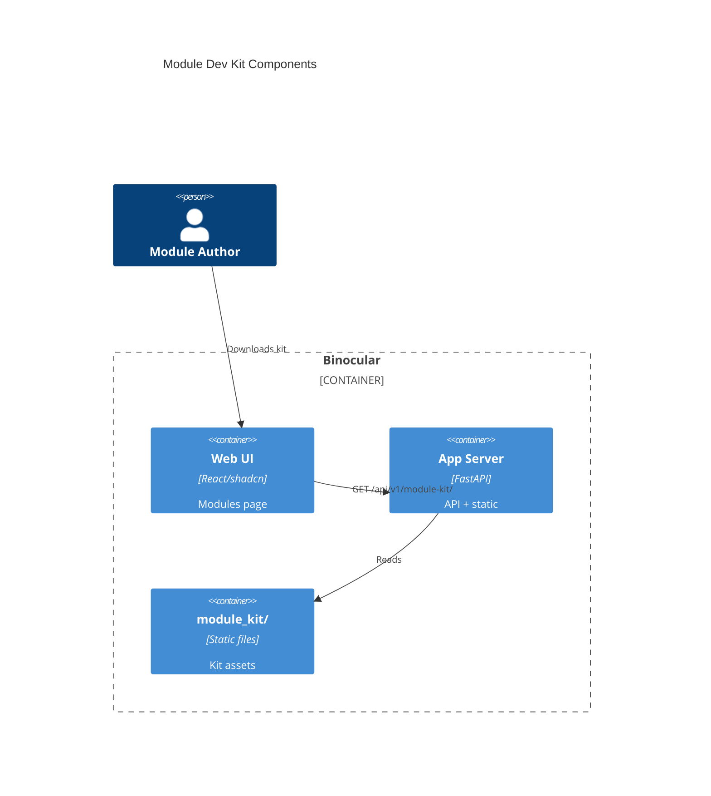

# Implementation Plan: Module Dev Kit & AI-Assisted Authoring

**Branch**: `00019-module-dev-kit-ai-assisted-authoring` | **Date**: 2026-06-11 | **Spec**: [spec.md](spec.md)

## Summary

**Goal**: Deliver a downloadable AI Module Kit and in-app authoring guidance to enable module creation with zero prior codebase knowledge.
**Approach**: Static files served by a new FastAPI route, collapsible guidance UI component on the Modules page, shared copy-errors utility.
**Key Constraint**: Kit files must accurately reflect the live V1 contract; no runtime dependencies.

## Technical Context

**Language/Version**: Python 3.13 (backend); TypeScript 5.x / React 19 (frontend)
**Primary Dependencies**: FastAPI, Pydantic (backend); React, Vite, Tailwind CSS 4.x, shadcn/ui (frontend)
**Storage**: N/A — static file serving only
**Testing**: pytest + httpx.AsyncClient (backend); Vitest + React Testing Library (frontend)
**Target Platform**: Linux Docker container (python:3.13-slim), single port 8000
**Project Type**: web
**Project Mode**: brownfield
**Performance Goals**: N/A — static file serving
**Constraints**: Static files bundled in backend package; no external deps; no runtime state
**Scale/Scope**: Single-user; kit files < 50KB total

## Instructions Check

*GATE: Must pass before Phase 0 research. Re-check after Phase 1 design.*

| Principle | Status | Evidence |
|-----------|--------|----------|
| I. Honest Failure | PASS | Static file serving; 404 for missing files |
| II. Polite by Default | PASS | No outbound scraping |
| III. Data Ownership & Self-Containment | PASS | Static files in backend package; no external deps |
| IV. Least-Privilege & Explicit Trust Boundary | PASS | Kit docs reference trust boundary |
| V. Type Safety & Correctness-First | PASS | mypy --strict, tsc strict |
| VI. Set-and-Forget Reliability | PASS | Static files; no state to corrupt |
| VII. Agent Output Style | N/A | |

## Architecture



## Architecture Decisions

| ID | Decision | Options Considered | Chosen | Rationale |
|----|----------|--------------------|--------|-----------|
| AD-001 | Kit file storage location | Backend package dir / Separate volume / Database | Backend package dir (`module_kit/`) | Files are static, ship with code; no persistence needed. See ADR-0001. |
| AD-002 | Kit serving mechanism | FastAPI StaticFiles mount / Custom route with JSON listing | Custom route with JSON listing + individual file serving | JSON listing enables UI to dynamically render download links; StaticFiles lacks listing. |
| AD-003 | ZIP download approach | Server-side ZIP generation / Client-side ZIP via JSZip / No ZIP | Client-side ZIP via JSZip | Avoids backend dependency; keeps backend simple. ZIP is convenience, not primary path. |

## Data Model Summary

N/A — no persistent data

## API Surface Summary

| Method | Path | Purpose | Auth | Req/Res Types |
|--------|------|---------|------|---------------|
| GET | `/api/v1/module-kit/` | List available kit files | None (trusted LAN) | `→ KitFileListResponse` |
| GET | `/api/v1/module-kit/{filename}` | Download individual kit file | None | `→ FileResponse` |

**Endpoint Details**:

`GET /api/v1/module-kit/`:
```json
{
  "files": [
    { "name": "STARTER_TEMPLATE.py", "description": "Annotated contract skeleton", "size_bytes": 1234, "url": "/api/v1/module-kit/STARTER_TEMPLATE.py" },
    { "name": "EXAMPLE_MODULE.py", "description": "Working example (Sony Alpha)", "size_bytes": 5678, "url": "/api/v1/module-kit/EXAMPLE_MODULE.py" },
    { "name": "AI_INSTRUCTIONS.md", "description": "Structured AI authoring guide", "size_bytes": 9012, "url": "/api/v1/module-kit/AI_INSTRUCTIONS.md" },
    { "name": "CONTRACT_REFERENCE.md", "description": "V1 contract documentation", "size_bytes": 3456, "url": "/api/v1/module-kit/CONTRACT_REFERENCE.md" }
  ]
}
```

`GET /api/v1/module-kit/{filename}`: Returns raw file content with appropriate content type. 404 if file not found.

## Testing Strategy

| Tier | Tool | Scope | Mock Boundary | Install |
|------|------|-------|---------------|---------|
| Unit | pytest + httpx.AsyncClient | Kit listing endpoint, file serving, 404 handling | Filesystem (uses real kit files) | configured |
| Unit | Vitest + RTL | ModuleGuidanceSection rendering, download links, copyErrorsForAI utility | API responses mocked | configured |
| Integration | pytest | Full request cycle: list → download → verify content | None | configured |
| Security | N/A | No new attack surface — static file serving on trusted LAN | — | — |
| Coverage | pytest-cov, vitest --coverage | ≥80% on new backend routes and frontend components | — | configured |

## Error Handling Strategy

| Error Category | Pattern | Response | Retry |
|----------------|---------|----------|-------|
| File not found | fail-fast | 404 + `{"detail": "Kit file not found: {filename}"}` | no |
| Kit dir missing | fail-fast | 500 + `{"detail": "Module kit directory not found"}` | no |

## Risk Mitigation

| Risk (from spec) | Likelihood | Impact | Mitigation | Owner |
|-------------------|------------|--------|------------|-------|
| Contract-documentation drift | Low | Medium | Derive CONTRACT_REFERENCE.md content from contract.py docstrings; EXAMPLE_MODULE.py is a simplified Sony Alpha | Backend module_kit |
| AI instruction effectiveness | Medium | Low | Test with at least one AI coding assistant during QC; iterate on instruction structure | Kit content |

## Requirement Coverage Map

| Req ID | Component(s) | File Path(s) | Notes |
|--------|--------------|--------------|-------|
| FR-001 | Module Kit route | `backend/src/binocular/routes/module_kit.py` | FastAPI router with listing + file serving |
| FR-002 | Starter template | `backend/src/binocular/module_kit/STARTER_TEMPLATE.py` | Annotated V1 contract skeleton |
| FR-003 | Example module | `backend/src/binocular/module_kit/EXAMPLE_MODULE.py` | Simplified Sony Alpha with comments |
| FR-004 | AI instructions | `backend/src/binocular/module_kit/AI_INSTRUCTIONS.md` | Structured prompting guide |
| FR-005 | Guidance section | `frontend/src/components/modules/ModuleGuidanceSection.tsx` | Collapsible accordion with steps |
| FR-006 | Copy utility | `frontend/src/lib/copy-errors-for-ai.ts` | Extract from ModuleUploadForm |
| FR-007 | Test harness docs | `backend/src/binocular/module_kit/AI_INSTRUCTIONS.md` | Included in AI instructions |
| FR-008 | Kit listing endpoint | `backend/src/binocular/routes/module_kit.py` | JSON response with file metadata |
| FR-009 | File download endpoint | `backend/src/binocular/routes/module_kit.py` | FileResponse for individual files |
| FR-010 | Responsive guidance | `frontend/src/components/modules/ModuleGuidanceSection.tsx` | Tailwind responsive classes |

## Project Structure

### Source Code

```text
+ backend/src/binocular/module_kit/                    # Kit static files directory
+ backend/src/binocular/module_kit/__init__.py          # Package init
+ backend/src/binocular/module_kit/STARTER_TEMPLATE.py  # Annotated contract skeleton
+ backend/src/binocular/module_kit/EXAMPLE_MODULE.py    # Simplified Sony Alpha example
+ backend/src/binocular/module_kit/AI_INSTRUCTIONS.md   # Structured AI authoring guide
+ backend/src/binocular/module_kit/CONTRACT_REFERENCE.md # V1 contract documentation
+ backend/src/binocular/routes/module_kit.py            # Kit API routes
+ backend/tests/test_module_kit.py                      # Backend tests
+ frontend/src/lib/copy-errors-for-ai.ts                # Extracted copy utility
+ frontend/src/components/modules/ModuleGuidanceSection.tsx # Guidance UI component
~ frontend/src/pages/modules.tsx                        # Add guidance section
~ backend/src/binocular/routes/__init__.py              # Register kit router
```

**Brownfield Notes**:
- **Patterns to reuse**: Router registration in `routes/__init__.py`; existing `ModuleUploadForm` for copy-errors pattern; `Card`/`Button` shadcn/ui components
- **Tests to extend**: `backend/tests/` pytest structure; `frontend/src/pages/modules.test.tsx`
- **Naming conventions**: snake_case for Python files/modules; PascalCase for React components; kebab-case for TS utility files

## Implementation Hints

- **[HINT-001]** Order: Create kit static files before the route, so endpoint tests have real files to serve.
- **[HINT-002]** Gotcha: EXAMPLE_MODULE.py must be a simplified, well-commented version of Sony Alpha — not a copy. Strip the complex bracket-matching parser; keep the contract skeleton clear.
- **[HINT-003]** Constraint: The `copyErrorsForAI` extraction from `ModuleUploadForm.tsx` must preserve the existing inline behavior — the upload form should import the extracted utility.
- **[HINT-004]** Gotcha: `FileResponse` needs explicit `media_type` — use `text/x-python` for `.py` files and `text/markdown` for `.md` files to trigger download vs. display correctly.
- **[HINT-005]** Order: Register the module-kit router in `routes/__init__.py` after creating the route file. Follow existing router registration pattern.
