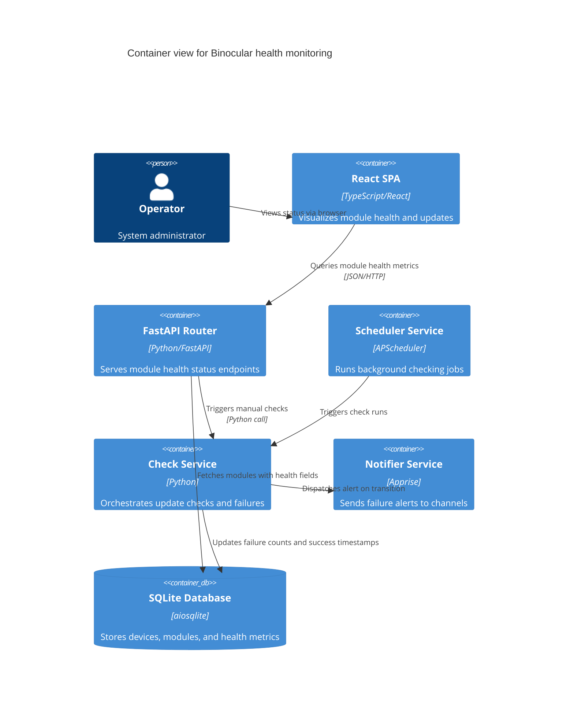

# Implementation Plan: Official Module Health Monitoring

**Branch**: `00020-official-module-health-monitoring` | **Date**: 2026-06-11 | **Spec**: [spec.md](spec.md)

## Summary

**Goal**: Enable tracking of consecutive scraping failures and last success time for official modules, displaying warnings in UI and alerting via notifications.  
**Approach**: Extend modules table via schema migration, update CheckService to manage failure counts/timestamps on device check execution, expose health metrics in API response, and add frontend indicators.  
**Key Constraint**: Only track health status for official modules (`is_official = 1`).

## Technical Context

**Language/Version**: Python 3.13  
**Primary Dependencies**: FastAPI, aiosqlite, pydantic, pydantic-settings, apprise  
**Storage**: SQLite  
**Testing**: pytest, pytest-asyncio, pytest-cov  
**Target Platform**: Linux server  
**Project Type**: web  
**Project Mode**: brownfield  
**Performance Goals**: N/A  
**Constraints**: <200ms p95 API response time  
**Scale/Scope**: ~50 modules, ~100 devices  

## Instructions Check

*GATE: Must pass before Phase 0 research. Re-check after Phase 1 design.*

- **Rule 1**: Store Feature Workspace artifacts in `specs/<feature-folder>/` -> PASS (Target matches `specs/00020-official-module-health-monitoring/`).
- **Rule 2**: Enforce the lifecycle order strictly -> PASS (Gate and Specify phases completed).
- **Rule 3**: All checklist items must be complete or skipped -> PASS (Checklist phase is next).

## Architecture



## Architecture Decisions

Feature-local tradeoffs only. Project-wide architectural decisions belong in standalone ADRs under `specs/adrs/` — reference them by ID (e.g., "See ADR-0001") instead of duplicating here.

| ID | Decision | Options Considered | Chosen | Rationale |
|----|----------|--------------------|--------|-----------|
| AD-001 | Where to increment failure counter | Inside CheckService check_device / Inside SchedulerService | Inside CheckService check_device | Ensure manual check runs also trigger failure tracking and counter updates. |
| AD-002 | Alert dispatch threshold | Send alert on every failure / Send alert only when threshold is crossed | Send alert only when threshold is crossed | Avoid notification fatigue by only notifying on transition from healthy to failing state. |

## Data Model Summary

| Entity | Key Fields | Relationships | Notes |
|--------|------------|---------------|-------|
| Module | `consecutive_failures: int`, `last_success: str` | N/A | Added to track scraping failure history for official modules. |

**Detail**: [data-model.md](data-model.md)

## API Surface Summary

N/A — no new endpoints, existing endpoints extended to include `consecutive_failures` and `last_success` in `/api/v1/modules` and GET module details.

## Testing Strategy

| Tier | Tool | Scope | Mock Boundary | Install |
|------|------|-------|---------------|---------|
| Unit | pytest | CheckService counter increment, reset, and threshold logic. | ScrapeClient, Apprise | configured |
| Integration | pytest | FastAPI routes for modules showing health fields, DB migration execution. | ScrapeClient | configured |
| Security | pip-audit | Backend dependencies vulnerability scanning. | — | configured |
| Coverage | pytest-cov | CheckService coverage validation. | — | configured |

## Error Handling Strategy

| Error Category | Pattern | Response | Retry |
|----------------|---------|----------|-------|
| DB update failure | Fail-fast | Log error, raise internal exception | No |
| Apprise alert failure | Fail-safe | Log warning, proceed without throwing | No |

## Integration Points

| Spec Reference | System/Service | Technical Approach | Contract |
|----------------|----------------|--------------------|----------|
| FR-006 | Apprise (NotifierService) | Invoke `NotifierService.send_notification` when threshold is reached | `title: str`, `body: str` -> returns boolean |

## Risk Mitigation

| Risk (from spec) | Likelihood | Impact | Mitigation | Owner |
|-------------------|------------|--------|------------|-------|
| Notification Fatigue | Medium | Medium | Dispatch notifications exactly once when consecutive failures hit the threshold; do not repeat alerts for subsequent failures until reset. | CheckService |

## Requirement Coverage Map

| Req ID | Component(s) | File Path(s) | Notes |
|--------|--------------|--------------|-------|
| FR-001 | CheckService, ModuleRepository | `backend/src/binocular/services/checks.py`, `backend/src/binocular/extensions/repository.py` | Add `consecutive_failures` column to modules, track in DB. |
| FR-002 | CheckService, ModuleRepository | `backend/src/binocular/services/checks.py`, `backend/src/binocular/extensions/repository.py` | Track last check success time. |
| FR-003 | Settings | `backend/src/binocular/config.py` | Add `module_health_threshold` settings key. |
| FR-004 | CheckService | `backend/src/binocular/services/checks.py` | Reset `consecutive_failures` to 0 on success. |
| FR-005 | Frontend modules component | `frontend/src/` components | Expose in UI on module card. |
| FR-006 | CheckService, NotifierService | `backend/src/binocular/services/checks.py` | Trigger notification when threshold reached. |

## Project Structure

### Source Code

```text
~ backend/src/binocular/config.py
~ backend/src/binocular/services/checks.py
~ backend/src/binocular/extensions/repository.py
+ backend/src/binocular/db/migrations/0007_module_health.sql
~ frontend/src/types/module.ts
~ frontend/src/components/modules/ModuleCard.tsx
```

**Patterns to reuse**: aiosqlite repository pattern (`ModuleRepository`), settings loading via Pydantic, NotifierService dispatch.  
**Tests to extend**: `backend/tests/services/test_checks.py`, `backend/tests/extensions/test_repository.py`.  
**Naming conventions**: Snake case in Python, camelCase in React/TypeScript.  

## Implementation Hints

- **[HINT-001]** Order: Make database migration first, verify schema runs, then update Python backend models, then implement logic.
- **[HINT-002]** Gotcha: Ensure only official modules are updated with failure counts, non-official modules remain unaffected.
- **[HINT-003]** Constraint: Do not trigger apprise alerts if notifier settings are not configured/empty.
