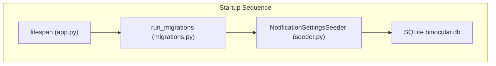

# Technical Plan: Environment-Based Notification Settings

## Technical Context

- **Language/Version**: Python 3.13
- **Primary Dependencies**: FastAPI, Pydantic, pydantic-settings, aiosqlite, Apprise
- **Storage**: SQLite (`notification_channels` table)
- **Testing**: pytest, pytest-asyncio
- **Target Platform**: Linux Docker container (`python:3.13-slim`)
- **Project Type**: Web application backend
- **Performance Goals**: Near-instantaneous startup settings loading and database seeding (< 100ms overhead)
- **Constraints**: No database ORM, must work with zero-config default settings, must support standard container environment variables and secrets file-based loading
- **Scale/Scope**: System-level container startup configurations
- **Project Mode**: Brownfield (modifying existing configuration and database initialization logic)

## Architecture

At startup, the FastAPI lifespan event triggers after database migrations have completed. The lifespan function invokes the settings seeding logic to read active environment configurations and upsert/seed the corresponding notification channel records in the SQLite database.



### Architecture Decisions

| Decision ID | Title | Status | Rationale | Links |
|-------------|-------|--------|-----------|-------|
| ADR-0010 | Environment-Variable Based Configuration and Database Seeding | accepted | Declares startup sync of env variables into the persistent SQLite notification settings. | [ADR-0010](../adrs/0010-environment-variable-based-configuration-and-database-seeding.md) |

## Data Model Summary

N/A — no persistent data schema changes (reuses existing `notification_channels` table).

## API Surface Summary

N/A — no new API surface endpoints (reuses existing REST endpoints under `/api/v1/notifications`).

## Source Code Structure

Modifying the backend code:

```diff
 backend/src/binocular/
+  services/settings_seeder.py   # New seeder service to sync env vars to SQLite notification_channels
   config.py                     # Modify to add new environment fields, aliases, and secret file loading
   app.py                        # Modify lifespan startup hook to run the new settings seeder
```

### Brownfield Notes
- Existing [config.py](file:///Users/attila/git/Binocular/backend/src/binocular/config.py) already has a `Settings` class built with Pydantic Settings and a custom validator `load_secret_files`. We will expand it to include SMTP/Gotify parameters and update the validator.
- Existing [app.py](file:///Users/attila/git/Binocular/backend/src/binocular/app.py) has a `lifespan` function that we will modify to call the new seeder after running migrations.

## Testing Strategy

| Tier | Tool | Scope | Mock Boundary | Install |
|------|------|-------|---------------|---------|
| Unit | pytest | Settings parsing and secret file resolution logic | File system mocks for `_FILE` files | configured |
| Integration | pytest | Seeding settings into `notification_channels` on lifespan startup | Mock database session | configured |
| Security | ruff | Static analysis checking for hardcoded credentials / vulnerabilities | N/A | configured |
| Coverage | pytest-cov | Verifying test coverage target (>80%) for settings and seeder code | N/A | configured |

## Error Handling Strategy

| Scenario | Handling Approach | Log/Alert Signal |
|----------|-------------------|------------------|
| Unreadable secret file (from `_FILE` environment var) | Raise `ValueError` at startup causing the container to halt early | `ValueError: Could not read secret file...` |
| SQLite locking/contention during seeding | Wrap startup seeder transaction in a connection block with `busy_timeout` | `db_lock_warning` |
| Invalid SMTP port format (non-integer string in env) | Pydantic validation error raised at startup, halting the container | `ValidationError` |

## Integration Points

| Integration Point | Technical Approach |
|-------------------|--------------------|
| Apprise notification configurations | Map database configuration fields so they generate valid `mailto://` and `gotify://` connection URLs inside `NotifierService`. |

## Risk Mitigation

| Risk | Likelihood/Impact | Mitigation |
|------|-------------------|------------|
| Environmental vars overwrite database configs unintendedly | Medium/Medium | Only update channel settings if the environment variable is explicitly non-empty. UI alerts the user of settings precedence. |

## Requirement Coverage Map

| Requirement ID | Component | File Path |
|----------------|-----------|-----------|
| TR-001 | Settings Model | [config.py](file:///Users/attila/git/Binocular/backend/src/binocular/config.py) |
| TR-002 | Secrets Validator | [config.py](file:///Users/attila/git/Binocular/backend/src/binocular/config.py) |
| TR-003 | Lifespan hook | [app.py](file:///Users/attila/git/Binocular/backend/src/binocular/app.py) |
| TR-004 | Settings Seeder | `backend/src/binocular/services/settings_seeder.py` |
| TR-005 | Settings Seeder | `backend/src/binocular/services/settings_seeder.py` |

## Implementation Hints

- **[HINT-001]** Alias choices: Use Pydantic's `AliasChoices` to bind fields like `smtp_password` to both `BINOCULAR_SMTP_PASSWORD` (prefixed) and `SMTP_PASSWORD` (non-prefixed).
- **[HINT-002]** Seeder idempotency: The seeding service must only run once at startup and overwrite existing DB records if env values are active, keeping them up-to-date with container variables.
