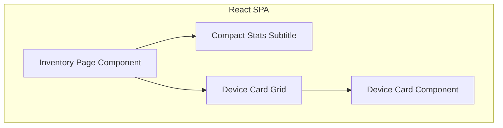

# Implementation Plan: Compact Inventory Subtitle

**Branch**: `00022-compact-inventory-subtitle` | **Date**: 2026-06-12 | **Spec**: [spec.md](file:///Users/attila/git/Binocular/specs/00022-compact-inventory-subtitle/spec.md)

## Summary

**Goal**: Convert the separate card-based stat panels on the Inventory page into a single, compact subtitle under the page header.  
**Approach**: Modify `inventory.tsx` to group stats into a single text-based subtitle row and remove the grid containing the `StatCard` components.  
**Key Constraint**: Keep the UI clean, responsive, and aligned with standard text formatting while preserving correct count pluralization.

## Technical Context

**Language/Version**: TypeScript 5.x / React 19  
**Primary Dependencies**: React, Vite, Lucide React, Tailwind CSS 4.x  
**Storage**: N/A  
**Testing**: Vitest, React Testing Library  
**Target Platform**: Browser  
**Project Type**: web  
**Project Mode**: brownfield  
**Performance Goals**: N/A  
**Constraints**: Zero layout shift and clean alignment.  
**Scale/Scope**: Single file frontend layout change.

## Instructions Check

*GATE: Must pass before Phase 0 research. Re-check after Phase 1 design.*

- **Type Safety & Correctness-First**: The modified frontend code MUST pass `tsc` in strict mode. Run validation/compilation after changes.
- **Agent Output Style**: All progress updates must be concise and fact-based.

## Architecture



## Architecture Decisions

Feature-local tradeoffs only. Project-wide architectural decisions belong in standalone ADRs under `specs/adrs/` — reference them by ID (e.g., "See ADR-0001") instead of duplicating here.

| ID | Decision | Options Considered | Chosen | Rationale |
|----|----------|--------------------|--------|-----------|
| AD-001 | Subtitle Format | Bullet-separated line vs flex layout with icons | Bullet-separated line | Extremely lightweight, takes minimal vertical space, and looks clean under the title. |

## Data Model Summary

N/A — no persistent data

## API Surface Summary

N/A — no API surface

## Testing Strategy

| Tier | Tool | Scope | Mock Boundary | Install |
|------|------|-------|---------------|---------|
| Unit | Vitest + RTL | Test that inventory page renders with correct subtitle text and doesn't show stat cards | N/A | configured |
| Integration | Vitest | Test state transitions and check actions | N/A | configured |
| Security | N/A | - | - | - |
| Coverage | Vitest | Test coverage remains above 80% | - | configured |

## Error Handling Strategy

N/A — simple layout change with no new API interaction.

## Integration Points

None.

## Risk Mitigation

None.

## Requirement Coverage Map

| Req ID | Component(s) | File Path(s) | Notes |
|--------|--------------|--------------|-------|
| FR-001 | InventoryPage | [inventory.tsx](file:///Users/attila/git/Binocular/frontend/src/pages/inventory.tsx) | Render subtitle under page title |
| FR-002 | InventoryPage | [inventory.tsx](file:///Users/attila/git/Binocular/frontend/src/pages/inventory.tsx) | Display total devices, updates, and checked counts |
| FR-003 | InventoryPage | [inventory.tsx](file:///Users/attila/git/Binocular/frontend/src/pages/inventory.tsx) | Hide subtitle when empty or loading |
| FR-004 | InventoryPage | [inventory.tsx](file:///Users/attila/git/Binocular/frontend/src/pages/inventory.tsx) | Remove three StatCard components |

## Project Structure

### Source Code

```text
frontend/src/
  ~ pages/
    ~ inventory.tsx
```

**Patterns to reuse**: Existing Tailwind typography classes (e.g., `text-sm text-muted-foreground`).  
**Tests to extend**: Frontend unit tests for the Inventory page if they exist.  
**Naming conventions**: Keep camelCase.

## Implementation Hints

- **[HINT-001]** Pluralization: Make sure strings are correctly formatted (e.g., "1 device" vs "X devices", "1 update" vs "X updates").
