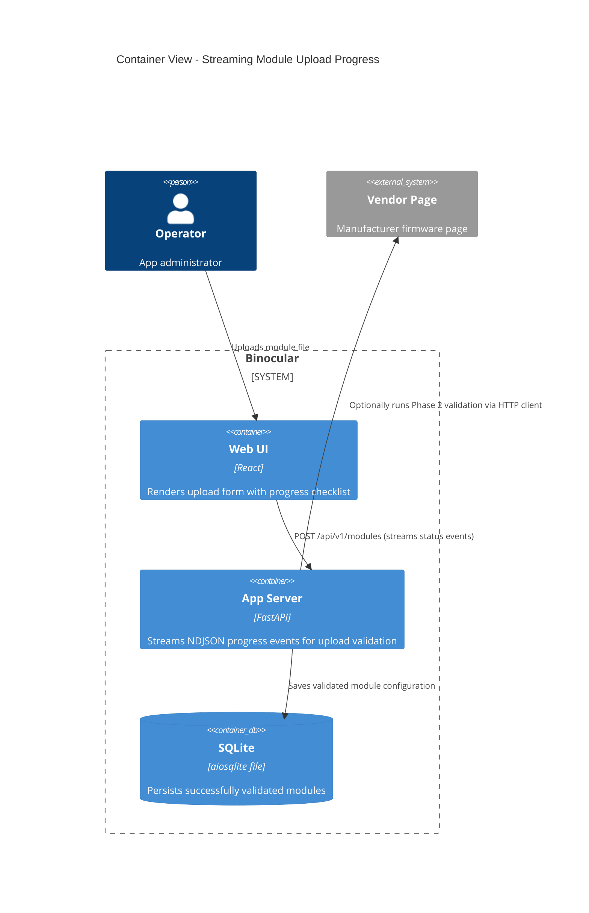

# Implementation Plan: Module Upload Progress Feedback

**Branch**: `00023-module-upload-progress-feedback` | **Date**: 2026-06-12 | **Spec**: [spec.md](spec.md)

## Summary

**Goal**: Provide visual progress reporting and step-by-step updates to the operator when uploading custom modules.  
**Approach**: Update the backend POST upload endpoint to return a chunked newline-delimited JSON stream of validation stages and final result, and update the frontend React form to read the stream and render progress checklists.  
**Key Constraint**: No external queues or message brokers — all validation and streaming must run within the existing FastAPI container monolith process.

## Technical Context

**Language/Version**: Python 3.13+, TypeScript 5.x / React 19  
**Primary Dependencies**: FastAPI, Uvicorn, aiosqlite, `@tanstack/react-query`  
**Storage**: N/A (no schema changes; uses existing `modules` and `schedules` tables)  
**Testing**: pytest + pytest-asyncio, Vitest + React Testing Library  
**Target Platform**: Linux Docker container (`python:3.13-slim`)  
**Project Type**: web  
**Project Mode**: brownfield  
**Performance Goals**: Stream milestones to UI in <100ms from execution completion.  
**Constraints**: Zero-config startup, offline LAN compatibility, non-root execution.  
**Scale/Scope**: Support single-user custom module uploads.

## Instructions Check

*GATE: Must pass before Phase 0 research. Re-check after Phase 1 design.*

- **Single-process Monolith**: All streaming and validation logic runs in-process inside the FastAPI app.
- **Non-root Container**: No filesystem or process operations require root permissions.
- **No External DB/Broker**: NDJSON stream runs natively over the HTTP response.
- **Linting & Types**: Mypy strict type checking and frontend biome/tsc compilation must pass.

## Architecture



## Architecture Decisions

Feature-local tradeoffs only. Project-wide architectural decisions belong in standalone ADRs under `specs/adrs/` — reference them by ID (e.g., "See ADR-0011") instead of duplicating here.

| ID | Decision | Options Considered | Chosen | Rationale |
|----|----------|--------------------|--------|-----------|
| AD-001 | Response streaming | Server-Sent Events (SSE) vs NDJSON Chunked Stream | NDJSON Chunked Stream | Simpler upload flow: browser can use a single `fetch()` POST request to upload the file and read the streaming response body stream chunk-by-chunk. |

## Data Model Summary

N/A — no persistent data

## API Surface Summary

| Method | Path | Purpose | Auth | Req/Res Types |
|--------|------|---------|------|---------------|
| POST | `/api/v1/modules` | Upload module and stream validation progress events | Basic Auth (optional) | Request: `multipart/form-data` (file)<br>Response: `application/x-ndjson` (event chunks stream) |

**Detail**: `specs/00023-module-upload-progress-feedback/contracts/`

## Testing Strategy

| Tier | Tool | Scope | Mock Boundary | Install |
|------|------|-------|---------------|---------|
| Unit | pytest | Generator functions yielded stream events | Module validation functions | configured |
| Integration | pytest | FastAPI TestClient chunk-by-chunk request/response matching | Mock network for Phase 2 validation | configured |
| Security | Ruff / Bandit | Verify AST loader logic safety checks | — | configured |
| Coverage | pytest-cov | Ensure 100% coverage on route generator path | — | configured |

## Error Handling Strategy

| Error Category | Pattern | Response | Retry |
|----------------|---------|----------|-------|
| Validation Failure | fail-fast | NDJSON `failed` event chunk with details, close connection | no |
| Client disconnect | detect context abort | Terminate validation execution gracefully | no |

## Integration Points

| Spec Reference | System/Service | Technical Approach | Contract |
|----------------|----------------|--------------------|----------|
| FR-003 / FR-004 | POST `/api/v1/modules` | Return `StreamingResponse` yielding stringified NDJSON | [contracts/api.md](contracts/api.md) |

## Risk Mitigation

| Risk (from spec) | Likelihood | Impact | Mitigation | Owner |
|-------------------|------------|--------|------------|-------|
| Proxy Buffering | medium | high | Add `X-Accel-Buffering: no` header; set `Content-Type: application/x-ndjson` or `text/plain` | API Routes |

## Requirement Coverage Map

| Req ID | Component(s) | File Path(s) | Notes |
|--------|--------------|--------------|-------|
| FR-001 | UI Checklist Component | `frontend/src/components/modules/ModuleUploadForm.tsx` | Reset and initialize checklists |
| FR-002 | Stream Reader / UI | `frontend/src/components/modules/ModuleUploadForm.tsx` | Decode stream body chunks |
| FR-003 | API Endpoint Stream | `backend/src/binocular/routes/modules.py` | Change handler to return a generator |
| FR-004 | Endpoint Error handling | `backend/src/binocular/routes/modules.py` | Catch validation errors, stream final chunk |
| FR-005 | UI error state | `frontend/src/components/modules/ModuleUploadForm.tsx` | Display validation phase errors |

## Project Structure

### Source Code

```text
~ backend/src/binocular/routes/modules.py
~ frontend/src/components/modules/ModuleUploadForm.tsx
~ frontend/src/lib/api.ts
~ frontend/src/hooks/use-modules.ts
+ backend/tests/routes/test_modules_streaming.py
```

**Patterns to reuse**: Standard backend TestClient routes tests, React hooks pattern in use-modules.ts.  
**Tests to extend**: Add `backend/tests/routes/test_modules_streaming.py` to cover chunked validation scenarios.  
**Naming conventions**: Keep camelCase in React code, snake_case in FastAPI generator variables.

## Implementation Hints

- **[HINT-001]** FastAPI: Use `StreamingResponse` from `fastapi.responses` wrapping a generator `async def event_generator()`.
- **[HINT-002]** Streaming JSON formatting: Ensure each chunk ends with exactly one `\n`.
- **[HINT-003]** Frontend: Consume the stream body reader using `response.body.getReader()`. Decode using `new TextDecoder("utf-8")`.
- **[HINT-004]** Hook adjustments: Adjust `useUploadModule` mutation to support stream parsing callbacks (or refactor mutation logic to handle updates).

## Compliance Check

- **Status**: PASS
- **Review Date**: 2026-06-12
- **Auditor**: Autopilot Policy Auditor
- **Findings**: The technical plan adheres to all system constraints: no external messaging queues are added, all streaming operates in-process over standard HTTP chunked encoding, and lints/types are validated.
