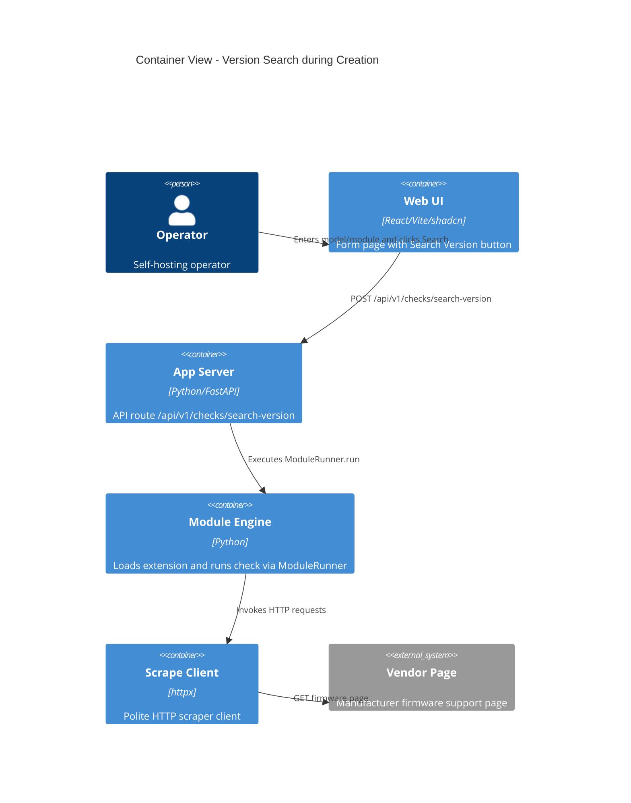

# Implementation Plan: On-Demand Version Search during Device Creation

**Branch**: `00024-on-demand-version-search-during-device-creation` | **Date**: 2026-06-16 | **Spec**: [spec.md](spec.md)

## Summary

**Goal**: Allow operators to query and auto-populate a device's current version on the creation form using its module and model.  
**Approach**: Expose a REST endpoint that runs the module check statelessly on-demand, and add a dynamically enabled "Search Version" button in the frontend form.  
**Key Constraint**: The version search MUST NOT write to the database, log checks in the activity log, or trigger any notification dispatch.

## Technical Context

**Language/Version**: Python 3.13+, TypeScript 5.x / React 19  
**Primary Dependencies**: FastAPI, Uvicorn, React, Tailwind CSS 4.x, shadcn/ui  
**Storage**: N/A (stateless check, database is bypassed)  
**Testing**: pytest (backend), Vitest + React Testing Library (frontend)  
**Target Platform**: Linux Docker container  
**Project Type**: web  
**Project Mode**: brownfield  
**Performance Goals**: Responsive UI execution (scraper timeout cap at 30s)  
**Constraints**: Zero database mutations or notification dispatches during ad-hoc version checking  
**Scale/Scope**: Form integration only

## Instructions Check

*GATE: Must pass before Phase 0 research. Re-check after Phase 1 design.*

- **Principle I: Honest Failure**: Search failure or no version returned must be propagated back as a visible error (HTTP 400).
- **Principle II: Polite by Default**: Check execution must utilize the central `ScrapeClient` provided by the host.
- **Principle V: Type Safety**: Python code must satisfy `mypy --strict` and frontend must pass strict `tsc` checks.
- **Source Code Layout**: Source files reside under `backend/src/` and `frontend/src/`.

## Architecture



## Architecture Decisions

| ID | Decision | Options Considered | Chosen | Rationale |
|---|---|---|---|---|
| AD-001 | API Endpoint Path | `/api/v1/checks/search-version` / `/api/v1/modules/{id}/search-version` | `/api/v1/checks/search-version` | Aligns with checks routing structure because it performs a check run. |
| AD-002 | Stateless Check Logic | Create dummy device in DB / Add stateless logic to CheckService | Add stateless logic to CheckService | Avoids database writes, activity log side-effects, and email/Gotify alerts. |

## Data Model Summary

N/A — no persistent data

## API Surface Summary

| Method | Path | Purpose | Auth | Req/Res Types |
|---|---|---|---|---|
| POST | `/api/v1/checks/search-version` | Perform a firmware version search for a model using a module | None / Basic Auth | Request: `SearchVersionRequest`<br>Response: `SearchVersionResponse` |

**Detail**: [contracts/openapi.yaml](contracts/openapi.yaml)

## Testing Strategy

| Tier | Tool | Scope | Mock Boundary | Install |
|---|---|---|---|---|
| Unit | pytest | `CheckService.search_version` logic | Mock ModuleRunner and ModuleRepository | configured |
| Integration | pytest | POST `/api/v1/checks/search-version` route | Mock runner execution | configured |
| Unit | Vitest | `DeviceForm` button enabling/disabling states | Mock API fetch calls | configured |

## Error Handling Strategy

| Error Category | Pattern | Response | Retry |
|---|---|---|---|
| Validation / Module Missing | Fail-fast | HTTP 400 + detail message | No |
| Module execution timeout | Catch exception / timeout | HTTP 400 + "Check timed out" | No |
| Empty Scraper Result | Check response and fail-fast | HTTP 400 + "No version found" | No |

## Integration Points

| Spec Reference | System/Service | Technical Approach | Contract |
|---|---|---|---|
| FR-001 / FR-002 | Module Runner | Invoke `runner.run()` using ScrapeClient | [plan.md](plan.md) |

## Risk Mitigation

| Risk (from spec) | Likelihood | Impact | Mitigation | Owner |
|---|---|---|---|---|
| Scraper Rate Limiting | Medium | Low | Polite ScrapeClient is injected; UI disables button during active check | Frontend & Backend |
| Hanging Web Requests | Low | Medium | Enforce check timeout limit inside ModuleRunner | Backend |

## Requirement Coverage Map

| Req ID | Component(s) | File Path(s) | Notes |
|---|---|---|---|
| FR-001 | API Endpoint | `backend/src/binocular/routes/checks.py` | Expose route and map request |
| FR-002 | Search Service logic | `backend/src/binocular/services/checks.py` | Load module and run runner |
| FR-003 | Stateless constraint | `backend/src/binocular/services/checks.py` | No database writes or notifications |
| FR-004 | Form Button | `frontend/src/components/inventory/device-form.tsx` | UI button next to Module Select |
| FR-005 | Form Button state | `frontend/src/components/inventory/device-form.tsx` | Disable unless module & model set |
| FR-006 | Populate form field | `frontend/src/components/inventory/device-form.tsx` | Set `currentVersion` state on success |
| FR-007 | Display error message | `frontend/src/components/inventory/device-form.tsx` | Display toast or form error text |

## Project Structure

### Source Code

```text
  backend/src/binocular/
    routes/
~     checks.py
    services/
~     checks.py
  frontend/src/
    components/
      inventory/
~       device-form.tsx
  backend/tests/
    routes/
~     test_checks_routes.py
```

**Patterns to reuse**: CheckService instance retrieval via dependencies; mock patching in pytest routes.  
**Tests to extend**: Add `test_search_version_success` and `test_search_version_failure` inside `backend/tests/routes/test_checks_routes.py`.  
**Naming conventions**: standard PEP8/FastAPI snake_case routes, camelCase props for React component state.

## Implementation Hints

- **[HINT-001]** Scraper HTTP client: Inject request's `app.state.scrape_client` to `CheckService` so that robots.txt and pacing are honored.
- **[HINT-002]** Input sanitization: Trim `model` name before running the scraper.
