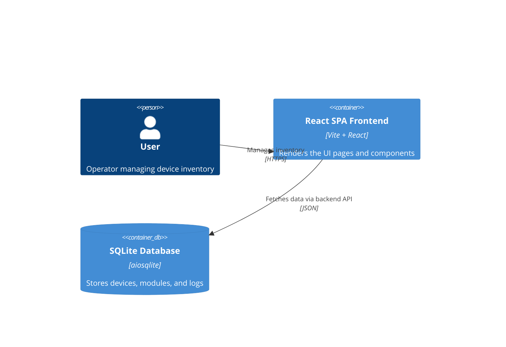

# Implementation Plan: Compact Device Inventory Layout

**Branch**: `00025-compact-device-inventory-layout` | **Date**: 2026-06-16 | **Spec**: [spec.md](spec.md)

## Summary

**Goal**: Remove the `device_type` badge and make the device card layout more compact on the Inventory page.  
**Approach**: Modify `device-card.tsx` to remove the badge rendering the derived `device_type` and adjust Tailwind classes (margins, paddings, text sizes) to improve information density.  
**Key Constraint**: The compact card design must remain responsive and render correctly across desktop and mobile viewports.

## Technical Context

**Language/Version**: TypeScript 5.x / React 19 on Node (frontend)  
**Primary Dependencies**: React, Vite, Tailwind CSS 4.x, shadcn/ui, Lucide React (frontend)  
**Storage**: N/A  
**Testing**: Vitest + React Testing Library (frontend)  
**Target Platform**: Linux server, modern web browsers  
**Project Type**: web  
**Project Mode**: brownfield  
**Performance Goals**: N/A  
**Constraints**: N/A  
**Scale/Scope**: Inventory page UI

## Instructions Check

*GATE: Must pass before Phase 0 research. Re-check after Phase 1 design.*

| Principle | Verdict | Notes |
|-----------|---------|-------|
| I. Honest Failure | N/A | UI layout change only. |
| II. Polite by Default | N/A | UI layout change only. |
| III. Data Ownership & Self-Containment | PASS | No changes to storage or external data dependencies. |
| IV. Least-Privilege & Explicit Trust Boundary | PASS | No change to privileges or code execution behavior. |
| V. Type Safety & Correctness-First | PASS | All UI component modifications are checked by strict static typing and Vitest tests. |
| VI. Set-and-Forget Reliability | PASS | No impact on background service scheduling or core stability. |

## Architecture



## Architecture Decisions

| ID | Decision | Options Considered | Chosen | Rationale |
|----|----------|--------------------|--------|-----------|
| AD-001 | Remove vs. Keep type badge | Keep and map vs. Remove badge | Remove badge | Avoids adding database schema overhead or fragile heuristics to resolve multi-type modules. |
| AD-002 | Card compact layout approach | Grid column reduction vs. Card container padding adjustment | Card container padding adjustment | Tighter container padding (`p-4` or `p-3`) and reduced margins allow cards to be more compact without breaking the responsive grid flow. |

## Data Model Summary

N/A — no persistent data

## API Surface Summary

N/A — no API surface

## Testing Strategy

| Tier | Tool | Scope | Mock Boundary | Install |
|------|------|-------|---------------|---------|
| Unit | Vitest | Test React rendering of compact DeviceCard component without crash | Render with mock device data | configured |
| Integration | Vitest | Verify card layout integration on the Inventory page | Mock hooks (`useModules`, `useDevices`) | configured |
| Security | Trivy | Scan container image for vulnerabilities | — | configured |
| Coverage | Vitest | Verify frontend coverage target is met | — | configured |

## Error Handling Strategy

N/A — UI presentation-only changes

## Integration Points

None.

## Risk Mitigation

| Risk (from spec) | Likelihood | Impact | Mitigation | Owner |
|-------------------|------------|--------|------------|-------|
| Long device names wrap awkwardly | Medium | Low | Use text truncation or standard wrapping classes to prevent text overflow. | frontend |

## Requirement Coverage Map

| Req ID | Component(s) | File Path(s) | Notes |
|--------|--------------|--------------|-------|
| FR-001 | DeviceCard | `frontend/src/components/inventory/device-card.tsx` | Delete the `<Badge>` element displaying `device_type`. |
| FR-002 | DeviceCard | `frontend/src/components/inventory/device-card.tsx` | Reduce paddings (e.g. CardContent, CardHeader padding from default/p-6 to p-4/p-3) and adjust layout classes. |

## Project Structure

### Source Code

```text
~ frontend/
  ~ src/
    ~ components/
      ~ inventory/
        ~ device-card.tsx
```

**Patterns to reuse**: Existing Tailwind CSS 4.x layout classes and shadcn/ui Card primitive overrides.  
**Tests to extend**: [inventory.test.tsx](file:///workspace/Binocular/frontend/src/pages/inventory.test.tsx) (verify card rendering states).  
**Naming conventions**: Follow existing TSX React components styling conventions.  

## Implementation Hints

- **[HINT-001]** UI Spacing: Check how CardContent and CardHeader components handle default padding in Tailwind CSS v4 / shadcn, and use custom Tailwind classes (`p-3`, `p-4`, etc.) to override defaults.

## Compliance Check

### Instructions Check Report
**Target**: specs/00025-compact-device-inventory-layout/plan.md
**Status**: PASS

| Principle | Verdict | Notes |
|-----------|---------|-------|
| I. Honest Failure | N/A | UI layout change only. |
| II. Polite by Default | N/A | UI layout change only. |
| III. Data Ownership & Self-Containment | PASS | No persistent storage or external data dependency changes. |
| IV. Least-Privilege & Explicit Trust Boundary | PASS | No changes to backend execution boundaries. |
| V. Type Safety & Correctness-First | PASS | Verified that frontend changes are covered by strict TypeScript compilation and Vitest. |
| VI. Set-and-Forget Reliability | PASS | Layout change does not impact background scheduler or server stability. |
| VII. Agent Output Style | PASS | Formatting matches project plan standard templates. |

**Violations**:
None.
