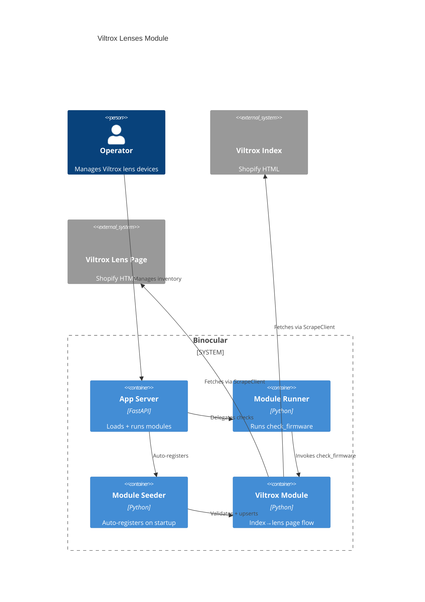

# Implementation Plan: E025 — Official Viltrox Lenses Module

**Branch**: `00026-official-viltrox-lenses-module` | **Date**: 2026-06-29 | **Spec**: [spec.md](spec.md)

## Summary

**Goal**: Ship an official Viltrox Lenses firmware-check module for Binocular's starter set, following the existing authoring contract (ADR-0005).  
**Approach**: Implement `check_firmware(url, model, http_client)` performing a two-step fetch (Viltrox index page → per-lens `/pages/<slug>` page) via the host-provided `ScrapeClient`, parse the `### Document Download` section, and return a contract-shaped dict with the top entry's `<lens name> V<version>`.  
**Key Constraint**: Companion app version (`Viltrox Lens V1.13 for Mac/Win`) must never be returned as `latest_version`; parsing is restricted to the per-lens page's `### Document Download` section.

## Technical Context

**Language/Version**: Python 3.13  
**Primary Dependencies**: BeautifulSoup4, aiosqlite, structlog, httpx (via injected `http_client`)  
**Storage**: N/A  
**Testing**: pytest + pytest-asyncio  
**Target Platform**: Linux Docker container (`python:3.13-slim`)  
**Project Type**: web  
**Project Mode**: brownfield  
**Performance Goals**: One index fetch + one lens page fetch per check, on the per-device schedule  
**Constraints**: Conforms to V1 module contract (ADR-0005); `mypy --strict` clean; Ruff clean; no direct HTTP imports  
**Scale/Scope**: Single official module for ~70 Viltrox lenses across 6 mount groups (FE / E / X / Z / M / DL)

## Instructions Check

*GATE: Must pass before Phase 0 research. Re-check after Phase 1 design.*

All `project-instructions.md` principles satisfied:

| Principle | Compliance |
|-----------|------------|
| Honest Failure (I) | Module raises typed `ValueError` (`network_error`, `parse_error`, `product_not_found`, `firmware_not_available`, `download_url_not_found`); failures surface via E020. |
| Polite by Default (II) | All HTTP via injected `http_client` (ScrapeClient enforces robots.txt, UA, rate limit, backoff). No direct `httpx`/`requests` imports. |
| Data Ownership (III) | No new storage or external dependency; seeder auto-discovers the new module. |
| Trust Boundary (IV) | Runs unsandboxed in-process — same boundary as the other official modules; no sandbox claim. |
| Type Safety (V) | `mypy --strict` clean; fixture-based zero-FP/FN correctness tests required. |
| Set-and-Forget (VI) | Per-invocation error boundary (E007); broken module cannot crash core process. |
| Source Layout (ENFORCE_SRC_ROOT) | Module at `backend/src/binocular/official_modules/viltrox_lenses.py`; tests at `backend/tests/`. |

## Architecture



## Architecture Decisions

Feature-local tradeoffs only. Project-wide decisions belong in standalone ADRs under `specs/adrs/`.

| ID | Decision | Chosen | Rationale |
|----|----------|--------|-----------|
| AD-001 | Two-step fetch (index → lens page) vs. cached/single-URL | Two-step | Index is the only authoritative source of per-lens URLs; operators configure by display name; per-check walk is bounded (one index + one lens page). |
| AD-002 | Section isolation to exclude companion app version | Restrict parser to `### Document Download` only | Companion app string appears outside that section; restricting the parser structurally prevents false positives. |
| AD-003 | Model key resolution: display name vs. page-slug | Display name primary, page-slug fallback | Page-slug fallback covers operators who record the URL slug instead of the display name. |
| AD-004 | Sync `check_firmware` over async `http_client` | `asyncio.new_event_loop` + `run_until_complete` in a `try/finally` | Matches existing pattern in `panasonic_lumix_lenses.py` / `godox_flashes.py`; preserves ScrapeClient enforcement. |

## Data Model Summary

N/A — no persistent data. The seeder auto-discovers the module on startup; the SQLite `modules` table schema is unchanged.

## API Surface Summary

N/A — no API surface. The module plugs into the existing module engine (E007) and reuses the existing `/api/v1/checks` and `/api/v1/checks/search-version` endpoints (per project-plan API Surfaces).

## Testing Strategy

| Tier | Tool | Scope | Mock Boundary | Install |
|------|------|-------|---------------|---------|
| Unit | pytest | `parse_index_entries`, `parse_lens_page_entries`, `find_lens_link`, model normalization, top-entry version extraction | HTML fixtures under `backend/tests/fixtures/viltrox_lenses/`, no network | configured |
| Integration | pytest | `check_firmware` end-to-end via `asyncio.to_thread` | `FakeScrapeClient` returns captured index + lens page HTML in order | configured |
| Security | Ruff | Static code scanning (no direct HTTP imports) | — | configured |
| Coverage | pytest-cov | ≥80% line coverage for the new module | — | configured |
| Type-check | mypy --strict | Strict type validation | — | configured |

## Error Handling Strategy

| Error Code | Trigger | Response |
|------------|---------|----------|
| `network_error` | ScrapeClient fails on index or lens page | `raise ValueError("network_error: ...")`; per-device schedule retries |
| `parse_error` | Index or lens page structure changed (no side menu, no `### Document Download` section) | `raise ValueError("parse_error: ...")`; E020 escalates consistent failures |
| `product_not_found` | Configured model not in index side menu | `raise ValueError("product_not_found: ...")` |
| `firmware_not_available` | Top entry exists with empty version | `raise ValueError("firmware_not_available: ...")` |
| `download_url_not_found` | Top entry has no download link | `raise ValueError("download_url_not_found: ...")`; lens page URL used as fallback when canonical |

All errors propagate through the module engine's per-invocation error boundary (E007) into the activity log (E015) and feed E020 on consistent failure.

## Integration Points

| Source | System/Service | Contract |
|--------|----------------|----------|
| ADR-0005 | Module Engine | `check_firmware(url, model, http_client)`, `MODULE_VERSION`, `SUPPORTED_DEVICE_TYPE` |
| E005 / ADR-0006 | ScrapeClient (robots.txt, UA, rate limit, backoff) | `await http_client.get(url) -> Response` (called inside a thread-local `asyncio.new_event_loop`) |
| E007 | Module Loader (two-phase validation) | `ModuleLoader.load(module_path) -> LoadResult` |
| E016 | Module Seeder (auto-discovers `official_modules/`) | Upserts module record idempotently |
| E013 / ADR-0007 | Scheduler + Notifier | Per-device schedule; `NotifyService.dispatch` with `last_notified_version` dedup |
| E020 | Official Module Health Monitoring | Consistent failures surface in-app |

## Risk Mitigation

| Risk (from spec) | L | I | Mitigation |
|-------------------|---|---|------------|
| Page structure change (sidebar → JS widget, model names localized, side menu removed) | M | H | Restrict parsing to `### Document Download`; on index walk failure raise `parse_error`; E020 surfaces consistent failures in-app. |
| Inconsistent `V<version>` format (some entries omit leading `V` or use different separators) | L | M | Normalize `V1.03` and `1.03`; fixtures cover both forms; failures bubble up as `parse_error`. |
| Lens page with no active firmware (legacy model, empty section) | L | L | Return `firmware_not_available`; operator sees a clear "scrape failed" status. |

## Requirement Coverage Map

| Req ID | File Path(s) | Notes |
|--------|--------------|-------|
| FR-001 / FR-002 / FR-003 / FR-004 / FR-005 / FR-006 / FR-007 / FR-009 / FR-010 | `backend/src/binocular/official_modules/viltrox_lenses.py` | Single module file implements all module-level requirements: contract entry point, constants, two-step fetch, `### Document Download` parsing with companion app exclusion, typed errors, no direct HTTP imports, auto-discoverable. |
| FR-008 | `backend/tests/test_official_viltrox_lenses_module.py` + `backend/tests/fixtures/viltrox_lenses/` | Golden/fixture-based correctness tests against captured index + per-lens page fixtures. |

## Project Structure

### Source Code

```text
  ~ backend/src/binocular/
    + official_modules/viltrox_lenses.py
  ~ backend/tests/
    + fixtures/viltrox_lenses/
      + download_center_index.html
      + tc_2_0x_fe_lens_page.html
      + empty_version_lens_page.html
      + missing_section_lens_page.html
      + unparseable_index.html
    + test_official_viltrox_lenses_module.py
```

**Patterns to reuse**: thread-local `asyncio.new_event_loop` (`panasonic_lumix_lenses.py` / `godox_flashes.py`); `FakeScrapeClient` + `read_fixture()` test pattern; case-insensitive / whitespace-trimmed model key normalization; typed `ValueError("<error_code>: ...")` error pattern.

**Naming conventions**: module file `viltrox_lenses.py`; constants `UPPER_CASE`; helpers `snake_case`; test file `test_official_viltrox_lenses_module.py`; fixture dir `backend/tests/fixtures/viltrox_lenses/`.

## Implementation Hints

- **[HINT-001]** Gotcha: Sync-over-async. Use `loop = asyncio.new_event_loop()` + `loop.run_until_complete(...)` inside `try/finally` with `loop.close()` — matches `panasonic_lumix_lenses.py` / `godox_flashes.py`; prevents "event loop closed" errors on shutdown.
- **[HINT-002]** Constraint: Section isolation. The `### Document Download` parser must operate on a section-scoped sub-tree, never on the full page — structurally excludes the companion app version.
- **[HINT-003]** Order: Two-step fetch. Fetch the index first to resolve the configured model's `/pages/<slug>`; the lens page fetch is conditional on a successful index walk. Never guess the slug.
- **[HINT-004]** Gotcha: Companion app string. The string `Viltrox Lens V1.13` (or any `Viltrox Lens V\d+(\.\d+)+`) is the companion app version and must never reach `latest_version`. Section-scoped parser (HINT-002) is the primary defense; a defensive test assertion is the secondary check.
- **[HINT-005]** Compatibility: Seeder. Module must be importable in isolation with no top-level side effects (no `print`, no `os.environ` reads, no global state) — the seeder imports each module to validate it.
