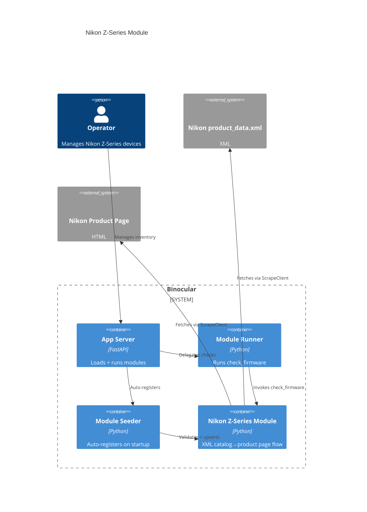

# Implementation Plan: E026 — Official Nikon Z-Series Module

**Branch**: `00027-official-nikon-z-series-module` | **Date**: 2026-07-01 | **Spec**: [spec.md](spec.md)

## Summary

**Goal**: Ship an official Nikon Z-Series camera firmware-check module for Binocular's starter set, following the existing authoring contract (ADR-0005).  
**Approach**: Implement `check_firmware(url, model, http_client)` performing a two-step fetch (Nikon Download Center XML catalog → per-product `/en/products/<id>/<slug>.html` page) via the host-provided `ScrapeClient`, parse the `#firmware` pseudoTable's first row, strip the class-agnostic `<token>:Ver.` prefix, normalize the `YYYY/MM/DD` date, and return a contract-shaped dict.  
**Key Constraint**: Use stdlib `xml.etree.ElementTree` for the catalog and regex for the HTML firmware table (no BeautifulSoup dependency); model resolution via alias-set intersection covering display-name / no-space / slug / lowercase / Roman-numeral input forms.

## Technical Context

**Language/Version**: Python 3.13  
**Primary Dependencies**: aiosqlite, structlog, httpx (via injected `http_client`); stdlib `xml.etree.ElementTree` + `re` for parsing  
**Storage**: N/A  
**Testing**: pytest + pytest-asyncio  
**Target Platform**: Linux Docker container (`python:3.13-slim`)  
**Project Type**: web  
**Project Mode**: brownfield  
**Performance Goals**: One XML catalog fetch + one product-page fetch per check, on the per-device schedule  
**Constraints**: Conforms to V1 module contract (ADR-0005); `mypy --strict` clean; Ruff clean; no direct HTTP imports; no new external dependencies  
**Scale/Scope**: Single official module for the 14 Nikon Z Series bodies listed under `Mirrorless Cameras` / `Z Series`

## Instructions Check

*GATE: Must pass before Phase 0 research. Re-check after Phase 1 design.*

All `project-instructions.md` principles satisfied:

| Principle | Compliance |
|-----------|------------|
| Honest Failure (I) | Module raises typed `ValueError` (`network_error`, `firmware_not_available`, `firmware_index_not_found`, `product_not_found`, `download_url_not_found`); `parse_error` is NOT used; failures surface via E020. |
| Polite by Default (II) | All HTTP via injected `http_client` (ScrapeClient enforces robots.txt, UA, rate limit, backoff) for BOTH the XML catalog fetch and the product-page fetch. No direct `httpx`/`requests`/`urllib` imports. |
| Data Ownership (III) | No new storage or external dependency; stdlib parser only; seeder auto-discovers the new module. |
| Trust Boundary (IV) | Runs unsandboxed in-process — same boundary as the other official modules; no sandbox claim. |
| Type Safety (V) | `mypy --strict` clean; fixture-based zero-FP/FN correctness tests required (golden: `Z 30` → `1.20`). |
| Set-and-Forget (VI) | Per-invocation error boundary (E007); broken module cannot crash core process. |
| Source Layout (ENFORCE_SRC_ROOT) | Module at `backend/src/binocular/official_modules/nikon_z_series.py`; tests at `backend/tests/`. |

## Architecture



## Architecture Decisions

Feature-local tradeoffs only. Project-wide decisions belong in standalone ADRs under `specs/adrs/`.

| ID | Decision | Chosen | Rationale |
|----|----------|--------|-----------|
| AD-001 | Two-step fetch (XML catalog → product page) vs. per-model hardcoded URL | Two-step | The catalog is the only authoritative source of per-product `href` values; operators configure by model name (not URL); per-check walk is bounded (one XML + one HTML). |
| AD-002 | XML parser: stdlib `xml.etree.ElementTree` vs. `lxml` / BeautifulSoup | stdlib `xml.etree.ElementTree` | No new external dependency; the catalog is well-formed XML; matches Project Instructions §III (self-contained, no new dep). |
| AD-003 | HTML firmware-table parser: regex vs. BeautifulSoup | regex (`_ROW_RE`/`_CELL_RE` idiom from `panasonic_lumix.py`) | No new external dependency; matches Panasonic module's proven approach; the `#firmware` pseudoTable shape is stable and regex-amenable. |
| AD-004 | Version prefix stripping: camera-only vs. class-agnostic | Class-agnostic `<token>:Ver.` strip | Future-proofs against Nikon reusing the firmware-table format for non-camera classes (`A:Ver.`/`L:Ver.`); the camera case (`C:Ver.`) remains the primary input. |
| AD-005 | Model resolution: exact match vs. alias-set intersection | Alias-set intersection (display name / no-space / slug form) | Mirrors `panasonic_lumix.py` / `sony_alpha.py`; covers operator input variants `Z 30`/`Z30`/`Z_30`/`z 30`/`z30`/`z_30` and Roman-numeral spacing `Z 6II`/`Z6II`/`Z_6II`/`Z 6 II` without special-casing. |
| AD-006 | Sync `check_firmware` over async `http_client` | `asyncio.new_event_loop` + `run_until_complete` in `try/finally` | Matches existing pattern in `panasonic_lumix_lenses.py` / `godox_flashes.py` / `viltrox_lenses.py`; preserves ScrapeClient enforcement. |
| AD-007 | Catalog structural breakage error code | `firmware_index_not_found` (NOT `parse_error`) | Matches Sony/Panasonic conventions; `parse_error` is not in the V1 contract's standardized prefix set. |

## Data Model Summary

N/A — no persistent data. The seeder auto-discovers the module on startup; the SQLite `modules` table schema is unchanged.

## API Surface Summary

N/A — no API surface. The module plugs into the existing module engine (E007) and reuses the existing `/api/v1/checks` and `/api/v1/checks/search-version` endpoints (per project-plan API Surfaces).

## Testing Strategy

| Tier | Tool | Scope | Mock Boundary | Install |
|------|------|-------|---------------|---------|
| Unit | pytest | XML catalog parsing (`Mirrorless Cameras` / `Z Series` selection, `<product>` collection), `#firmware` pseudoTable row extraction, class-agnostic `<token>:Ver.` prefix stripping, `YYYY/MM/DD` → `YYYY-MM-DD` normalization, alias-set model normalization | Captured `product_data.xml` + `Z_30.html` fixtures under `backend/tests/fixtures/nikon_z_series/`, no network | configured |
| Integration | pytest | `check_firmware` end-to-end via `asyncio.to_thread` | `FakeScrapeClient` returns captured XML + HTML in order | configured |
| Security | Ruff | Static code scanning (no direct HTTP imports) | — | configured |
| Coverage | pytest-cov | ≥80% line coverage for the new module | — | configured |
| Type-check | mypy --strict | Strict type validation | — | configured |

## Error Handling Strategy

| Error Code | Trigger | Response |
|------------|---------|----------|
| `network_error` | ScrapeClient fails on the XML catalog fetch or the product-page fetch | `raise ValueError("network_error: ...")`; per-device schedule retries |
| `firmware_index_not_found` | Catalog XML structure changed (no `Mirrorless Cameras` main category, no `Z Series` subcategory, `<product>` elements missing `href`, non-`YYYY/MM/DD` date form) | `raise ValueError("firmware_index_not_found: ...")`; E020 escalates consistent failures |
| `product_not_found` | Configured model not in `Z Series` subcategory (alias-set intersection empty) | `raise ValueError("product_not_found: ...")` |
| `firmware_not_available` | Product page has no `#firmware` section or the `pseudoTable` has no firmware rows (e.g. a body with no published firmware updates) | `raise ValueError("firmware_not_available: ...")` |
| `download_url_not_found` | First firmware row has a valid version but no `View download page` link | `raise ValueError("download_url_not_found: ...")` |

All errors propagate through the module engine's per-invocation error boundary (E007) into the activity log (E015) and feed E020 on consistent failure. The prefix `parse_error` is NOT used.

## Integration Points

| Source | System/Service | Contract |
|--------|----------------|----------|
| ADR-0005 | Module Engine | `check_firmware(url, model, http_client)`, `MODULE_VERSION`, `SUPPORTED_DEVICE_TYPE = "camera"` |
| E005 / ADR-0006 | ScrapeClient (robots.txt, UA, rate limit, backoff) | `await http_client.get(url) -> Response` (called inside a thread-local `asyncio.new_event_loop`) — used for BOTH the XML catalog fetch and the product-page fetch |
| E007 | Module Loader (two-phase validation) | `ModuleLoader.load(module_path) -> LoadResult` |
| E016 | Module Seeder (auto-discovers `official_modules/`) | Upserts module record idempotently |
| E013 / ADR-0007 | Scheduler + Notifier | Per-device schedule; `NotifyService.dispatch` with `last_notified_version` dedup |
| E020 | Official Module Health Monitoring | Consistent failures surface in-app |

## Risk Mitigation

| Risk (from spec) | L | I | Mitigation |
|-------------------|---|---|------------|
| Catalog structure change (`Z Series` renamed, category tree restructured, `href` attributes removed) | M | H | Restrict XML parse to `Mirrorless Cameras` / `Z Series`; on missing subcategory raise `firmware_index_not_found`; E020 surfaces consistent failures in-app. |
| Firmware table layout change (`pseudoTable` class dropped, `#firmware` section renamed) | L | M | Regex parser scoped to `<div id="firmware" class="contentsType">` → `<div class="pseudoTable">`; on missing section/rows raise `firmware_not_available` / `firmware_index_not_found`; fixtures cover the current shape. |
| Body with no firmware updates (page exists but `#firmware` section empty) | L | L | Return `firmware_not_available`; operator sees a clear "scrape failed" status. |
| Responsible-scraping posture (mandatory) | — | H | Module uses host-provided ScrapeClient for both fetches; per-module default check interval applies; no high-frequency polling. |

## Requirement Coverage Map

| Req ID | File Path(s) | Notes |
|--------|--------------|-------|
| FR-001 / FR-002 / FR-003 / FR-004 / FR-005 / FR-006 / FR-007 / FR-008 / FR-009 / FR-010 / FR-012 / FR-013 | `backend/src/binocular/official_modules/nikon_z_series.py` | Single module file implements all module-level requirements: contract entry point, constants, XML catalog fetch + category filter, alias-set model resolution, product-page fetch + `#firmware` pseudoTable parse, class-agnostic `<token>:Ver.` prefix strip, date normalization, relative-link resolution, five standardized typed errors, no direct HTTP imports, two-phase validation + auto-discoverable, `mypy --strict`/Ruff clean. |
| FR-011 | `backend/tests/test_official_nikon_z_series_module.py` + `backend/tests/fixtures/nikon_z_series/` | Golden/fixture-based correctness tests against captured `product_data.xml` + `Z_30.html` fixtures (golden: `latest_version = "1.20"`, `release_date = "2025-05-07"`, `download_url = "https://downloadcenter.nikonimglib.com/en/download/fw/556.html"`); model normalization across all input forms; zero FP/FN. |

## Project Structure

### Source Code

```text
  ~ backend/src/binocular/
    + official_modules/nikon_z_series.py
  ~ backend/tests/
    + fixtures/nikon_z_series/
      + product_data.xml
      + Z_30.html
      + empty_firmware_page.html
      + no_firmware_section_page.html
      + no_z_series_catalog.xml
      + unlisted_model_catalog.xml
    + test_official_nikon_z_series_module.py
```

**Patterns to reuse**: thread-local `asyncio.new_event_loop` (`panasonic_lumix_lenses.py` / `godox_flashes.py` / `viltrox_lenses.py`); `FakeScrapeClient` + `read_fixture()` test pattern; alias-set model normalization (`panasonic_lumix.py` / `sony_alpha.py`); regex `_ROW_RE`/`_CELL_RE` idiom (`panasonic_lumix.py`); typed `ValueError("<error_code>: ...")` error pattern.

**Naming conventions**: module file `nikon_z_series.py`; constants `UPPER_CASE`; helpers `snake_case`; test file `test_official_nikon_z_series_module.py`; fixture dir `backend/tests/fixtures/nikon_z_series/`.

## Implementation Hints

- **[HINT-001]** Gotcha: Sync-over-async. Use `loop = asyncio.new_event_loop()` + `loop.run_until_complete(...)` inside `try/finally` with `loop.close()` — matches `panasonic_lumix_lenses.py` / `godox_flashes.py` / `viltrox_lenses.py`; prevents "event loop closed" errors on shutdown.
- **[HINT-002]** Constraint: Two-step fetch order. Fetch the XML catalog first, select `Mirrorless Cameras` / `Z Series`, resolve the model via alias-set intersection, THEN fetch the matched product's `href` page. Never guess the product URL.
- **[HINT-003]** Gotcha: Class-agnostic prefix. Strip any `<token>:Ver.` prefix (regex `^[A-Z]+:Ver\.`) — do NOT hardcode `C:Ver.`. Camera `C:Ver.` is the primary case; `A:Ver.`/`L:Ver.` must also strip cleanly if Nikon reuses the table format.
- **[HINT-004]** Constraint: Date normalization. Convert `YYYY/MM/DD` → `YYYY-MM-DD` (single `str.replace`). Non-`YYYY/MM/DD` forms map to `firmware_index_not_found` (structural breakage), never emit an unnormalized date.
- **[HINT-005]** Compatibility: Seeder. Module must be importable in isolation with no top-level side effects (no `print`, no `os.environ` reads, no global state) — the seeder imports each module to validate it.
