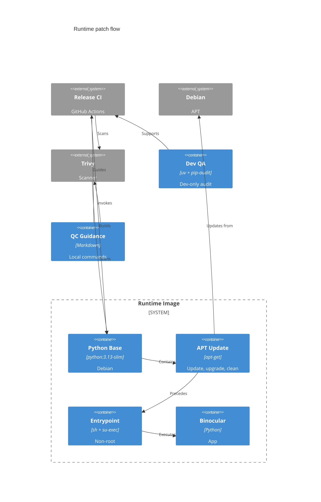

# Implementation Plan: Minimal Docker Runtime Base Package Update

**Branch**: `00028-minimal-docker-runtime-base-package` | **Date**: 2026-08-23 | **Spec**: [spec.md](spec.md)

## Summary

**Goal**: Remove the four reported HIGH `util-linux` CVEs from the published runtime image.
**Approach**: Update final-stage Debian packages; resolve `pip>=26.2` only for dev `pip-audit`; document loaded Buildx and OS-only Trivy local QC.
**Key Constraint**: Change only the five spec-allowed paths; retain the base family, production dependencies, release policy, and PUID/PGID contract.

## Technical Context

**Language/Version**: Dockerfile; Python 3.13/Debian 13 (`python:3.13-slim`); uv dev group
**Primary Dependencies**: Debian APT, Docker Buildx docker-container driver, Trivy CLI, uv `dev` group, `pip-audit`
**Storage**: N/A — no persistence change
**Testing**: Buildx-loaded candidate, image/run inspection, dev `pip-audit`, OS-only Trivy
**Target Platform**: Linux OCI image; amd64 and arm64 releases
**Project Type**: single — Docker runtime configuration change
**Project Mode**: brownfield
**Performance Goals**: N/A — build-time package update only
**Constraints**: Only `Dockerfile`, `backend/pyproject.toml`, `backend/uv.lock`, `.github/agents/_qc-auditor.md`, and `.github/skills/quality-control/SKILL.md`; final-stage update; `pip>=26.2` only in the dev `pip-audit` environment; no base tag, production dependency, source, entrypoint, command, release workflow, or scanner-policy change
**Scale/Scope**: One published image and existing scan controls

## Instructions Check

*GATE: Passed before design; re-checked after design.*

| Principle | Verdict | Plan Alignment |
|-----------|---------|----------------|
| I. Honest Failure | PASS | APT and Trivy remain fail-closed; no suppression. |
| II. Polite by Default | N/A | No application scraping behavior changes. |
| III. Data Ownership & Self-Containment | PASS | No state or service dependency is added. |
| IV. Least-Privilege & Explicit Trust Boundary | PASS | Retains `/entrypoint.sh` non-root privilege drop. |
| V. Type Safety & Correctness-First | N/A | No application code changes. |
| VI. Set-and-Forget Reliability | PASS | Available OS fixes apply per build; failures block it. |
| VII. Agent Output Style | PASS | Structured, scoped plan. |

## Architecture



## Architecture Decisions

| ID | Decision | Options Considered | Chosen | Rationale |
|----|----------|--------------------|--------|-----------|
| AD-001 | Update stage | Final / builder + final / base-tag change | Final only | Published image is the scan target. |
| AD-002 | Update command | Package pin / separate layers / one chain | `update && upgrade -y && rm -rf /var/lib/apt/lists/*` | Fresh metadata, all fixes, no retained lists. |
| AD-003 | Remediation evidence | Schedule only / suppress / loaded candidate + exact assertion | Existing gates plus Buildx-loaded candidate and OS-only no-match assertion | Direct local evidence without weakening release gates or scanner policy. |
| AD-004 | Quality-gate pip fix | Production dependency / dev-only dependency group / ignore audit | `pip>=26.2` in uv `dev` group and lockfile | Fixes the audit environment while `uv sync --no-dev` keeps production dependencies unchanged. |

## Dependencies

| Dependency | Status | Use |
|------------|--------|-----|
| `python:3.13-slim` | Existing | Retained final Debian 13 base. |
| Debian APT | Existing | Supplies fixed OS packages. |
| Docker Buildx docker-container driver | Existing | Builds and `--load`s the local candidate. |
| Trivy action / CLI | Existing | Scheduled gate and OS-only local verification. |
| uv `dev` group + `pip-audit` | Existing | Resolves and audits dev-only `pip>=26.2`. |

## Data Model Summary

N/A — no persistent data

## API Surface Summary

N/A — no API surface

## Testing Strategy

| Tier | Tool | Scope | Mock Boundary | Install |
|------|------|-------|---------------|---------|
| Unit | N/A | No application logic change | — | N/A |
| Integration | Docker Buildx + shell + `curl` | docker-container `--load` build; APT-list, health, and PUID/PGID checks | Real image and repositories | Docker Buildx configured |
| Security | `pip-audit`; Trivy action / CLI | Dev audit; loaded candidate/published image; named CVEs absent at HIGH/CRITICAL | Real advisory DB and image | configured |
| Coverage | N/A | No executable source change | — | N/A |

## Verification Evidence

| Check | Command or Existing Control | Pass Evidence | Requirement(s) |
|-------|-----------------------------|---------------|----------------|
| Fresh update and export | With the active docker-container builder: `docker buildx build --pull --no-cache --load -t binocular:qc-check -f Dockerfile .` | APT failure returns non-zero; successful single-platform candidate is present as `binocular:qc-check`. | TR-001, TR-005 |
| Package and lists | `docker run --rm --entrypoint /bin/sh binocular:qc-check -c 'test -z "$(ls -A /var/lib/apt/lists 2>/dev/null)" && dpkg-query -W util-linux'` | Empty list directory and installed package version. | TR-001, TR-002 |
| Dev audit | `uv run pip-audit` in `backend/`; inspect `pyproject.toml` and `uv.lock`. | Audit passes; `pip>=26.2` is resolved only in the `dev` group and production sync remains `--no-dev`. | TR-005 |
| Named-CVE absence | `trivy image --scanners vuln --pkg-types os --severity HIGH,CRITICAL --ignore-unfixed --format json binocular:qc-check`; assert zero HIGH/CRITICAL matches for all four CVE IDs. | No match for CVE-2026-53612 through CVE-2026-53615. | TR-003, TR-005 |
| Release and schedule | Existing candidate gate, then manually dispatch scheduled scan after publish. | Both Trivy actions exit 0; no suppression. | TR-003, TR-005 |
| Non-root contract | Run `id -u` and `id -g` with defaults and `PUID=1234 PGID=1235`; start default command and request health. | Non-zero default IDs, supplied IDs retained, health succeeds. | TR-004 |
| Permitted-path scope | Compare non-feature-artifact changes with the five-path allowlist. | Only the allowed Dockerfile, dev dependency/lock, and local QC-instruction paths changed; no source, release workflow, or scanner policy change. | TR-005 |

## Error Handling Strategy

| Error Category | Pattern | Response | Retry |
|----------------|---------|----------|-------|
| APT failure | Fail-fast | Docker build exits non-zero; no image publishes. | No |
| Named CVE persists | Fail closed | Trivy exit `1` blocks scan success; no suppression. | After repository/advisory update |
| Invalid PUID/PGID | Existing validation | Visible container failure before app start. | No |
| Local candidate unavailable | Fail-fast | Buildx `--load` failure prevents image inspection and Trivy verification. | Fix active docker-container builder, then rerun |

## Integration Points

| Spec Reference | System/Service | Technical Approach | Contract |
|----------------|----------------|--------------------|----------|
| IP-001 | Release pipeline | Unchanged candidate scan gates publish. | [release.yml](../../.github/workflows/release.yml) |
| IP-002 | PUID/PGID entrypoint | Retain entrypoint/command; validate privilege drop. | [entrypoint.sh](../../entrypoint.sh) |
| IP-003 | Scheduled Trivy | Unchanged published-image proof. | [scheduled-scan.yml](../../.github/workflows/scheduled-scan.yml) |

## Risk Mitigation

| Risk (from spec) | Likelihood | Impact | Mitigation | Owner |
|------------------|------------|--------|------------|-------|
| Vendor fix unavailable or scanner data lag | low | high | Keep the scheduled and local `--pkg-types os` scans unsuppressed; fail until fixed repository or advisory data is available. | Release pipeline / Trivy CLI |
| Package update build failure | low | medium | Chain steps with `&&`; Docker Buildx stops the build and retains the prior published image. | Dockerfile |

## Requirement Coverage Map

| Req ID | Component(s) | File Path(s) | Notes |
|--------|--------------|--------------|-------|
| TR-001 | Final APT layer | `Dockerfile` | Refresh and upgrade available packages. |
| TR-002 | Final APT layer | `Dockerfile` | Clean lists in same `RUN`. |
| TR-003 | Runtime image and local verifier | `Dockerfile`; `.github/agents/_qc-auditor.md`; `.github/skills/quality-control/SKILL.md` | Build fixed `util-linux`; scan the loaded candidate with current OS-package flag while scheduled controls remain unchanged. |
| TR-004 | Startup contract | `Dockerfile`; `entrypoint.sh` (verify only) | Retain entrypoint and test non-root IDs. |
| TR-005 | Scoped remediation and QC support | `Dockerfile`; `backend/pyproject.toml`; `backend/uv.lock`; `.github/agents/_qc-auditor.md`; `.github/skills/quality-control/SKILL.md` | Only permitted paths: final update; dev-only `pip>=26.2` lock; Buildx `--load` and `trivy image --pkg-types os` local instructions. |

## Project Structure

### Source Code

```text
~ Dockerfile                         # Final runtime-stage APT refresh, upgrade, and cleanup
~ backend/pyproject.toml             # Dev-only `pip>=26.2` for the `pip-audit` environment
~ backend/uv.lock                    # Locked dev-group pip resolution
~ .github/agents/_qc-auditor.md      # docker-container Buildx `--load` and OS-only Trivy QC instruction
~ .github/skills/quality-control/SKILL.md # Matching local QC workflow instruction
```

**Patterns to reuse**: Builder-stage chained APT cleanup; uv dev dependency group; existing QC command documentation.
**Tests to extend**: Existing Docker build, dev audit, and Trivy gates; no release workflow change.
**Naming conventions**: Preserve stage names, dependency-group layout, and QC command format.

## Implementation Hints

- **[HINT-001]** Order: Put the command in the final stage, not the builder.
- **[HINT-002]** Constraint: Join update, upgrade, and cleanup with `&&` in one `RUN`.
- **[HINT-003]** Gotcha: Do not pin `util-linux`, change the base tag, or ignore CVEs.
- **[HINT-004]** Constraint: Keep `pip>=26.2` in uv's `dev` group and lockfile only; the image builder must continue `uv sync --no-dev`.
- **[HINT-005]** Compatibility: Use `docker buildx build --load` with the docker-container driver and `trivy image --pkg-types os`; do not change `ENTRYPOINT`, `CMD`, `EXPOSE`, release workflow, or scanner policy.
