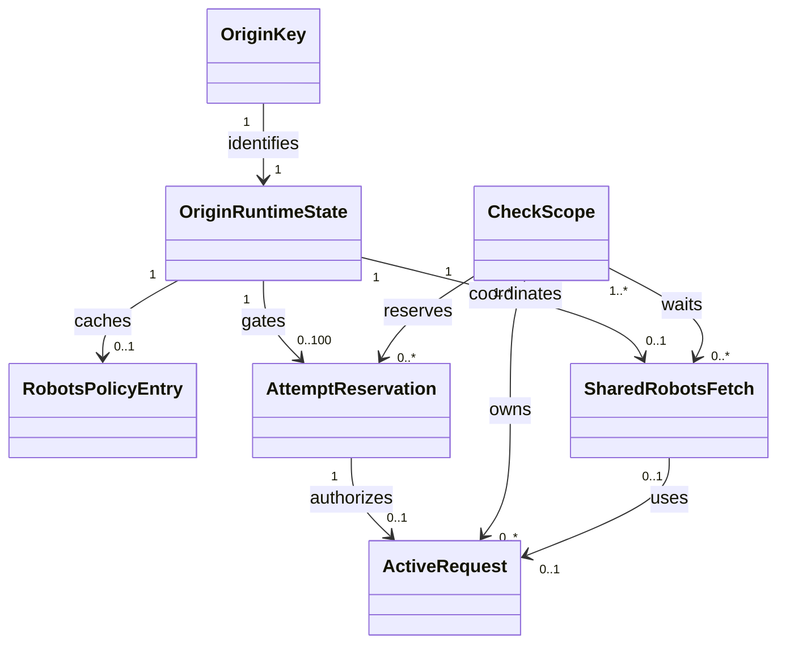

# Data Model: Source-Aware HTTP Pacing

## Runtime Scope

| Property | Constraint |
|---|---|
| Storage | Process-memory only; no SQLite schema, migration, or durable serialization |
| Lifetime | Registry, policies, reservations, scopes, and request ownership are discarded on process restart |
| Time basis | Injected monotonic time for deadlines, pacing, and TTL expiry; injected wall time only to interpret HTTP-date `Retry-After` |
| Authority | This model coordinates outbound work only; durable check outcomes and last-success timestamps remain owned by the existing persistence model |

## Entity Model

| Entity | Attributes (name: type, constraints) | Relationships | State Transitions |
|---|---|---|---|
| `OriginKey` | `scheme: str`; `host: str, IDNA-or-IPv6`; `effective_port: int, 1..65535`; `UNIQUE(scheme, host, effective_port)` | identifies one state; malformed hosts fail; scheme/non-default ports differ | immutable |
| `OriginRuntimeState` | `key: OriginKey`; `delay_s: float`; `arrival_seq: int`; `last_active_at/next_start_at: float`; `pending_count: int, 0..100`; `active_count: int, 0..4`; registry max 1,024 | one policy/fetch; reservations/requests | `ACTIVE → INACTIVE → EVICTED`; future cooldown is protected; full protected registry fails closed |
| `RobotsPolicyEntry` | `origin_key: OriginKey, UNIQUE`; `decision: enum`; `delay_s: float`; `fetched_at/expires_at: float`; `user_agent: str, immutable` | belongs to origin state | `ABSENT/EXPIRED → FETCHING → FRESH → EXPIRED` |
| `SharedRobotsFetch` | `origin_key: OriginKey, UNIQUE`; `waiters: ordered map[ScopeId,float deadline]`; `request_id: RequestId?`; `result: RobotsPolicyEntry?`; waiter set nonempty | collectively owned by live waiters; may own one request | arrivals/detach/final-cancel linearize; continues while any waiter lives |
| `AttemptReservation` | `id: ReservationId, REQUIRED, UNIQUE(runtime)`; `origin_key: OriginKey, REQUIRED`; `scope_id: ScopeId, REQUIRED`; `arrival_seq: int, REQUIRED, UNIQUE per origin`; `phase: ROBOTS | RESOURCE`; `attempt_no: int, REQUIRED, 1..4`; `redirect_hop: int, REQUIRED, 0..10`; `arrived_at: monotonic_time, REQUIRED`; `default_paced_at: monotonic_time, REQUIRED`; `effective_paced_at: monotonic_time, REQUIRED, >=default_paced_at`; `backoff_until: monotonic_time | null`; `retry_after_until: monotonic_time | null`; `default_eligible_at: monotonic_time, REQUIRED, =max(default_paced_at, backoff_until, retry_after_until)`; `eligible_at: monotonic_time, REQUIRED, =max(effective_paced_at, backoff_until, retry_after_until)`; `candidate_excess_s: float, REQUIRED, =max(0, eligible_at-default_eligible_at) for this scope's reservation with cross-scope contention excluded`; `credited_excess_s: float, REQUIRED, >=0, zero unless authorized and never cancelled`; `slot_retained: bool, REQUIRED` | belongs to one `OriginRuntimeState` and one `CheckScope`; authorizes at most one `ActiveRequest` | `QUEUED → AUTHORIZED → STARTED → FINISHED`; `QUEUED/AUTHORIZED → CANCELLED_SLOT_RETAINED`; `QUEUED → REJECTED` on cap or deadline; cancelled reservations do not move later reservations earlier and receive zero credit |
| `CheckScope` | `id: ScopeId, UNIQUE`; `started_at/baseline_deadline/absolute_deadline: float`; `credit_s: float, 0..300`; `cleanup_deadline: float`; `reason: enum` | reservations, requests, shared fetches | `ACTIVE → INVALIDATING → CLOSED/CLEANUP_FAILED`; registry owns survivors |
| `ActiveRequest` | `id: RequestId, REQUIRED, UNIQUE(runtime)`; `reservation_id: ReservationId, REQUIRED, UNIQUE`; `owner_scope_ids: nonempty set[ScopeId] while live`; `task_handle: cancellable handle, REQUIRED`; `resource_handle: closeable handle, REQUIRED`; `transport_started_at: monotonic_time | null`; `settled_at: monotonic_time | null`; multiple owners are allowed only for a shared robots fetch | authorized by exactly one `AttemptReservation`; owned by one `CheckScope` normally or multiple live scopes for a shared robots fetch; optionally belongs to one `SharedRobotsFetch` | `REGISTERED → STARTED → SETTLED`; `REGISTERED/STARTED → CANCELLING → SETTLED`; removing the last owner requires cancellation, await, and resource close |

## State Machines

### Reservation Authorization and Start

1. Under the origin gate, assign the next `arrival_seq`; reject the 101st pending reservation visibly.
   A reservation begins counting when it enters `QUEUED` after acceptance and ceases counting on transition to `AUTHORIZED`, `CANCELLED_SLOT_RETAINED`, or `REJECTED`.
2. Compute default-paced and effective-paced eligibility in the same stable reservation order. Waiting attributable only to other scopes is contention and contributes zero credit.
3. Combine pacing, exponential backoff, and valid `Retry-After` by taking their latest eligibility time. A non-negative delta-seconds value is valid; a past HTTP-date becomes zero; malformed or negative values are absent.
4. Under the scope/gate synchronization boundary, calculate candidate excess and the resulting capped deadline before authorization. Reject if eligibility is outside that candidate deadline; otherwise authorize and commit only this scope's qualifying credit.
5. Linearize scope validation and transport start: start only when `scope.state == ACTIVE`, `accepting_starts == true`, and `now < absolute_deadline`. Expiry wins if it linearizes first; an already-started transmission is not a later start.

### Scope Invalidation

1. Atomically change `ACTIVE → INVALIDATING` and disable new starts.
2. Cancel queued/authorized-not-started waits, roll back credit/deadline, retain conservative slots, and expire if the recomputed deadline passed.
3. Detach from shared robots fetches; cancel a fetch only after its final live waiter exits.
4. Cancel/await work and close resources; after 5 seconds force-close, transfer non-network survivor ownership to the registry, and record cleanup failure.
5. End network authority as `CLOSED` or `CLEANUP_FAILED`; propagate caller cancellation, reject survivor sends, and retain registry ownership until physical settlement.

## Invariants

| ID | Rule |
|---|---|
| `INV-01` | Every transport start, including robots, initial requests, retries, and redirects, has exactly one preceding reservation on the target normalized origin. |
| `INV-02` | Per origin, reservation order is stable by `arrival_seq`; transport starts are no earlier than `eligible_at`, and a longer effective policy advances pending eligibility without reordering. |
| `INV-03` | A scope's pacing credit is based only on positive effective-versus-default eligibility difference from its own authorized, non-cancelled reservations; contention and cancelled reservations contribute zero; total credit never exceeds `300s`. |
| `INV-04` | Authorization, candidate credit/deadline calculation, invalidation, and transport-start permission are atomic at their shared synchronization boundary; no circular deadline rejection is possible. |
| `INV-05` | Live work always has scope or cleanup-registry ownership. Closed scopes have no network-capable request, pending wait, or open resource. |
| `INV-06` | Four is the maximum attempt count. Every retry reserves again and applies pacing plus exponential backoff and any valid retryable-response `Retry-After`. |
| `INV-07` | Origin state is evictable only without work, robots fetch/waiters, unexpired policy, or future cooldown; full protected capacity fails closed. |
| `INV-08` | Completed shared fetches, terminal reservations, settled requests, expired policy entries, and cancelled queue records are removed; a cancelled reservation may preserve only its conservative next-start timestamp. Terminal records retain no scope or resource references. |
| `INV-09` | Each origin has one policy, one shared fetch, at most 100 pending reservations, and four active requests for the root client's immutable User-Agent. |

## Deterministic Validation Model

| Record | Required Fields | Oracle |
|---|---|---|
| `ValidationEvent` | `run_seq`, `event_seq`, `event_type`, `origin_key`, optional `scope_id`/`reservation_id`/`request_id`, `arrival_seq`, `observed_at`, `default_eligible_at`, `eligible_at`, `authorized_at`, `transport_started_at`, `credited_excess_s`, `absolute_deadline`, `cancellation_or_invalidation`, `settled_at`, `terminal_reason`, post-event policy/fetch/queued/active counts | Compare exact event order, virtual timestamps, derived eligibility, committed budget, cancellation/settlement, release events, post-cleanup counts, and terminal outcome; no tolerance windows |

Barriers establish asserted arrival, policy-update, authorization, and invalidation order before tasks are released. A barrier-controlled simultaneous-ready case uses the recorded linearization event, not incidental event-loop scheduling, as its oracle. Virtual-time advancement releases all due cancellable sleeps and yields until runnable work is quiescent. Determinism requires an identical comparison trace from at least three fresh runs.

## TTL and Capacity Rules

| Boundary | Rule | Boundary Result |
|---|---|---|
| Robots resolved policy or `403` | TTL `24h` from completed fetch | Fresh before expiry; refetch at/after expiry |
| Robots transient failure (`5xx`, transport/fetch failure) | TTL `5m` from completed fetch; cached decision is `DISALLOW` | Fresh before expiry; refetch at/after expiry |
| Runtime restart | All policy, pacing, reservation, scope, and ownership state clears | No persistence or migration |
| Origin registry | Maximum `1,024` origins | Insert evicts least-recently-used inactive origin; if none is inactive, fail visibly before creating a reservation or starting transport |
| Origin pending queue | Maximum `100 pending reservations per origin` | Reservation 101 fails visibly and is never started |
| Origin active requests | Maximum `4` | Excess attempts remain pending within the 100-item cap |
| Scope cleanup | `5s` after invalidation | Force-close; registry owns non-network survivors until settlement |
| Scope pacing credit | Maximum `300s` above baseline | Additional excess does not extend the deadline and attempts beyond it fail visibly |
| Retry attempts | Maximum `4` per request chain position | No fifth attempt |

Class Diagram (visual reference)

## TR-001–TR-009 Validation

| Requirement | Model Evidence | Status |
|---|---|---|
| `TR-001` | `OriginKey` canonicalizes scheme, IDNA/trailing-dot/IPv6 host, and effective port for pacing and credentials. | PASS |
| `TR-002` | Per-origin/User-Agent policy entries, 24h/5m TTLs, restart clearing, inactive-LRU 1,024-origin cap, and live-waiter shared-fetch cancellation are explicit. | PASS |
| `TR-003` | `RobotsPolicyEntry.delay_s` enforces the 1-second floor, valid positive applicable delays, and specific-before-wildcard selection. | PASS |
| `TR-004` | `AttemptReservation` covers every attempt, stable per-origin arrival order, longer-policy advancement, paced starts, and the 100-pending cap with visible rejection. | PASS |
| `TR-005` | Attempt range, exponential-backoff eligibility, `Retry-After` validity rules, latest-time selection, and deadline rejection are modeled. | PASS |
| `TR-006` | `CheckScope.absolute_deadline` is one monotonic deadline across robots, queueing, backoff, redirects, and I/O. | PASS |
| `TR-007` | Scope credit formula, own-reservation/zero-contention rules, cancellation exclusion, 300-second cap, and pre-authorization atomic candidate calculation are explicit. | PASS |
| `TR-008` | Scope/start linearization, expiry precedence, force-close, registry ownership, and later-send rejection are explicit. | PASS |
| `TR-009` | Cancellation cleanup precedes propagation; ownership forbids detached work; cancelled reservations retain conservative slots with zero credit. | PASS |
