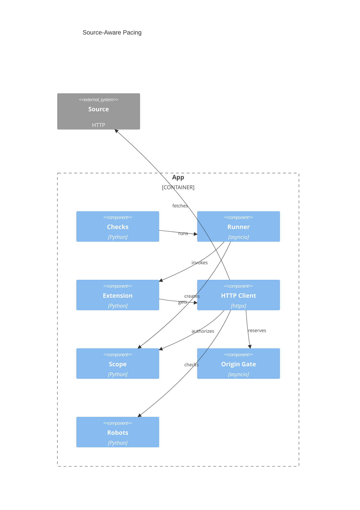

# Implementation Plan: Source-Aware HTTP Pacing

**Branch**: `00030-my-feature` | **Date**: 2026-09-06 | **Spec**: [spec.md](spec.md)

## Summary

**Goal**: Pace scoped attempts.
**Approach**: Extend scraping.
**Constraint**: Preserve 30s baseline; cap credit at 300s.

## Technical Context

**Language/Version**: Python 3.13
**Primary Dependencies**: asyncio, httpx 0.28, urllib.robotparser, structlog
**Storage**: Process memory; SQLite outcomes unchanged
**Testing**: pytest 9, pytest-asyncio, pytest-cov, httpx MockTransport
**Target Platform**: Linux container/host
**Project Type**: web backend
**Project Mode**: brownfield
**Performance Goals**: Independent origins; exact spacing; bounded state
**Constraints**: Zero config; 1s default; 30s baseline; 300s credit; 1,024 origins; 100 pending reservations per origin
**Scale/Scope**: One process; overlapping checks

## Instructions Check

| Gate | Status | Evidence |
|------|--------|----------|
| Honest Failure | PASS | Persist outcomes; expose failures. |
| Polite by Default | PASS | ADR-0012 on every attempt. |
| Self-Containment | PASS | Runtime state; no migration/service/config. |
| Least Privilege/Trust | PASS | Non-root; user-vetted extensions run unsandboxed/in-process with full application privileges. |
| Fault Isolation | PASS | Block survivors; keep core live. |
| Type/Quality | PASS | `backend/src/`; deterministic strict gates. |

## Architecture



## Architecture Decisions

| ID | Decision | Options Considered | Chosen | Rationale |
|----|----------|--------------------|--------|-----------|
| AD-001 | Registry pressure | Evict cooldown / overflow / tombstones | Fail closed when protected | Preserves ADR-0012 cap/pacing. |
| AD-002 | Cross-loop bridge | Context / facade / signature | Thread-safe scoped facade | Preserves boundary/signature. |
| AD-003 | Deadline sync | Poll / event / reschedule | Reschedulable timeout | Commits credit atomically. |
| AD-004 | Credential sanitation | Hook / copy / reject | Sanitized request copy | Makes ordering testable. |
| AD-005 | Virtual time | Patch / scheduler / injection | Inject clock/sleep/jitter | Exact non-starving tests. |

Policy: [ADR-0012](../adrs/0012-source-aware-centralized-scraping-with-shared-per-origin-pacing-and-bounded-cancellation.md).

## Data Model Summary

| Entity | Key Fields | Relationships | Notes |
|--------|------------|---------------|-------|
| Origin state | key, delay, sequence, queue | policy/reservations | Caps/LRU |
| Robots policy/fetch | decision, delay, expiry | live scopes | TTL; final waiter cancels |
| Reservation | sequence, eligibility, credit | origin/scope | Stable; cancelled=zero |
| Scope/request | deadline, credit, state, task | reservations/requests | Atomic; 300s cap |

**Detail**: [data-model.md](data-model.md)

## API Surface Summary

N/A — no API surface changes.

## Testing Strategy

| Tier | Tool | Scope | Mock Boundary | Install |
|------|------|-------|---------------|---------|
| Unit | pytest + pytest-asyncio | origin/robots/retry/redirect/scope | Controlled time/transport | configured |
| Integration | pytest + MockTransport | client/runner/check concurrency | Vendor transport | configured |
| Quality | project tools + Actions | backend/frontend tests/lint/types; Docker build | `.github/workflows/ci.yml`, `Dockerfile` | configured |
| Security | Ruff S/pip-audit/Trivy | code/dependencies/image | `.github/workflows/release.yml`, built image | configured |
| Security acceptance | pytest/docs | scope/robots/redirect/lifecycle/trust | Scripted transport/docs | configured |
| Coverage | pytest-cov | full backend, minimum 80% | — | configured |

## Error Handling Strategy

| Error Category | Pattern | Response | Retry |
|----------------|---------|----------|-------|
| Robots denial/failure | Fail closed | Typed failure | TTL |
| Transient HTTP | Bounded | Failure after 4 attempts | Backoff/pacing/Retry-After |
| Deadline/cancellation | Invalidate/drain | Timeout/cancel; no later start | No |
| Redirect/overload | Bound | Typed loop/hop/origin/queue failure | No |

## Integration Points

| Spec Reference | System/Service | Technical Approach | Contract |
|----------------|----------------|--------------------|----------|
| IP-001 | Scraping | Gate supplies policy/reservations | `ScrapeClient.get()` |
| IP-002 | ModuleRunner | Scoped facade/deadline/drain | Existing signature |
| IP-003 | Check callers | Shared client; separate scopes | CheckService |

## Risk Mitigation

| Risk (from spec) | Likelihood | Impact | Mitigation | Owner |
|-------------------|------------|--------|------------|-------|
| Surviving traffic | High | High | Reject starts; cancel tasks. | Client/Runner |
| Origin races | Medium | High | Linearize; barrier-test. | Origin gate |
| Budget inflation | Medium | Medium | Own non-cancelled credit; cap. | Scope |

## Requirement Coverage Map

`scraping/`, `extensions/`, and `services/` are under `backend/src/binocular/`; `tests/` is under `backend/`; other paths are workspace-relative.

| Req ID | Component — File Path(s) |
|--------|--------------------------|
| TR-001 | Origin key — `scraping/rate_limit.py` |
| TR-002 | Robots/registry — `scraping/{robots,rate_limit}.py` |
| TR-003 | Robots policy — `scraping/robots.py` |
| TR-004 | Origin gate — `scraping/rate_limit.py` |
| TR-005 | Retry — `scraping/client.py` |
| TR-006 | Scope — `scraping/{scope,client}.py` |
| TR-007 | Scope/gate — `scraping/{scope,rate_limit}.py` |
| TR-008 | Scope/client — `scraping/{scope,client}.py` |
| TR-009 | Runner/scope — `extensions/runner.py`, `scraping/scope.py` |
| TR-010 | Robots status — `scraping/robots.py` |
| TR-011 | Compatibility — `scraping/client.py`, `extensions/runner.py` |
| TR-012 | Boundary tests — `tests/{scraping/,extensions/test_runner.py}` |
| TR-013 | Outcomes — `services/checks.py`, `tests/services/test_checks.py` |
| TR-014 | Redirects — `scraping/client.py` |
| TR-015 | Quality/CI/image — `backend/{pyproject.toml,tests/}`, `.github/workflows/{ci,release}.yml`, `Dockerfile` |
| TR-016 | Test controls — `tests/scraping/conftest.py` |
| TR-017 | Trace — `tests/scraping/{conftest,test_trace}.py` |
| TR-018 | Deadlines — `tests/scraping/test_scope.py` |
| TR-019 | Races — `tests/scraping/{test_rate_limit,test_robots}.py` |
| TR-020 | Limits — `tests/scraping/` |
| TR-021 | Lifecycle — `tests/{scraping/test_scope.py,extensions/test_runner.py}` |
| TR-022 | Reclamation — `scraping/{rate_limit,robots,scope}.py` |
| TR-023 | Scope boundary — `scraping/client.py`, `extensions/runner.py` |
| TR-024 | Trust docs — `docs/security.md`, `README.md` |
| TR-025 | Credential safety — `scraping/client.py` |
| TR-026 | Robots failures — `scraping/robots.py` |
| TR-027 | Robots redirects — `scraping/{robots,client}.py` |
| TR-028 | Cleanup — `scraping/scope.py`, `extensions/runner.py` |
| TR-029 | Security evidence — `tests/{scraping/,extensions/test_runner.py}` |

## Success Criteria Traceability

| SC ID | Components / Files | Test Evidence |
|-------|--------------------|---------------|
| SC-001 | Gate/client — `scraping/{rate_limit,client}.py` | `tests/scraping/{test_rate_limit,test_client}.py` |
| SC-002 | Origin/robots/client — `scraping/{rate_limit,robots,client}.py` | `tests/scraping/` full policy/retry/redirect/limit matrix |
| SC-003 | Scope/gate/client — `scraping/{scope,rate_limit,client}.py` | `tests/scraping/{test_scope,test_rate_limit,test_client}.py` |
| SC-004 | Scope/runner — `scraping/scope.py`, `extensions/runner.py` | `tests/scraping/test_scope.py`, `tests/extensions/test_runner.py` |
| SC-005 | Client/runner/docs — `scraping/client.py`, `extensions/runner.py`, `docs/security.md` | Existing suite plus docs assertions |
| SC-006 | Trace — `tests/scraping/{conftest,test_trace}.py` | Three exact runs; no live HTTP/real sleep |
| SC-007 | CI/image — `backend/`, `frontend/`, `.github/workflows/{ci,release}.yml`, `Dockerfile` | All tests/lint/types/coverage/audit/build/Trivy |
| SC-008 | Redirect/scope — `scraping/client.py`, `extensions/runner.py` | Instrumented credentials; pre-network unscoped rejection |

## Project Structure

### Source Code

```text
+ backend/src/binocular/scraping/scope.py
~ backend/src/binocular/scraping/{rate_limit,robots,client}.py
~ backend/src/binocular/extensions/runner.py
~ backend/tests/{scraping/,extensions/test_runner.py,services/test_checks.py}
~ .github/workflows/{ci,release}.yml
~ Dockerfile
+ docs/security.md
~ README.md
```

**Brownfield Notes**
**Patterns to reuse**: Async locks, typed errors, MockTransport.
**Tests to extend**: Scraping, runner, CheckService.
**Naming conventions**: snake_case, PascalCase, strict annotations.

## Implementation Hints

- **[HINT-001]** Order: Follow objectives: origin/robots/retry may precede scope; complete scope before runner integration.
- **[HINT-002]** Gotcha: Reject surviving `to_thread` calls.
- **[HINT-003]** Gotcha: Pace first robots fetch by default; learned delay advances pending starts.
- **[HINT-004]** Constraint: Cancel shared robots fetch after its final waiter.
- **[HINT-005]** Compatibility: Preserve errors, attempts, status policy, UA, signature.
