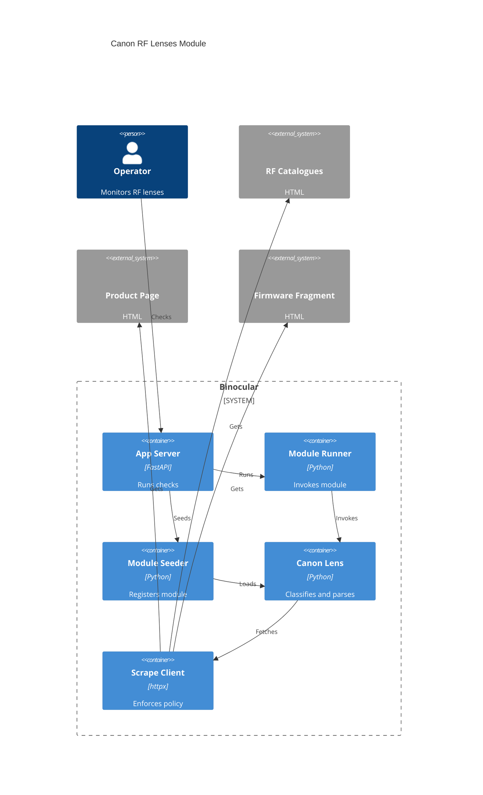

# Implementation Plan: E029 — Official Canon RF Lenses

**Branch**: `00032-official-canon-rf-lenses` | **Date**: 2026-09-07 | **Spec**: [spec.md](spec.md)

## Summary

**Goal**: Ship an exact, classified, model-only official Canon RF/RF-S lens firmware module.  
**Approach**: Parse captured Canon Asia catalogue/product/firmware HTML through the existing scoped ScrapeClient and module contract.  
**Key Constraint**: Exclude non-lenses, follow source links/actions verbatim, and share Canon's 30-second origin pacing.

## Technical Context

**Language/Version**: Python 3.13  
**Primary Dependencies**: BeautifulSoup4; host-injected ScrapeClient; existing extension loader, runner, and seeder  
**Storage**: N/A — existing module upsert only  
**Testing**: pytest, pytest-asyncio, pytest-cov, injected clocks and scripted transports  
**Target Platform**: Linux Docker container (`python:3.13-slim`)  
**Project Type**: web  
**Project Mode**: brownfield  
**Performance Goals**: Bounded four-stage source flow; no real sleeps in tests  
**Constraints**: mypy strict; Ruff; no direct HTTP; conservative classification; Canon delay; cancellation-safe  
**Scale/Scope**: One module covering exact classified lenses in captured RF/RF-S catalogues

## Instructions Check

| Principle | Status | Plan Evidence |
|-----------|--------|---------------|
| Honest Failure | PASS | Typed failures distinguish unsupported, unavailable, drift, denial, timeout, and cancellation |
| Polite by Default | PASS | Every request uses scoped ScrapeClient; shared origin policy applies before retries |
| Data Ownership | PASS | No new state, server, telemetry, or dependency |
| Trust Boundary | PASS | Existing unsandboxed in-process module boundary is documented and unchanged |
| Type Safety | PASS | mypy strict, Ruff, and fixture correctness are required |
| Set-and-Forget | PASS | Bounded scope prevents post-cancellation requests; errors remain isolated |
| Source Layout | PASS | Source under `backend/src/`; tests under `backend/tests/` |

**Gate Result**: PASS before research and after design; no complexity exception.

## Architecture



## Architecture Decisions

| ID | Decision | Options Considered | Chosen | Rationale |
|----|----------|--------------------|--------|-----------|
| AD-001 | How to resolve models? | Exact normalized / aliases / hardcoded map | Trimmed case-folded exact catalogue name | Prevents near-name false positives while tolerating harmless input differences |
| AD-002 | How to classify products? | Trust catalogue / allowlist / conservative name rules | RF/RF-S lens prefix plus exclusion rules | RF catalogue includes accessories; conservative rules avoid false support |
| AD-003 | How to locate firmware content? | Construct URL / discover action | Verbatim catalogue link then product form action | Source links are authoritative and encoded irregularly |
| AD-004 | How to select releases? | First row / OS package / grouped version | Group by normalized version, select newest | Prevents OS duplicates and preserves version semantics |
| AD-005 | How to parse HTML? | Regex / BeautifulSoup4 | BeautifulSoup4 | Existing dependency supports structural validation at all stages |

## Data Model Summary

N/A — no persistent data changes; existing automatic module upsert is reused.

## API Surface Summary

N/A — no API changes; existing version-search and check endpoints invoke the module contract.

## Testing Strategy

| Tier | Tool | Scope | Mock Boundary | Install |
|------|------|-------|---------------|---------|
| Unit | pytest | Exact matching, classification, action discovery, release grouping, typed failures | Captured HTML fixtures | configured |
| Integration | pytest-asyncio | Module load/seed, version search/check, shared pacing, timeout/cancellation | Scripted httpx transport + injected time | configured |
| Security | Ruff + pip-audit | Unsafe imports, source and dependency scan | — | configured |
| Coverage | pytest-cov | Backend suite and module branches; ≥80% | — | configured |
| Static | mypy --strict | Backend source typing | — | configured |

## Error Handling Strategy

| Error Category | Pattern | Response | Retry |
|----------------|---------|----------|-------|
| Input/unsupported | Fail fast after exact classified lookup | `product_not_found` visible failure | No |
| No firmware | Distinguish explicit source message | `firmware_not_available` visible failure | No |
| Source drift | Require catalogue entries, unique action, valid rows/link | `firmware_index_not_found` visible failure | No |
| Network/denial | Preserve scoped client error | Existing activity/check failure | Client policy only |
| Timeout/cancellation | Propagate scope termination | Visible failure; no later requests | No |

## Risk Mitigation

| Risk (from spec) | Likelihood | Impact | Mitigation | Owner |
|------------------|------------|--------|------------|-------|
| Source drift | H | H | Stage-specific structural checks plus captured malformed fixtures | Canon lens module |
| Classification error | M | H | Positive lens and negative accessory/mount fixture matrix | Canon lens module |
| Long source pacing | M | M | Reuse source-aware scope credit and deterministic timing/cancellation tests | ScrapeClient integration |

## Requirement Coverage Map

| Req ID | Component(s) | File Path(s) | Notes |
|--------|--------------|--------------|-------|
| FR-001 | Module + Seeder | `backend/src/binocular/official_modules/canon_rf_lenses.py`; `backend/src/binocular/services/seeder.py` | Auto-discovery; no seeder code expected |
| FR-002 | Catalogue resolver | `backend/src/binocular/official_modules/canon_rf_lenses.py`; `backend/tests/fixtures/canon_rf_lenses/` | Exact normalized names |
| FR-003 | Product classifier | `backend/src/binocular/official_modules/canon_rf_lenses.py` | Admit RF/RF-S lenses; reject accessories/mounts |
| FR-004 | Source discovery | `backend/src/binocular/official_modules/canon_rf_lenses.py` | Verbatim product link and unique form action |
| FR-005 | Release parser | `backend/src/binocular/official_modules/canon_rf_lenses.py` | Normalize, deduplicate, newest, detail link |
| FR-006 | Failure mapping | `backend/src/binocular/official_modules/canon_rf_lenses.py`; `backend/tests/test_official_canon_rf_lenses_module.py` | Full failure matrix and RF-S unavailable case |
| FR-007 | Scraping integration | `backend/src/binocular/official_modules/canon_rf_lenses.py`; `backend/tests/scraping/` | Injected client only; shared Canon pacing |
| FR-008 | Scope integration | `backend/tests/scraping/`; `backend/tests/test_official_canon_rf_lenses_module.py` | Deadline and cancellation assertions |
| FR-009 | Existing flows | `backend/tests/routes/test_checks_routes.py`; `backend/tests/test_official_canon_rf_lenses_module.py` | Search and normal runner paths |
| FR-010 | Fixture correctness | `backend/tests/fixtures/canon_rf_lenses/`; `backend/tests/test_official_canon_rf_lenses_module.py` | Golden, unavailable, and negative matrix |
| FR-011 | Documentation | `backend/src/binocular/official_modules/README.md` | Region, classification, semantics, exclusions |

## Project Structure

### Source Code

```text
~ backend/src/binocular/official_modules/README.md
+ backend/src/binocular/official_modules/canon_rf_lenses.py
+ backend/tests/fixtures/canon_rf_lenses/
  + catalog_rf.html
  + catalog_rf_s.html
  + rf24_105_product.html
  + rf24_105_firmware.html
  + rf_s18_45_product.html
  + no_firmware.html
  + malformed_*.html
+ backend/tests/test_official_canon_rf_lenses_module.py
~ backend/tests/routes/test_checks_routes.py
```

**Patterns to reuse**: Canon camera helpers and errors; FakeScrapeClient fixtures; Seeder auto-discovery; E027 scoped pacing tests.  
**Tests to extend**: Module loading/seeding, check service, version search, deterministic scrape scope.  
**Naming conventions**: `snake_case` module/helpers, uppercase constants, typed `ValueError("code: detail")` failures.

## Implementation Hints

- **[HINT-001]** Order: Parse both catalogues, classify entries, exact-match model, follow product link, discover one firmware action, then parse releases.
- **[HINT-002]** Gotcha: Do not URL-decode or rebuild source links and action paths before `urljoin`.
- **[HINT-003]** Constraint: Exclude adapter, extender, cinema, and unrelated-mount products before exact resolution.
- **[HINT-004]** Compatibility: Preserve the synchronous official-module entry point while HTTP uses the injected async client.
- **[HINT-005]** Performance: Timing tests use the existing virtual clock; never wait 30 real seconds.
