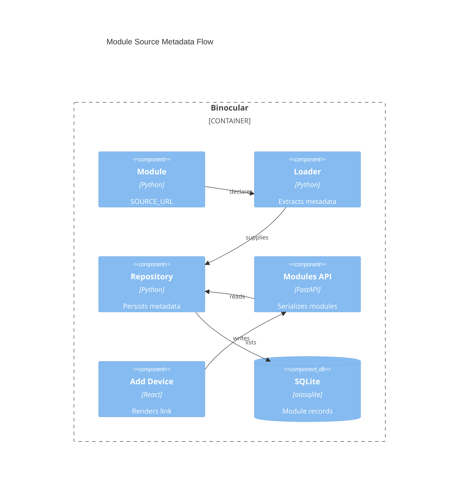

# Implementation Plan: Add Device Module Source Link

**Branch**: `00033-add-device-module-source-link` | **Date**: 2026-09-07 | **Spec**: [spec.md](spec.md)

## Summary

**Goal**: Let operators open a selected module's canonical source page while adding a device.
**Approach**: Carry optional source metadata from module declaration through SQLite and the existing modules API to the React form.
**Key Constraint**: Preserve compatibility for modules and database rows with no source URL.

## Technical Context

**Language/Version**: Python 3.13+; TypeScript 5.x / React 19
**Primary Dependencies**: FastAPI, Pydantic, aiosqlite; React, TanStack Query, shadcn/ui
**Storage**: SQLite via aiosqlite and numbered migrations
**Testing**: pytest + pytest-asyncio; Vitest + React Testing Library
**Target Platform**: Linux Docker container and modern browsers
**Project Type**: web
**Project Mode**: brownfield
**Performance Goals**: No network request is added to form rendering.
**Constraints**: Raw parameterized SQL, strict mypy/TypeScript, display-only metadata, no outbound module requests.
**Scale/Scope**: Single-user inventory of 5–50+ devices.

## Instructions Check

| Gate | Status | Evidence |
|------|--------|----------|
| Honest failure | PASS | No check path changes; empty metadata produces no misleading link. |
| Polite scraping | PASS | No requests are added and modules retain host-client-only behavior. |
| Data ownership | PASS | Metadata is stored in the existing SQLite volume. |
| Least privilege | PASS | No container or extension trust-boundary change. |
| Type safety | PASS | Typed Pydantic and TypeScript fields with automated tests. |
| Reliability | PASS | Nullable migration preserves existing module records. |

## Architecture



## Architecture Decisions

| ID | Decision | Options Considered | Chosen | Rationale |
|----|----------|--------------------|--------|-----------|
| AD-001 | Representation for missing source metadata | NULL only / empty string only / nullable storage with normalized empty API value | Nullable storage, empty API value | Preserves old rows while giving the frontend a simple conditional. |
| AD-002 | Link behavior | same-tab / external tab without relation / external tab with `noreferrer` | External tab with `noreferrer` | Retains the form and removes opener/referrer exposure. |

## Data Model Summary

| Entity | Key Fields | Relationships | Notes |
|--------|------------|---------------|-------|
| Module | `source_url` nullable TEXT | Existing module record | Declared metadata; no check semantics. |

**Detail**: [data-model.md](data-model.md)

## API Surface Summary

| Method | Path | Purpose | Auth | Req/Res Types |
|--------|------|---------|------|---------------|
| GET | `/api/v1/modules` | List source metadata with modules | Existing trusted-LAN model | `ModuleResponse.source_url` |

**Detail**: [contracts/modules-source-url.md](contracts/modules-source-url.md)

## Testing Strategy

| Tier | Tool | Scope | Mock Boundary | Install |
|------|------|-------|---------------|---------|
| Unit | pytest | Loader extraction and repository CRUD | Temporary module files / SQLite | configured |
| Integration | pytest, Vitest | API serialization, seeding, Add Device link states | Test DB / mocked `useModules` | configured |
| Security | Trivy | Built image in CI | — | configured in CI |
| Coverage | pytest-cov, Vitest | Backend and frontend changed paths | — | configured |

## Error Handling Strategy

| Error Category | Pattern | Response | Retry |
|----------------|---------|----------|-------|
| Missing metadata | graceful fallback | Empty API value and no link | no |
| Migration failure | startup fail-fast | Existing migration runner logs and prevents unsafe start | no |

## Risk Mitigation

| Risk (from spec) | Likelihood | Impact | Mitigation | Owner |
|-------------------|------------|--------|------------|-------|
| Stale source metadata | medium | low | Keep URLs in module source so module updates refresh persisted values. | Official modules / uploader |
| Incomplete persistence path | medium | medium | Test loader, repository, upload, seeding, and API paths with declared and absent values. | Backend tests |

## Requirement Coverage Map

| Req ID | Component(s) | File Path(s) | Notes |
|--------|--------------|--------------|-------|
| FR-001 | Contract, loader, validator | `backend/src/binocular/extensions/{contract,loader,validator}.py` | Optional extraction only. |
| FR-002 | Migration, repository, upload, seeder | `backend/src/binocular/db/migrations/0008_module_source_url.sql`; `backend/src/binocular/{extensions/repository.py,routes/modules.py,services/seeder.py}` | Create and update paths. |
| FR-003 | Response schema and modules route | `backend/src/binocular/devices/models.py`; `backend/src/binocular/routes/modules.py` | Existing GET gains field. |
| FR-004 | API type and form | `frontend/src/lib/api.ts`; `frontend/src/components/inventory/device-form.tsx` | Conditional safe external link. |
| FR-005 | Official modules | `backend/src/binocular/official_modules/*.py` | Add canonical declarations. |

## Project Structure

### Source Code

```text
~ backend/src/binocular/extensions/contract.py
~ backend/src/binocular/extensions/loader.py
~ backend/src/binocular/extensions/repository.py
+ backend/src/binocular/db/migrations/0008_module_source_url.sql
~ backend/src/binocular/routes/modules.py
~ backend/src/binocular/services/seeder.py
~ backend/src/binocular/official_modules/*.py
~ backend/src/binocular/devices/models.py
~ frontend/src/lib/api.ts
~ frontend/src/components/inventory/device-form.tsx
~ backend/tests/extensions/*
~ frontend/src/components/inventory/device-form.test.tsx
```

**Patterns to reuse**: frozen/slotted loader results, repository allowlists, Pydantic response models, TanStack Query hooks.
**Tests to extend**: loader, repository/routes/seeder, and `device-form.test.tsx`.
**Naming conventions**: snake_case Python/SQL and kebab-case frontend component files.

## Implementation Hints

- **[HINT-001]** Order: Add migration before repository fields so fresh and upgraded databases share the schema.
- **[HINT-002]** Compatibility: Keep `SOURCE_URL` optional; never add it to required validator attributes.
- **[HINT-003]** Gotcha: Upsert paths must write `source_url` even when the module version is unchanged but source metadata changes.
- **[HINT-004]** Constraint: Use `target="_blank" rel="noreferrer"` only for a non-empty selected URL.
