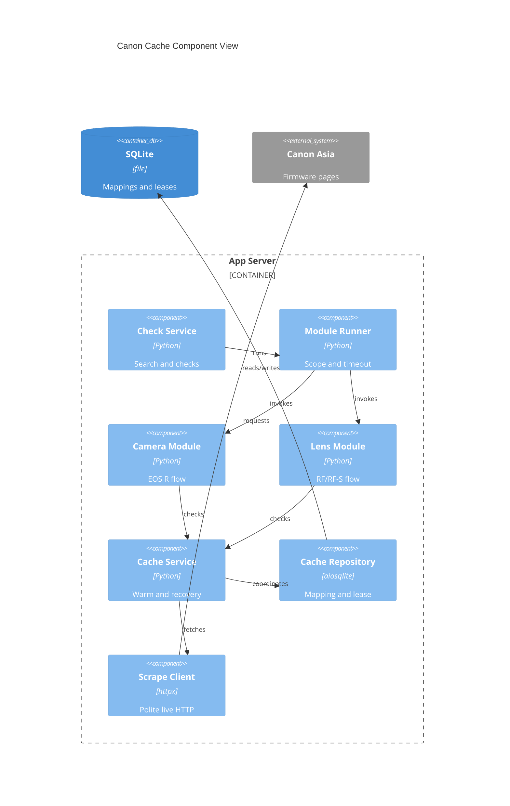

# Implementation Plan: Canon Endpoint Discovery Cache

**Branch**: `00033-canon-endpoint-discovery-cache` | **Date**: 2026-09-07 | **Spec**: [spec.md](spec.md)

## Summary

**Goal**: Persist Canon endpoint metadata without caching firmware results.
**Approach**: Use SQLite mapping/lease state for paced live validation or one recovery discovery.
**Key Constraint**: `ScrapeClient`, strict `<24h` freshness, cancellation, and visible failure remain authoritative.

## Technical Context

**Language/Version**: Python 3.13
**Primary Dependencies**: aiosqlite, httpx, BeautifulSoup4, structlog
**Storage**: Existing SQLite single file; raw parameterized SQL; numbered migrations
**Testing**: pytest, pytest-asyncio, pytest-cov; injected time and scripted transports
**Target Platform**: Linux non-root Docker container
**Project Type**: web
**Project Mode**: brownfield
**Performance Goals**: Fresh mapping completes in 0–30 seconds after Canon pacing slot acquisition
**Constraints**: No version cache; shared Canon pacing; bounded cancellation-safe execution
**Scale/Scope**: Single user/instance; 5–50+ devices

## Instructions Check

| Gate | Status | Evidence |
|------|--------|----------|
| Honest failure | PASS | `TR-005`/`TR-007` surface unrecovered failure with last-success intact |
| Polite scraping | PASS | `TR-003` retains `ScrapeClient` policy enforcement |
| SQLite ownership | PASS | [data-model.md](data-model.md) stores discovery/lease metadata only in the existing SQLite volume |
| Correctness/testing | PASS | `TR-008` maps deterministic migration, expiry, fixture, concurrency, and cancellation coverage |
| Reliability/trust boundary | PASS | No detached post-cancel request, external dependency, or sandbox claim introduced |

## Architecture



## Architecture Decisions

| ID | Decision | Options Considered | Chosen | Rationale |
|----|----------|--------------------|--------|-----------|
| AD-001 | Cache value | Stored firmware result / endpoint metadata only | Endpoint metadata only | A fresh live parse is the authoritative result; aligns with ADR-0014 |
| AD-002 | Coordination boundary | In-process lock / SQLite lease | Fenced SQLite lease | Coalesces same-model work across processes and survives owner loss |
| AD-003 | Recovery policy | Reuse stale endpoint / invalidate then one discovery | Definitive invalidation plus one full discovery | Prevents stale success and bounds extra Canon work |

## Data Model Summary

| Entity | Key Fields | Relationships | Notes |
|--------|------------|---------------|-------|
| CanonFirmwareEndpointMapping | family, model key, endpoint URL, discovery/validation/invalidation timestamps | Same composite key as lease | No firmware version; fresh only below 24h |
| CanonRefreshLease | family, model key, owner/fencing token, expiry, heartbeat, waiters, state | Coordinates one mapping operation | CAS takeover and atomic detach/close |

**Detail**: [data-model.md](data-model.md)

## API Surface Summary

N/A — no new HTTP API contract; existing search, manual, and scheduled paths retain their public outcomes.

## Testing Strategy

| Tier | Tool | Scope | Mock Boundary | Install |
|------|------|-------|---------------|---------|
| Unit | pytest + pytest-asyncio | Freshness, invalidation, repository and lease CAS | Clock, SQLite connection, client | configured |
| Integration | pytest + httpx MockTransport | Migration/restart, three check paths, shared pacing and fixtures | Canon responses/transport only | configured |
| Static analysis | mypy --strict | Cache, modules, runner, and service changes | — | configured |
| Security | Ruff S rules + pip-audit + Trivy | Parameterized SQL, dependencies, and built image vulnerabilities | — | configured / CI image scan |
| Coverage | pytest-cov | Cache/module/runner paths; ≥80% repository policy | — | configured |

## Error Handling Strategy

| Error Category | Pattern | Response | Retry |
|----------------|---------|----------|-------|
| Cached endpoint failure | Invalidate then one full discovery | Shared live result or visible failed check; preserve last-success | One recovery only |
| Policy failure before endpoint | Propagate existing client/runner behavior | Visible failure where applicable; no stale result | `ScrapeClient` policy only |
| Lease loss/close race | Fence stale owner; join successor | Waiter gets successor result or shared visible failure | No independent duplicate work |

## Integration Points

| Spec Reference | System/Service | Technical Approach | Contract |
|----------------|----------------|--------------------|----------|
| IP-001 | Migration runner / SQLite WAL | Append migration and raw-SQL repository; short transactions | [data-model.md](data-model.md) |
| IP-002 | `ScrapeClient` | Cache service invokes only scoped centralized live requests | Existing `get(url)` contract |
| IP-003 | Canon modules / runner / checks | Preserve return shape across all check entry points | Existing module contract |

## Risk Mitigation

| Risk (from spec) | Likelihood | Impact | Mitigation | Owner |
|-------------------|------------|--------|------------|-------|
| Module execution model limits async coordination | medium | high | Preserve synchronous module contract; test cancellation/close races | Cache service + runner |
| Endpoint response drift | medium | high | Fixture failures invalidate before discovery and prove no stale success | Canon modules/tests |
| Migration contention | low | medium | Append one short-transaction migration; use keyed repository writes and file-backed migration tests | Cache repository |

## Requirement Coverage Map

| Req ID | Component(s) | File Path(s) | Notes |
|--------|--------------|--------------|-------|
| TR-001 | Migration, cache repository | `backend/src/binocular/db/migrations/0009_canon_endpoint_cache.sql`; `backend/src/binocular/official_modules/canon_endpoint_cache.py` | Mapping and fenced lease metadata only |
| TR-002 | Cache service, repository | `backend/src/binocular/official_modules/canon_endpoint_cache.py` | Dispatch-point `<24h` check after lease/pacing |
| TR-003 | Canon modules, runner checks | `backend/src/binocular/official_modules/canon_rf_cameras.py`; `backend/src/binocular/official_modules/canon_rf_lenses.py`; `backend/src/binocular/extensions/runner.py` | One mapped `ScrapeClient` request per entry path |
| TR-004 | Cache service, Canon modules | `backend/src/binocular/official_modules/canon_endpoint_cache.py`; `backend/src/binocular/official_modules/canon_rf_cameras.py`; `backend/src/binocular/official_modules/canon_rf_lenses.py` | Full discovery on missing/expired mapping |
| TR-005 | Cache service, parsers | `backend/src/binocular/official_modules/canon_endpoint_cache.py`; `backend/src/binocular/official_modules/canon_rf_cameras.py`; `backend/src/binocular/official_modules/canon_rf_lenses.py` | Classification, invalidation, one fallback |
| TR-006 | Lease repository, cache service | `backend/src/binocular/official_modules/canon_endpoint_cache.py` | Owner token, fencing, heartbeat, atomic enrollment/close |
| TR-007 | Runner/check service integration | `backend/src/binocular/extensions/runner.py`; `backend/src/binocular/services/checks.py` | Preserve visible failed check and last-success |
| TR-008 | Cache/module/runner tests | `backend/tests/test_canon_endpoint_cache.py`; Canon module tests | Fixtures, virtual time, no real sleep/live request |

## Project Structure

### Source Code

```text
~ backend/src/binocular/official_modules/canon_rf_cameras.py
~ backend/src/binocular/official_modules/canon_rf_lenses.py
+ backend/src/binocular/official_modules/canon_endpoint_cache.py
+ backend/src/binocular/db/migrations/0009_canon_endpoint_cache.sql
~ backend/src/binocular/extensions/runner.py
~ backend/src/binocular/services/checks.py
+ backend/tests/test_canon_endpoint_cache.py
~ backend/tests/test_official_canon_rf_cameras_module.py
~ backend/tests/test_official_canon_rf_lenses_module.py
```

**Patterns to reuse**: `RepositoryBase`, append-only migrations, `ScrapeClient.scope`, module error prefixes, fixture clients.
**Tests to extend**: Canon camera/lens fixture suites, runner/check service tests, migration tests.
**Naming conventions**: `snake_case` modules/functions; `test_*.py`; `NNNN_description.sql` migrations.

## Implementation Hints

- **[HINT-001]** Order: Enroll/fence lease, acquire the centralized pacing slot, then evaluate freshness at the linearized dispatch point.
- **[HINT-002]** Constraint: A successful recovery discovery already has the authoritative live response; do not send an extra validation request.
- **[HINT-003]** Gotcha: Invalidate on every cached-endpoint transport, status, parsing, identity, timeout, or cancellation failure before recovery.
- **[HINT-004]** Compatibility: Preserve synchronous `check_firmware` module contract and existing `RunResult`/visible failure shape.
- **[HINT-005]** Performance: Never hold a SQLite transaction across pacing, HTTP, parsing, or waiter completion.
