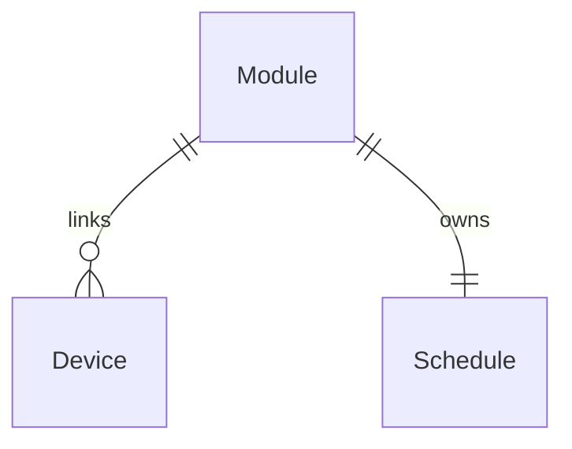

# Data Model: Sources

## Guidance Contract

| Optional V1 declaration | Python type | Persisted field / default | Validation |
|---|---|---|---|
| SOURCE_DISPLAY_NAME | str | display_name TEXT NOT NULL DEFAULT '' | ≤120 Unicode characters; blank means readable filename fallback. |
| SOURCE_COVERAGE_NOTES | str | coverage_notes TEXT NOT NULL DEFAULT '' | ≤1000 characters; plain text only; blank means existing type, no invented coverage. |
| SOURCE_MODEL_EXAMPLES | list[str] or tuple[str, ...] | model_examples TEXT NOT NULL DEFAULT '[]' | ≤10 items; each nonblank string ≤120 characters; serialize JSON array. |
| SOURCE_HELP_URL | str | help_url TEXT NOT NULL DEFAULT '' | ≤2048 characters; only absolute HTTP(S) with hostname may act; invalid scheme/relative/control-character/credential URLs become empty actionable help, never affect canonical source_url. |

- **Strictness**: Missing declarations default; reject wrong types, non-string entries and excessive limits without str() coercion or truncation. Names/notes/examples render escaped text, not HTML/Markdown. Explicit empty strings/empty arrays are supported.
- **Validation stages**: Shared typed parser in `extensions/guidance.py`; AST checks literal declarations, reports unsupported nonliteral metadata with field-specific fixes; loader independently validates runtime values. Neither proof phase nor loader bypasses bounds. Existing V1 required constants/function remain unchanged.
- **SOURCE_URL**: Existing canonical string preserved verbatim, including unsafe legacy values for fidelity; API/UI expose action only after separate URL validation. Human help never replaces scrape endpoints.

## Persistent Entities

| Entity | Attributes (types / constraints) | Relationships | State Transitions |
|---|---|---|---|
| Module | Existing id PK, name, file_path, device_type, version, author, is_official, status, created_at, source_url, consecutive_failures, last_success preserved; four bounded guidance fields above; registration_origin TEXT NOT NULL DEFAULT 'legacy' CHECK legacy/bundled/custom; official_content_hash TEXT NOT NULL DEFAULT '' CHECK empty or 64 lowercase hex, host-controlled | has_many Devices; has_one Schedule | active → inactive on pause; inactive/error → active only explicit resume; provenance transitions below |
| Device | Existing id PK and all fields, especially module_id/current_version/notification/check state, preserved; no stored counter/type override | module_id existing FK(Module) | create/relink/delete changes derived membership |
| Schedule | Existing id PK, module_id UNIQUE FK, interval_hours, last_run, next_run, created_at, updated_at preserved; no new interval default/pause column | belongs_to Module | interval edit preserves Module.status; inactive/error never registers automatic work |

ER Diagram (visual reference)

- **Migration**: Append `0010_source_guidance.sql` after current 0009; ALTER additions only; CHECK length/default/provenance constraints where SQLite supports them; parser owns JSON element validation. Do not edit earlier migrations, rebuild tables, seed guessed labels by name, replace IDs, or reset schedules. Runner backup gate applies.
- **Derived API**: `guidance_provenance` = verified_official/custom/legacy; verified requires host-owned bundled registration and actual active-file digest matching current shipped entry. Failed/missing/unrecognized digest clears official claim, never silently substitutes official guidance. Validate cheap local digest on module list/lifecycle; no import/vendor I/O for render. Persisted declaration text may remain as unverified author guidance.
- **Scope snapshot**: Module list query uses correlated count by module_id; detail endpoint SELECTs exact id/name/model membership once and derives count from that same array. No persisted counters or duplicate-filter implementation.

## Lifecycle / Legacy Seeding

| Situation | Required transition |
|---|---|
| New bundled source | Validate → copy → insert active/bundled/hash/guidance; existing schedule insert trigger supplies initial 24h schedule. |
| Known bundled file unchanged | Refresh missing/stale persisted guidance/type/provenance even when hash/version match; retain all operational fields and schedule timestamps. |
| Known bundled file upgrade | Use existing VersionCompare ordering; update content/metadata by existing ID; preserve inactive/error state, interval, links, health, timestamps; never downgrade a newer active version. |
| Legacy row without provenance | Inspect existing file_path, expected active destination, version and hash; adopt only exact current shipped bytes or an explicit checked-in historical shipped digest for that name/version. Identity alone or is_official alone is insufficient. |
| Legacy unknown/missing/mismatched file | Protect existing file/row; report unverifiable provenance visibly and do not seed competing record under same identity. Do not map unrelated readable labels onto official IDs. |
| Explicit custom upload/replacement | Validate before save; clear official hash/is_official; set custom origin and uploaded guidance (including empty omissions); preserve existing ID, status, links and schedule; do not inherit official guidance. New custom source starts active with normal trigger schedule. |
| Direct file modification | Digest mismatch invalidates verified badge; protect divergent bytes, downgrade guidance provenance, show repair warning. |
| Pause / interval edit / resume | Pause commits inactive then blocks automatic admission/removes job before success; interval edit updates saved interval without activating; resume is explicit status=active and registers active-only job. |

- **Actual legacy baseline**: SQL migrations create tables and schedules, not official module names. Current Python seeder scans every .py including helpers (invalid contract rejected); identical hash/version returns early; same-version divergent files are overwritten, older bundled versions are protected, newer bundled versions overwrite and force active. No general same-version custom protection currently exists. Upload forces active and retains existing is_official: both defects must change.
- **Historical evidence**: `services/official_provenance.py` contains only maintainers' known shipped digests, generated from baseline `b1b8b99` files before metadata changes. Unknown releases remain protected; do not pretend this finite list proves arbitrary older images. Missing files need visible operator recovery, not silent replacement.

## Execution / Write Boundaries

- **Shared writes**: One lifespan aiosqlite connection; RepositoryBase commits per write, scheduler/check/cache issue independent commits. Use one parameterized UPDATE for each metadata/status mutation. No BEGIN transaction spanning awaits, ad-hoc SAVEPOINT or new DB mutex; unrelated cache commits must not participate in lifecycle transactions.
- **Automatic admission**: Scheduler owns per-module process-local execution gate/generation, shared by every CheckService/runner it creates and status routes. A short thread-safe gate protects the worker's entry claim and pause invalidation only; never holds across module execution, DB I/O or HTTP. This is not a transaction lock.
- **Start boundary**: Re-read module status/device membership before automatic dispatch; worker queued in asyncio/executor must claim current active generation immediately before invoking check_firmware. Successful pause invalidates all unclaimed entries before response; claimed/running invocations may finish. Resume issues a new generation; old queued work cannot run after pause/resume. Skips do not count as scrape failures, health failures, notifications or last-success updates.
- **Manual**: No automatic admission requirement for single/bulk/search; no status writes/resume side effects. Startup hydrates gates only from active rows. Test status-query/pause/worker barriers deterministically.
