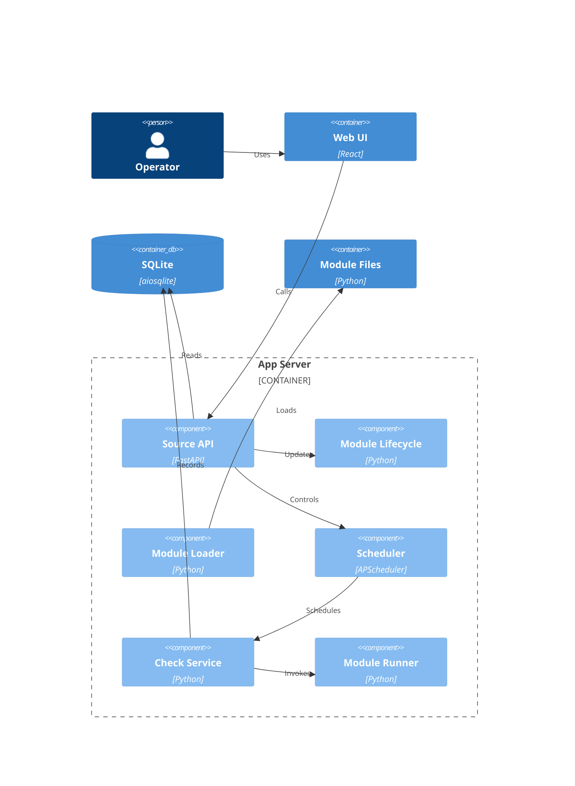

# Implementation Plan: Sources

**Branch**: `00036-source-guidance-schedule-scope` | **Date**: 2026-10-07 | **Spec**: [spec.md](spec.md)

## Summary

**Goal**: Entire #12: guidance, scope, authoring.
**Approach**: Optional V1 fields; SQLite; provenance; automatic admission.
**Key Constraint**: Preserve identity/matching/URLs/state/custom replacements.

## Technical Context

| Field | Value |
|---|---|
| Baseline | `specs/sad.md`, `project-instructions.md`; ADR-0004/0005/0007/0009/0013 |
| Language/Version | Python 3.13; React 19; TypeScript 5.9.3 (Implement alignment) |
| Primary Dependencies | Existing SAD stack; FastAPI/aiosqlite/APScheduler/React/Radix/Query |
| Storage | Single SQLite; parameterized SQL; numbered migrations |
| Testing | pytest/pytest-asyncio/fixtures; Vitest/RTL; Playwright smoke |
| Target Platform | Non-root Linux Docker, trusted LAN |
| Project Type | web monolith |
| Project Mode | brownfield |
| Performance Goals | Local help/member snapshots |
| Constraints | No crawling, dependencies, telemetry or coverage expansion |
| Scale/Scope | Eight official/custom V1; 5–50+ devices |

## Instructions Check

| Gate | Author pre/post | Evidence |
|---|---|---|
| I | PASS | Visible failures; retain last-success. |
| II | PASS | Existing centralized HTTP; local help. |
| III | PASS | Additive SQLite; no external state. |
| IV | PASS | Pre-import warning: user-vetted unsandboxed in-process/full privileges. |
| V / Stack | PASS | Planned TS5.9.3/lockfile alignment, strict app/node checks; golden verification required. |
| VI | PASS | Worker gate; preserve pause/custom bytes. |
| VII | PASS | Structured ≤10KB artifact. |
| Layout/QC | PASS | src roots; lint/static/security/80%/build. |
| Independent | PASS | Direct leaf DB/API/QC and policy reviews; planned design only. |

- **Resolution**: Parent authorized TS5.9.3 tooling correction, not policy amendment; prior FAIL retained in log.

## Architecture

## Architecture Decisions

| ID | Decision | Options Considered | Chosen | Rationale |
|---|---|---|---|---|
| AD-001 | Guidance | Registry/fields/UI | Optional fields | ADR-0013; V1 compatible. |
| AD-002 | Official proof | Name/flag/hash | Origin + hash | Protect custom/known old bytes. |
| AD-003 | Scope | Filter/list | Exact member endpoint | No existing inventory filter. |
| AD-004 | Pause | Remove/cancel/gate | DB recheck + worker generation | Block pending; running finishes; manual bypass. |
| AD-005 | Writes | Transactions/locks/UPDATE | Existing per-write commits | Shared connection; no competing DB lock. |

## Data Model Summary

| Entity | Key Fields | Relationships | Notes |
|---|---|---|---|
| Module | Four guidance fields; origin/hash | Existing FKs | 0010; bounds 120/1000/10×120/2048. |
| Device | module_id | Existing Module FK | No stored counter/type override. |
| Schedule | module_id, interval_hours; Module.status | Existing unique FK | Explicit resume only; retain timestamps. |

**Detail**: [data-model.md](data-model.md), [official-guidance.md](official-guidance.md).

## API Surface Summary

| Method | Path | Purpose | Auth | Req/Res Types |
|---|---|---|---|---|
| GET | /api/v1/modules | Compatible guidance/provenance/count | Existing LAN/basic auth | ModuleResponse[] |
| GET | /api/v1/modules/{module_id}/devices | Exact member snapshot | Existing | ScopeResponse |
| POST | /api/v1/modules | Validate/preserve replacements | Existing | Multipart/NDJSON |
| PUT | /api/v1/modules/{module_id} | Pause boundary/explicit resume | Existing | ModuleUpdate/Response |
| GET/PUT | /api/v1/schedules | Preserve status/interval semantics | Existing | Existing types |

**Detail**: [contracts/api.md](contracts/api.md), [contracts/openapi.yaml](contracts/openapi.yaml).

## Testing Strategy

| Tier | Tool | Scope | Mock Boundary | Install |
|---|---|---|---|---|
| Unit | pytest; Vitest/RTL | Bounds/links/resets | Fakes | configured |
| Integration | pytest-asyncio; Playwright | State/pause/golden/mobile | SQLite/fixtures/fake alerts | configured + quickstart.md |
| Security | Ruff S/pip-audit/npm audit/Trivy | URLs/provenance/image | Fake data | configured (Trivy release/scan CI) |
| Coverage | pytest-cov; Vitest v8 | ≥80%, boundaries/races | Same mocks | configured + quickstart.md |
| Static/build | Ruff/mypy --strict; ESLint/tsc; Docker | Changed code/image | None | configured |

- **Commands/matrix**: [quickstart.md](quickstart.md).

## Error Handling Strategy

| Error Category | Pattern | Response | Retry |
|---|---|---|---|
| Metadata | Reject pre-save | Field/limit/fix streamed failure | Correct input |
| Unsafe link | Preserve canonical, omit action | No unsafe/absent clickable URL | No |
| Fetch/count/kit | Visible errors | Unknown count; retry | Explicit |
| Write | Await commit/gate | Non-2xx/failed stream; confirmed state | Explicit |
| Provenance | Protect bytes | Repair warning | Operator |
| Automatic skip | Neutral | No failure/alert/last-success mutation | Active interval |

## Risk Mitigation

| Risk (from spec) | Likelihood | Impact | Mitigation | Owner |
|---|---|---|---|---|
| Drift: Verify fixtures. | medium | high | Evidence table/eight golden suites. | Modules |
| State regression: Test pause/upgrades. | high | high | State snapshots/worker barriers. | Lifecycle |
| Overlap: Coordinate UI. | medium | medium | Shared UI; coordinate #4/#5/#7/#8. | UI |

## Requirement Coverage Map

- **Roots**: B/ = `backend/src/binocular/`; F/ = `frontend/src/`.

| Req ID | Component(s) | File Path(s) | Notes |
|---|---|---|---|
| FR-001 | Identity | B/extensions/guidance.py; F/lib/api.ts | Labels ≠ IDs. |
| FR-002 | Eight sources | B/official_modules/*.py | Exact official-guidance.md table. |
| FR-003 | Types | B/official_modules/panasonic_lumix_lenses.py; F/components/modules/ModuleCard.tsx | Lens/mixed coverage. |
| FR-004 | Canon | B/official_modules/canon_rf_{cameras,lenses}.py | Asia/exclusions/RF-S. |
| FR-005 | Form | F/components/inventory/device-form.tsx | Source first/free text. |
| FR-006 | Search | F/components/inventory/device-form.tsx | Discard stale generation. |
| FR-007 | Links | B/extensions/guidance.py; F/lib/source-guidance.ts | HTTP(S)/opener. |
| FR-008 | Local help | F/components/inventory/SourceGuidance.tsx | Local metadata only. |
| FR-009 | Validation | B/extensions/{contract,loader,validator,guidance}.py | Bounds/omission fallback. |
| FR-010 | Provenance | B/services/official_provenance.py; B/routes/modules.py | Host proof; shared projection. |
| FR-011 | Lifecycle | B/db/migrations/0010_source_guidance.sql; B/services/seeder.py | Preserve state/custom bytes; backfill. |
| FR-012 | Scope | B/routes/modules.py; F/hooks/{use-devices,use-modules}.ts | Snapshot/invalidation. |
| FR-013 | Controls | F/components/modules/{ModuleCard,FrequencyEditor}.tsx | All N/current/future. |
| FR-014 | Pause UI | F/components/inventory/device-form.tsx; F/components/modules/ModuleCard.tsx | Automatic off/manual on. |
| FR-015 | Admission | B/services/{scheduler,checks,automatic_admission}.py; B/extensions/runner.py; B/routes/modules.py | Active/entry guard/resume. |
| FR-016 | Disclosure | F/components/modules/ModuleCard.tsx | Guidance first; health visible. |
| FR-017 | Authoring | F/components/modules/{ModuleGuidanceSection,ModuleUploadForm}.tsx; B/module_kit/* | Kit/AI/sharing/trust warning. |
| FR-018 | A11y | F/components/inventory/SourceGuidance.tsx; F/components/modules/{ModuleCard,ModuleGuidanceSection}.tsx | Keyboard/mobile/labels. |
| FR-019 | UI states | F/pages/modules.tsx; F/components/modules/{FrequencyEditor,ModuleGuidanceSection}.tsx; F/components/inventory/device-form.tsx | Unknown ≠ zero/saved. |
| FR-020 | Regression | backend/tests/{test_seeder.py,test_migrations.py,test_official_*_module.py,services/test_scheduler.py}; F/components/inventory/device-form.test.tsx | Offline matrix/smoke. |

## Project Structure

### Source Code

- **~ Backend**: Coverage map; B/extensions/repository.py, B/devices/models.py.
- **+ Backend**: B/extensions/guidance.py, B/services/{official_provenance,automatic_admission}.py, B/db/migrations/0010_source_guidance.sql.
- **~ Frontend**: Coverage map; F/lib/api.ts; frontend/package{,-lock}.json, tsconfig.node.json; tests.
- **+ Frontend**: F/lib/source-guidance.ts, F/components/inventory/SourceGuidance.tsx; tests/smoke.
- **Patterns to reuse**: RepositoryBase/backup/SOURCE_URL/NDJSON/Query/Radix.
- **Tests to extend**: Lifecycle/golden/form/kit/upload/card/scope.
- **Naming**: snake_case Python; PascalCase modules/lowercase inventory.

## Implementation Hints

- **[HINT-001]** Order: Capture pre-change shipped hashes; protect unknown legacy bytes.
- **[HINT-002]** Gotcha: Existing seeding skips backfill/forces active; no SQL name seeds.
- **[HINT-003]** Constraint: Start = worker entry, not submission; no competing DB lock or gate across execution.
- **[HINT-004]** Compatibility: Upload omissions clear guidance; collisions never inherit official claims.
- **[HINT-005]** Order: Task TS5.9.3/lockfile + strict node; remove ignoreDeprecations6 if present. Re-audit Plan; Implement verifies build/lint/tests per quickstart.md.
