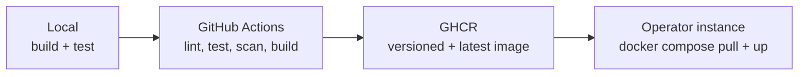
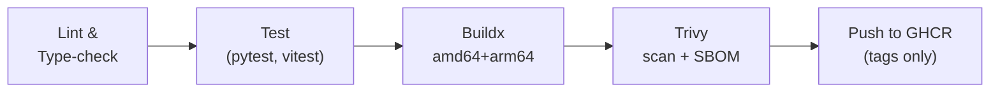
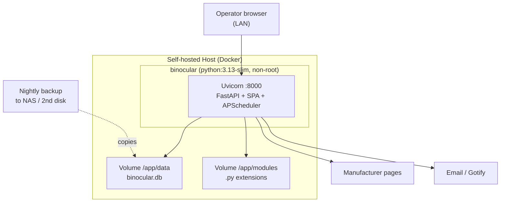
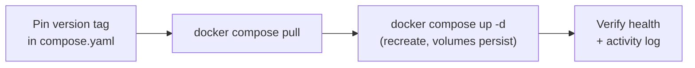

# Deployment & Operations Document: Binocular

> Date: 2026-05-31 | Status: Draft

## Deployment Summary and Context

Binocular ships as a **single, self-contained Docker image** that an operator runs on a private, trusted LAN. The deployment goal is set-and-forget homelab operation: one container, one port, one data volume, non-root, zero external dependencies (no database server, broker, or cloud service). This document covers how that image is built, distributed, configured, backed up, and operated. It complements — and does not repeat — the architecture in [specs/sad.md](sad.md); for runtime structure, the core/extension seam, and per-component decisions, see the SAD and its ADR catalog.

Operational ambition is intentionally **homelab-grade and minimal**: there is no environment ladder, no SLO/error-budget/on-call machinery, no IaC, and no external telemetry. Enterprise-oriented sections of the standard template are omitted as not applicable rather than filled with placeholders.

## Environment Strategy

Binocular has two effective environments: a developer workstation and the operator's production instance. They run the same image; there is no shared staging tier.

| Environment | Purpose | Promotion Gate | Data Strategy | Parity with Prod |
|-------------|---------|----------------|---------------|------------------|
| Local (dev) | Build, test, and validate modules locally | CI green on PR | Seed/fixtures + golden module tests | High — identical image build |
| Production (operator) | The operator's live homelab instance | Operator pulls a published SemVer tag | Real SQLite data on a persistent volume | Baseline |

### Environment Flow

### Progressive Rollout

- **Feature flags**: None. Behavior is controlled by environment variables and the operator's chosen image tag.
- **Rollout strategy**: Operator-driven. Each release is a published image tag; the operator updates when they choose.
- **Rollback trigger**: Operator pins the previous known-good SemVer tag and recreates the container (see [Rollback](#rollback)).

## Deployment Targets and Packaging

- **Deployment model**: Single OCI container image (multi-stage build — Node stage compiles the Vite SPA, final `python:3.13-slim` stage serves it via FastAPI `StaticFiles`).
- **Build artifact**: One Docker image, multi-arch `linux/amd64` + `linux/arm64` (covers x86 homelab hosts and ARM SBCs such as Raspberry Pi).
- **Container registry**: GitHub Container Registry (GHCR), public — `ghcr.io/<owner>/binocular`.
- **Image tagging**: Driven by SemVer git tags via `docker/metadata-action` — `{{version}}`, `{{major}}.{{minor}}`, and `latest`. The `{{major}}` tag is enabled only for `>= v1.0.0`. Base image pinned by digest for reproducibility.
- **Vulnerability scanning**: Trivy (`aquasecurity/trivy-action`) in CI against the built image; fail on HIGH/CRITICAL with available fixes. Weekly scheduled re-scan of the published image since it is long-lived.
- **SBOM / provenance**: Emitted cheaply by buildx (`sbom: true`, `provenance: true` on `build-push-action`) and attached as OCI attestations.
- **App store / Edge/CDN**: N/A.

## CI/CD Pipeline Design

### Pipeline Stages

- **Pipeline tooling**: GitHub Actions.
- **Quality gates (PRs and pushes)**: Ruff + mypy `--strict` (backend), Biome/ESLint + `tsc` (frontend); `pytest` + `pytest-asyncio`, Vitest + React Testing Library, one Playwright smoke test, and golden/fixture module-correctness tests.
- **Build stack**: `docker/setup-qemu-action` → `docker/setup-buildx-action` → `docker/login-action` (GHCR via `GITHUB_TOKEN`, `permissions: packages: write`) → `docker/metadata-action` → `docker/build-push-action` with `platforms: linux/amd64,linux/arm64`.
- **Publish condition**: Images are pushed only on SemVer tag refs; PR builds build-but-do-not-push. Layer caching via `type=gha` (`mode=max`).
- **IaC approach**: None — there is no managed infrastructure to provision.
- **Deployment method**: Pull-based. The operator runs `docker compose pull && docker compose up -d`; there is no push deploy or GitOps controller.
- **Secrets in pipeline**: Only the built-in `GITHUB_TOKEN` for GHCR; no application secrets are baked into the image or passed as build args.

## Infrastructure and Hosting

- **Hosting**: Self-hosted by the operator (homelab host, NAS, mini-PC, or SBC). No cloud provider.
- **Compute model**: A single Docker container managed by Docker / Docker Compose. No orchestrator (Kubernetes/Swarm) assumed or required.
- **Networking**: One exposed port (`8000`) on the trusted LAN. TLS, if desired, is provided by the operator's own reverse proxy (e.g. Caddy/Traefik/Nginx) — out of scope for the image.
- **Storage infrastructure**: Two persistent volumes — `/app/data` (SQLite `binocular.db`) and `/app/modules` (user extension `.py` files). Operator-managed; backed up by file/volume copy.
- **Container hardening**: Non-root fixed UID (e.g. `10001`), `no-new-privileges:true`, `cap_drop: [ALL]`; optional `read_only` rootfs with a `tmpfs` for `/tmp`. See {SAD:ADR-0008}, {SAD:ADR-0001}.

### Infrastructure Diagram

## Observability and Monitoring

No external telemetry, metrics backend, or APM — by design. Observability is what an operator can see from Docker and the app's own UI.

### Logging
- **Approach**: Structured (JSON / key=value) logs via `structlog` with contextual fields (`device_id`, `module_name`), written to **stdout/stderr only** — never to files inside the container.
- **Aggregation**: `docker logs` / `docker compose logs -f`. The operator's Docker logging driver (`json-file` with `max-size`/`max-file`) handles rotation.
- **In-app activity log**: A bounded, size-limited recent-events log persisted in SQLite and viewable in the UI (scrape runs, notification dispatches, errors). Complements stdout; does not replace it.

### Metrics
- **Application signals**: Surfaced in the UI, not exported — failed-scrape count, last-success timestamps per device/module, notification dispatch failures.
- **Infrastructure signals**: Container health and data-volume disk usage observed via the operator's own Docker tooling.
- **DORA / distributed tracing**: N/A — out of scope for a single-user homelab app.

### Health Checking
- **Container HEALTHCHECK**: `--interval=30s --timeout=5s --start-period=20s --retries=3` against a cheap `/healthz` endpoint (process up + SQLite openable). Drives `docker ps` health status and `restart` policy. Kept shallow intentionally — not a deep dependency check.

### Alerting
- **Self-notification**: Binocular can dispatch operational failures (e.g. repeated scrape failures, notification-channel errors) through its own Apprise channels (Email/SMTP, Gotify). There is no PagerDuty/on-call rotation.
- **What the operator watches**: container health = healthy; failed-scrape trend; notification dispatch failures; `/app/data` disk-usage growth; container restart loops.

## Reliability Engineering

- **Availability target**: Best-effort homelab availability; `restart: unless-stopped` plus the HEALTHCHECK recover from crashes. No formal uptime SLO.
- **RPO** (Recovery Point Objective): **≤ 24h** — a nightly backup of `/app/data` to a second host/disk/NAS.
- **RTO** (Recovery Time Objective): **≤ 1h** — pull the image tag, restore the data file, `docker compose up -d`.

### Backup and Restore
- **Backup (live-safe)**: Do **not** plain-`cp` the WAL-mode database under load. Use SQLite `VACUUM INTO 'backup.db'` or the Online Backup API (`Connection.backup()`) for a consistent single-file snapshot. A scheduled (APScheduler) nightly job produces the snapshot; the operator copies it offsite/second-disk.
- **Raw-copy caveat**: If copying the volume directly, copy `binocular.db` together with its `-wal`/`-shm` files, or run `PRAGMA wal_checkpoint(TRUNCATE)` first. Separating the DB from its WAL loses committed transactions. See {SAD:ADR-0004}.
- **Restore**: Stop the container → replace `/app/data/binocular.db` (and remove stale `-wal`/`-shm`) → start. Boot path runs `PRAGMA integrity_check;`.
- **Disaster recovery**: One offsite/second-disk copy is sufficient at homelab scale; no replication or failover. Reprovision = run the image against the restored volume.

### Migration Safety
- Schema migrations run at startup inside a transaction, gated by `schema_version` / `PRAGMA user_version`, forward-only and idempotent. An automatic **pre-migration backup** is taken so a failed migration or a rollback to a previous image tag is recoverable. See {SAD:ADR-0004}.

### Production Readiness
- Non-root image builds and HEALTHCHECK pass.
- A restore from backup has been verified at least once.
- SMTP and/or Gotify notification channels validated end-to-end.
- Operator has pinned a specific SemVer tag (not relying solely on `latest`).

## Security and Compliance in Operations

### Supply Chain Security
- **SBOM**: buildx-generated, attached as an OCI attestation.
- **Dependency scanning**: Trivy/Grype in CI; backend deps hash-pinned (`uv.lock` / `pip --require-hashes`), frontend via `package-lock.json` + `npm ci`.
- **Artifact provenance**: buildx provenance attestation on published images.

### Runtime Security
- **Trust boundary**: Extension modules in `/app/modules` execute **unsandboxed, in-process, with full app privileges** — installing a module is equivalent to running arbitrary code. Accepted under the trusted-LAN single-user threat model and mitigated (not eliminated) by non-root container execution and operator vetting. Operators must **not** expose port 8000 to untrusted networks. See {SAD:ADR-0005}, {SAD:ADR-0008}.
- **Container**: non-root user, `no-new-privileges`, `cap_drop: [ALL]`, optional read-only rootfs.
- **No WAF/IDS**: Not applicable on a trusted LAN; perimeter is the operator's network.

### Secrets Management
- **Secrets store**: Environment variables, with the `_FILE` convention for Docker/Compose secrets — e.g. if `SMTP_PASSWORD_FILE` is set, read the credential from that path, else fall back to `SMTP_PASSWORD`. Same pattern for Gotify tokens.
- **Rotation**: Operator-managed; update the secret/env and recreate the container.
- **Access pattern**: Injected at runtime; never baked into the image or build args. See {SAD:ADR-0008}.

### Compliance
- **Frameworks**: None applicable (single-user, self-hosted, no personal-data processing beyond the operator's own inventory, no telemetry).
- **Audit logging**: The in-app activity log provides operator-visible history.

## Operational Ownership and Processes

- **Ownership model**: The self-hosting operator is the sole owner and operator ("you run it"). Project maintainers own the image, CI, and release tags.
- **On-call**: None.
- **Change management**: PR-based with CI quality gates; releases cut by tagging a SemVer version.
- **Release approval**: Maintainer creates a SemVer git tag → CI publishes the versioned + `latest` image. Operators adopt on their own schedule.
- **Documentation expectations**: A `compose.yaml` example, `.env.example`, README run/upgrade instructions, and a module dev/test kit for extension authors.

### Update Workflow

### Rollback

- Pin the previous known-good SemVer tag in `compose.yaml`, then `docker compose pull && docker compose up -d`.
- Because migrations are forward-only, pair any rollback that crosses a schema change with the **pre-migration backup** taken at upgrade time.

## Cost Considerations

- **Estimated cost**: Effectively $0 beyond the operator's existing hardware and electricity. GHCR is free for public images; GitHub Actions covers public-repo CI.
- **Cost drivers**: None recurring. Multi-arch QEMU builds consume slightly more CI minutes (optionally mitigated with native arm64 runners).
- **Cost monitoring**: N/A.

## Deployment Decisions

### DDR-001: GitHub Actions → public multi-arch GHCR image driven by SemVer tags

- **Status**: Accepted
- **Context**: An OSS self-hosted app needs a free, trusted distribution channel covering both x86 and ARM homelab hosts, with reproducible, pinnable releases.
- **Decision**: Build with `docker buildx` (QEMU) in GitHub Actions for `linux/amd64` + `linux/arm64`, publish to public GHCR, and tag from SemVer git tags (`{{version}}`, `{{major}}.{{minor}}`, `latest`).
- **Rationale**: Zero cost for public repos, native fit with the GitHub-hosted source, arm64 reach for Raspberry Pi / SBC users, and version pinning for operators.
- **Alternatives Considered**: Docker Hub (rate-limit friction, separate account); amd64-only (excludes SBC homelabs); local-build-only (poor operator UX).
- **Tradeoffs**: Multi-arch QEMU builds are slower in CI; mitigated by gha caching and the option of native arm64 runners.
- **Consequences**: Releases are cut by tagging; operators pull `ghcr.io/<owner>/binocular:<version>`.

### DDR-002: Minimal homelab-grade operations posture

- **Status**: Accepted
- **Context**: The system is a single-user, trusted-LAN, no-telemetry app. Standard enterprise ops machinery (environment ladder, SLO/error budgets, on-call, IaC, APM) would be disproportionate.
- **Decision**: Operate at homelab scale — Docker/Compose only, stdout logs + in-app activity log, a shallow HEALTHCHECK, Apprise self-notification, and file-copy backups. Omit SLO/on-call/IaC/multi-env entirely.
- **Rationale**: Matches the threat model and the single-operator reality; avoids dead-weight process.
- **Alternatives Considered**: Adding staging + SLOs (rejected — no traffic/users to justify); full SRE template (rejected — unmaintainable for a single maintainer).
- **Tradeoffs**: No formal availability guarantees or metrics history; acceptable for the use case.
- **Consequences**: Reliability rests on `restart: unless-stopped`, the HEALTHCHECK, and operator backups rather than automated remediation.

### DDR-003: SQLite backup via Online Backup API / `VACUUM INTO`, not raw copy

- **Status**: Accepted
- **Context**: The data store is a WAL-mode SQLite file; naive copying under load risks an inconsistent snapshot or lost transactions.
- **Decision**: Take backups with `VACUUM INTO` or the Online Backup API on a nightly schedule, plus an automatic pre-migration snapshot; document the WAL-coupling caveat for raw volume copies.
- **Rationale**: Guarantees consistent, restorable single-file backups without stopping the service.
- **Alternatives Considered**: Plain `cp` of the DB file (rejected — unsafe under WAL); external DB with managed backups (rejected — violates the no-external-DB constraint).
- **Tradeoffs**: Slightly more logic than a file copy; negligible at this scale.
- **Consequences**: RPO ≤ 24h / RTO ≤ 1h are achievable with a single offsite copy.

## Risks, Assumptions, Constraints, and Open Questions

### Risks

- Operator exposes port 8000 beyond the trusted LAN, turning the accepted unsandboxed-module trust boundary into a real RCE surface — mitigated only by documentation and optional basic auth.
- Operator never configures or never tests backups — silent data-loss risk; mitigated by shipping a built-in scheduled backup job and a verified-restore readiness item.
- Multi-arch QEMU build flakiness/slowness could delay releases — mitigated by caching and optional native arm64 runners.
- `latest`-tag drift (operator not pinning a version) makes rollbacks and support harder — mitigated by recommending version pinning.

### Assumptions

- The host runs Docker (or a compatible runtime) with persistent volumes for `/app/data` and `/app/modules`.
- The operator can reach a second disk/host/NAS for offsite backup copies.
- The operator controls their own TLS/reverse proxy if exposing the UI beyond plain LAN HTTP.

### Constraints

- Single container, single port, single data volume, non-root, zero-config startup (per SAD constraints).
- No external database, broker, telemetry, or cloud dependency.
- All outbound scraping flows through the host-provided polite HTTP client.

### Open Questions

- Should a scheduled backup-to-path job be enabled by default, or opt-in via env var?
- Should the image adopt linuxserver-style `PUID`/`PGID` re-chown at entrypoint, or document the fixed non-root UID and let operators `chown` the volume?
- Should optional basic auth be defaulted on (or strongly prompted) for operators who reverse-proxy the UI beyond the trusted LAN?
