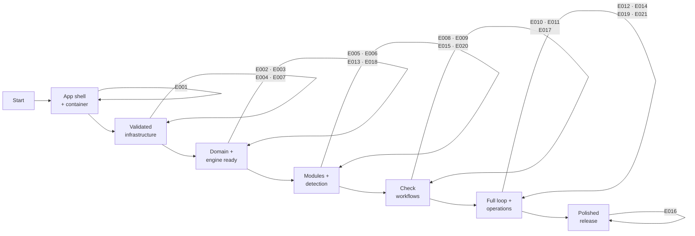

# Project Implementation Plan

**Product**: Binocular — self-hosted firmware-update watcher for offline devices
**Created**: 2026-05-31 | **Status**: Draft
**Total Epics**: 21 (P1: 13 · P2: 7 · P3: 1) | **Waves**: 7

A continuous-validation strategy is applied: an automated build-and-test pipeline lands in Wave 2 — immediately after the application skeleton — so every later increment is validated from the start. The full multi-architecture release/publish pipeline is deliberately split out and delivered later, once there is a stable image to publish.

## Epic Checklist

### Wave 1 — Foundation

> No dependencies. Establishes the runnable application shell and container so all later work — including the build pipeline — has something concrete to validate.

- [X] E001 [P1] [TECHNICAL] {SAD:ADR-0001}{SAD:ADR-0002} Application Skeleton & Container — layered FastAPI app, config, /healthz, non-root image

### Wave 2 — Validation & Core Infrastructure

> Each depends only on E001 and touches a distinct area, so all four run in parallel. E002 delivers the early-validation build pipeline first.

- [X] E002 [P1] [OPERATIONAL] [P] {DOD:DDR-001}{DOD:DDR-002} Continuous Integration Pipeline — lint, type-check, test, image build on every change
- [X] E003 [P1] [TECHNICAL] [P] {SAD:ADR-0003} Frontend SPA Shell — Vite/React/Tailwind app served as static files
- [X] E004 [P1] [TECHNICAL] [P] {SAD:ADR-0004}{DOD:DDR-003} Data Layer & Migrations — aiosqlite, raw SQL, numbered migrations
- [X] E007 [P1] [TECHNICAL] [P] {PRD:CAP-008}{SAD:ADR-0006} Responsible Scraping Client — central polite httpx client

### Wave 3 — Domain & Extensibility Foundations

> Build the inventory model, the module-execution engine, baseline operability, and the staged release pipeline. Distinct areas → parallel.

- [X] E005 [P1] [PRODUCT] [P] {PRD:CAP-001} Device Inventory Management — grouped inventory, stored versions, update confirmation
- [X] E006 [P1] [TECHNICAL] [P] {PRD:CAP-002}{SAD:ADR-0005} Module Engine & Contract — loader, error boundary, two-phase validation
- [X] E013 [P1] [PRODUCT] [P] {PRD:CAP-009}{SAD:ADR-0008}{DOD:DDR-002} Self-Hosted Operability — zero-config, secrets, optional basic auth
- [X] E018 [P2] [OPERATIONAL] [P] {DOD:DDR-001} Release & Publish Pipeline — multi-arch buildx, GHCR, SemVer, scan, SBOM

### Wave 4 — Module Management & Detection

> Module lifecycle UI, the version-comparison core, and the shipped starter modules. Distinct areas → parallel.

- [X] E008 [P1] [PRODUCT] [P] {PRD:CAP-003} Module Lifecycle Management — upload, update, delete modules via UI
- [X] E009 [P1] [PRODUCT] [P] {PRD:CAP-006} Update Detection & Comparison — determine newer-than-recorded reliably
- [X] E015 [P2] [PRODUCT] [P] {PRD:CAP-011} Official Sony Alpha Module — Sony Alpha detection with fixtures
- [X] E020 [P2] [PRODUCT] [P] {PRD:CAP-011} Official Panasonic Lumix Module — Panasonic Lumix detection with fixtures

### Wave 5 — Checking Workflows

> The manual and scheduled check paths plus the authoring dev kit. Distinct entry points → parallel.

- [X] E010 [P1] [PRODUCT] [P] {PRD:CAP-005} Manual On-Demand Checks — single/bulk checks, side-by-side comparison
- [X] E011 [P1] [PRODUCT] [P] {PRD:CAP-004}{SAD:ADR-0007} Automated Scheduled Checking — per-type interval jobs, restart-safe
- [X] E017 [P3] [PRODUCT] [P] {PRD:CAP-013} Module Dev Kit & Docs — authoring guide + standalone test harness

### Wave 6 — Alerting, Visibility & Backups

> Completes the detect→compare→notify loop and adds operational visibility/recovery. Distinct areas → parallel.

- [X] E012 [P1] [PRODUCT] [P] {PRD:CAP-007}{SAD:ADR-0007} Notification & Alerting — Apprise dispatch to Email/SMTP + Gotify
- [X] E014 [P2] [PRODUCT] [P] {PRD:CAP-010} Activity Logging & Visibility — bounded activity log + in-UI viewer
- [X] E019 [P2] [OPERATIONAL] [P] {DOD:DDR-003} Backup & Restore Operations — scheduled snapshot job + restore runbook
- [X] E021 [P2] [TECHNICAL] [P] {PRD:CAP-011}{SAD:ADR-0005} Automatic Module Seeding — discover and auto-register bundled official modules on startup

### Wave 7 — Experience Polish

> Cross-view responsive and dark-mode polish, applied once the feature surfaces exist.

- [ ] E016 [P2] [PRODUCT] {PRD:CAP-012} Responsive UI & Dark Mode — first-class responsive + dark theme across views

## Dependency Diagram

Activity-on-arrow style: nodes are milestones, arrows are epics. ` ` denotes parallel epics released into the same milestone.

## Execution Wave Summary

| Wave | Epics | All Parallel? | Notes |
|------|-------|---------------|-------|
| 1 | E001 | N/A (single) | Foundation skeleton + container; unblocks everything. |
| 2 | E002, E003, E004, E007 | Yes | Early CI lands here; infra epics touch distinct areas. |
| 3 | E005, E006, E013, E018 | Yes | Inventory, module engine, operability, staged release pipeline. |
| 4 | E008, E009, E015, E020 | Yes | Module lifecycle UI, detection core, Sony + Panasonic starter modules. |
| 5 | E010, E011, E017 | Yes | Manual + scheduled checks, authoring dev kit. |
| 6 | E012, E014, E019, E021 | Yes | Notifications complete the loop; logging, backups, and auto module seeding added. |
| 7 | E016 | N/A (single) | Responsive/dark-mode polish across existing surfaces. |

## Parallel Execution Guidance

### Independent Epics

- **Wave 2**: E002 (CI workflows under `.github/`), E003 (`frontend/`), E004 (`backend/src/db/`), E007 (`backend/src/scraping/`) have no shared mutable files.
- **Wave 3**: E005 (devices domain), E006 (module engine), E013 (operability/auth/config), E018 (release workflows) are isolated.
- **Wave 4**: E008 (module UI/API), E009 (detection service), E015 (Sony module files + fixtures), E020 (Panasonic module files + fixtures) are isolated.
- **Wave 5**: E010 (manual-check path), E011 (scheduler), E017 (docs/dev-kit) are isolated.
- **Wave 6**: E012 (notifier), E014 (activity log), E019 (backup job/runbook), E021 (module seeding) are isolated.

### Integration Risks

- **Migration ordering (E004 consumers)**: E005, E006, E014 each add migrations. Allocate non-overlapping numbered files (e.g. `002_devices.sql`, `003_modules.sql`, `004_activity.sql`) to avoid `schema_version` collisions when developed in parallel.
- **API router registration (E001 consumers)**: Each product epic mounts a router. Register routers from a single aggregator module to avoid edit conflicts on the app factory.
- **Check-result contract (E009)**: E010, E011, E012, E014 all consume the detection result/event shape. Freeze that contract in E009 before its dependents start.
- **Container build inputs (E001/E002)**: E018 extends the same Dockerfile/workflow surface E002 introduces; sequence E018 after E002 to avoid workflow churn.

### Shared Resource Conflicts

- `backend/src/db/migrations/` — append-only numbered files; never renumber existing migrations.
- App factory / router aggregator — single owner per change; coordinate additions.
- `Dockerfile` and `.github/workflows/` — E001 seeds, E002 wires CI, E018 extends to multi-arch publish; strictly sequential on these files.

## Epic Details

### E001 — Application Skeleton & Container

- **Category**: TECHNICAL | **Priority**: P1
- **Source**: {SAD:ADR-0001}, {SAD:ADR-0002}
- **Scope**: Stand up the single-process FastAPI application with the layered routes→services→repositories structure and an explicit core/extension seam. Provide settings/config loading, a shallow `/healthz` endpoint, structured (`structlog`) logging to stdout, and a multi-stage non-root Docker image.
- **Actors**: Operator, maintainer
- **Key entities**: App factory, settings, health endpoint
- **Depends on**: —
- **Dependency contracts**: None (foundation)
- **Depended on by**: All epics
- **Produces (shared)**: `app` factory + router aggregator; `structlog` config; `Dockerfile`; `/healthz`
- **Constraints**: Non-root container; zero-config startup; single port 8000; Python 3.13 / FastAPI per {SAD:ADR-0002}
- **Acceptance criteria**:
  - [ ] The app starts with no configuration and serves `/healthz` returning a liveness payload.
  - [ ] Code is organized into routes/services/repositories layers with a documented core/extension seam.
  - [ ] Structured logs emit to stdout with contextual fields.
  - [ ] A multi-stage Docker image builds and runs as a non-root user with a working `HEALTHCHECK`.
- **Specify input**:
  - **Description**: Establish the runnable FastAPI monolith skeleton and its container image as the foundation for all features.
  - **Actors**: Operator, maintainer
  - **Key entities**: App factory, settings, health endpoint
  - **Depends on artifacts**: —
  - **Constraints**: Non-root, zero-config, single port, layered structure
- **Pipeline hints**: lightweight

### E002 — Continuous Integration Pipeline

- **Category**: OPERATIONAL | **Priority**: P1
- **Source**: {DOD:DDR-001}, {DOD:DDR-002}
- **Scope**: Deliver the early-validation GitHub Actions pipeline: run backend lint (Ruff) + type-check (mypy) and frontend lint (Biome/ESLint) + `tsc`, execute the test suites, and build the Docker image on pull requests and pushes (build-only, no publish). This is the first stage of the staged pipeline strategy and exists to validate every subsequent increment.
- **Actors**: Maintainer, CI system
- **Key entities**: GitHub Actions workflow, quality-gate jobs
- **Depends on**: E001
- **Dependency contracts**: Lints/tests the skeleton and builds the `Dockerfile` from E001.
- **Depended on by**: E018
- **Produces (shared)**: `.github/workflows/ci.yml`; reusable lint/test/build jobs
- **Constraints**: PRs build but do not push; pin actions to major versions; use gha layer caching
- **Acceptance criteria**:
  - [ ] Every pull request runs lint, type-check, and tests for backend and frontend.
  - [ ] The Docker image is built (not published) as a CI gate on each run.
  - [ ] A failing lint, type, test, or build blocks the workflow.
- **Specify input**:
  - **Description**: A minimal GitHub Actions pipeline that lints, type-checks, tests, and builds the image on every change for early, continuous validation.
  - **Actors**: Maintainer, CI system
  - **Key entities**: Workflow, quality-gate jobs
  - **Depends on artifacts**: E001 skeleton + Dockerfile
  - **Constraints**: Build-only on PRs; cached; pinned actions
- **Pipeline hints**: skip_clarify, skip_checklist

### E003 — Frontend SPA Shell

- **Category**: TECHNICAL | **Priority**: P1
- **Source**: {SAD:ADR-0003}
- **Scope**: Create the React + TypeScript + Vite + Tailwind single-page-app shell with routing, a base layout, and first-class dark-mode theming primitives. Wire the production build so FastAPI serves `dist/` via `StaticFiles` with an SPA catch-all.
- **Actors**: Operator (browser user)
- **Key entities**: SPA shell, router, theme provider, API client
- **Depends on**: E001
- **Dependency contracts**: Mounts static serving + catch-all on the app factory from E001.
- **Depended on by**: E005, E008, E010, E014, E016
- **Produces (shared)**: `frontend/` app; typed API client; theme provider; static-serving integration
- **Constraints**: Single-image build; dark mode is first-class; responsive baseline
- **Acceptance criteria**:
  - [ ] A built SPA is served by FastAPI at the root with client-side routing working on deep links.
  - [ ] A shared layout, navigation, and dark/light theme toggle are in place.
  - [ ] A typed API client wraps `/api/v1` calls for reuse by feature epics.
- **Specify input**:
  - **Description**: The React/Vite/Tailwind SPA shell served as static files by FastAPI, with routing and dark mode.
  - **Actors**: Operator
  - **Key entities**: SPA shell, router, theme provider, API client
  - **Depends on artifacts**: E001 static-serving mount
  - **Constraints**: Single-image build; dark mode first-class
- **Pipeline hints**: lightweight

### E004 — Data Layer & Migrations

- **Category**: TECHNICAL | **Priority**: P1
- **Source**: {SAD:ADR-0004}, {DOD:DDR-003}
- **Scope**: Implement the SQLite data layer over `aiosqlite` with raw parameterized SQL, connection lifecycle (WAL, `foreign_keys=ON`, `busy_timeout`), a numbered migration runner tracked by `schema_version`, and a repository base. Include the automatic pre-migration backup snapshot hook from {DOD:DDR-003}.
- **Actors**: System, maintainer
- **Key entities**: Connection manager, migration runner, repository base, `schema_version`
- **Depends on**: E001
- **Dependency contracts**: Initialized by the app lifespan in E001.
- **Depended on by**: E005, E006, E008, E009, E011, E012, E013, E014, E019
- **Produces (shared)**: DB connection/lifecycle; migration runner; repository base; pre-migration backup hook
- **Constraints**: No ORM; parameterized queries only; forward-only idempotent migrations; single file on `/app/data`
- **Acceptance criteria**:
  - [ ] Numbered migrations apply automatically on startup inside a transaction, tracked by `schema_version`.
  - [ ] Connections enforce WAL, foreign keys, and busy-timeout pragmas.
  - [ ] A pre-migration backup snapshot is produced before applying pending migrations.
  - [ ] A repository base provides reusable parameterized data-access helpers.
- **Specify input**:
  - **Description**: The aiosqlite raw-SQL data layer with a numbered migration runner and pre-migration backup hook.
  - **Actors**: System, maintainer
  - **Key entities**: Connection manager, migration runner, repository base
  - **Depends on artifacts**: E001 app lifespan
  - **Constraints**: No ORM; parameterized SQL; forward-only migrations
- **Pipeline hints**: lightweight

### E007 — Responsible Scraping Client

- **Category**: TECHNICAL | **Priority**: P1
- **Source**: {PRD:CAP-008}, {SAD:ADR-0006}
- **Scope**: Provide the centralized host-owned `httpx` client that is the single enforcement point for responsible scraping: robots.txt (RFC 9309) respect, an identifiable User-Agent, per-domain rate limiting, and exponential backoff on 429/5xx. This client is later handed to modules by the engine.
- **Actors**: System (on behalf of modules)
- **Key entities**: Scrape client, rate limiter, robots cache
- **Depends on**: E001
- **Dependency contracts**: Constructed via app config/lifecycle from E001.
- **Depended on by**: E006, E015, E020, E017
- **Produces (shared)**: `ScrapeClient` interface provided to modules
- **Constraints**: Modules must use only this client for outbound requests; conservative defaults; polite by default
- **Acceptance criteria**:
  - [ ] Requests honor robots.txt and send an identifiable User-Agent.
  - [ ] Per-domain rate limiting and exponential backoff are enforced centrally.
  - [ ] The client exposes a stable interface suitable for injection into modules.
- **Specify input**:
  - **Description**: A central polite httpx client enforcing robots.txt, identifiable UA, rate limiting, and backoff.
  - **Actors**: System
  - **Key entities**: Scrape client, rate limiter, robots cache
  - **Depends on artifacts**: E001 config/lifecycle
  - **Constraints**: Sole outbound path for modules; conservative defaults
- **Pipeline hints**: lightweight

### E005 — Device Inventory Management

- **Category**: PRODUCT | **Priority**: P1
- **Source**: {PRD:CAP-001}
- **Scope**: Let the operator maintain an inventory of devices grouped by device type, each with a stored current firmware version, and perform one-click update confirmation that syncs the stored version and clears alert status. Includes the device/device-type API and UI.
- **Actors**: Operator
- **Key entities**: Device, DeviceType
- **Depends on**: E004, E003
- **Dependency contracts**: Persists via repositories from E004; renders in the SPA shell from E003.
- **Depended on by**: E009, E010, E016
- **Produces (shared)**: `Device`, `DeviceType` entities; `/api/v1/devices`, `/api/v1/device-types`
- **Constraints**: Grouping by device type; update confirmation is a single action
- **Acceptance criteria**:
  - [ ] The operator can create, edit, and delete devices grouped by device type.
  - [ ] Each device stores a current firmware version visible in the UI.
  - [ ] One-click update confirmation updates the stored version and resets alert status.
- **Specify input**:
  - **Description**: Device inventory CRUD grouped by device type, with stored versions and one-click update confirmation.
  - **Actors**: Operator
  - **Key entities**: Device, DeviceType
  - **Depends on artifacts**: E004 repositories, E003 SPA shell
  - **Constraints**: Grouped by type; single-action confirmation

### E006 — Module Engine & Contract

- **Category**: TECHNICAL | **Priority**: P1
- **Source**: {PRD:CAP-002}, {SAD:ADR-0005}
- **Scope**: Implement the extension-module engine: a documented authoring contract, an `importlib`-based loader, a per-invocation error boundary (Exception + SystemExit) with `asyncio.wait_for` timeouts, and two-phase validation (static AST checks plus optional runtime proof) producing structured per-phase results. Modules receive the scraping client from E007. Execution is explicitly unsandboxed.
- **Actors**: System, module author
- **Key entities**: Module, ModuleValidationResult, authoring contract
- **Depends on**: E001, E004, E007
- **Dependency contracts**: Persists module metadata via E004; injects the `ScrapeClient` from E007; loads within the app from E001.
- **Depended on by**: E008, E009, E015, E020, E017
- **Produces (shared)**: Authoring contract interface; module loader/runner; validation pipeline
- **Constraints**: Unsandboxed in-process execution (accepted ACE trust boundary); a broken/timed-out module must not crash the core
- **Acceptance criteria**:
  - [ ] Modules implementing the contract load and run, receiving the host scraping client.
  - [ ] A raising or timing-out module is contained by the error boundary without affecting other modules or the core.
  - [ ] Two-phase validation (AST + optional runtime) returns structured per-phase results.
  - [ ] The authoring contract is documented and stable.
- **Specify input**:
  - **Description**: The unsandboxed module engine with authoring contract, error boundary/timeouts, and two-phase validation.
  - **Actors**: System, module author
  - **Key entities**: Module, ModuleValidationResult, authoring contract
  - **Depends on artifacts**: E001 app, E004 persistence, E007 scrape client
  - **Constraints**: Unsandboxed; fault-isolated from core

### E013 — Self-Hosted Operability

- **Category**: PRODUCT | **Priority**: P1
- **Source**: {PRD:CAP-009}, {SAD:ADR-0008}, {DOD:DDR-002}
- **Scope**: Deliver the operability promise: zero-config startup with sane defaults, single-volume persistence, restart/upgrade survival with no data loss, environment + `_FILE` Docker-secret loading for credentials, optional basic-auth middleware for operators exposing the UI more broadly, and an example `compose.yaml` + `.env.example`.
- **Actors**: Operator
- **Key entities**: Settings, secret loader, auth middleware
- **Depends on**: E001, E004
- **Dependency contracts**: Extends config from E001; relies on single-file persistence from E004.
- **Depended on by**: E019
- **Produces (shared)**: Secret/`_FILE` loader; optional basic-auth middleware; `compose.yaml`, `.env.example`
- **Constraints**: Zero required configuration; non-root; secrets never baked into the image; trusted-LAN default (no auth)
- **Acceptance criteria**:
  - [ ] The app starts with no configuration and persists all state to a single volume.
  - [ ] Credentials load from env vars or the `_FILE` secret convention.
  - [ ] Optional basic auth can be enabled via configuration.
  - [ ] Data survives container restart and image upgrade with no loss (smoke-tested).
- **Specify input**:
  - **Description**: Zero-config operability with single-volume persistence, `_FILE` secrets, optional basic auth, and a compose example.
  - **Actors**: Operator
  - **Key entities**: Settings, secret loader, auth middleware
  - **Depends on artifacts**: E001 config, E004 persistence
  - **Constraints**: Zero-config; non-root; no baked secrets

### E018 — Release & Publish Pipeline

- **Category**: OPERATIONAL | **Priority**: P2
- **Source**: {DOD:DDR-001}
- **Scope**: Extend the CI base into the full release pipeline: multi-arch (`linux/amd64` + `linux/arm64`) `buildx` builds, publishing to public GHCR, SemVer tagging via `docker/metadata-action` (versioned + `latest`), a Trivy image scan, and buildx-generated SBOM/provenance attestations. This is the second, later stage of the staged GitHub Actions strategy.
- **Actors**: Maintainer, CI system
- **Key entities**: Release workflow, image tags, attestations
- **Depends on**: E002, E001
- **Dependency contracts**: Builds on the CI workflow + Dockerfile from E002/E001; pushes only on SemVer tag refs.
- **Depended on by**: —
- **Produces (shared)**: `.github/workflows/release.yml`; published GHCR images
- **Constraints**: Push only on tags; multi-arch; fail on HIGH/CRITICAL fixable CVEs
- **Acceptance criteria**:
  - [ ] Tagging a SemVer release publishes a multi-arch image to GHCR with versioned + `latest` tags.
  - [ ] A Trivy scan runs against the built image and gates publication.
  - [ ] SBOM and provenance attestations are attached to published images.
- **Specify input**:
  - **Description**: The multi-arch GHCR release pipeline with SemVer tagging, vulnerability scan, and SBOM/provenance.
  - **Actors**: Maintainer, CI system
  - **Key entities**: Release workflow, image tags, attestations
  - **Depends on artifacts**: E002 CI base, E001 Dockerfile
  - **Constraints**: Tag-triggered; multi-arch; scan-gated
- **Pipeline hints**: skip_clarify, skip_checklist

### E008 — Module Lifecycle Management

- **Category**: PRODUCT | **Priority**: P1
- **Source**: {PRD:CAP-003}
- **Scope**: Let the operator upload, update, and delete extension modules through the UI. Uploads are gated by the two-phase validation from E006 and are rejected before reaching the modules directory if validation fails, with structured per-phase feedback shown to the user.
- **Actors**: Operator
- **Key entities**: Module
- **Depends on**: E006, E003
- **Dependency contracts**: Invokes the validation pipeline from E006; renders in the SPA shell from E003.
- **Depended on by**: E016
- **Produces (shared)**: `/api/v1/modules` lifecycle endpoints + UI
- **Constraints**: Invalid modules never enter the modules directory; validation feedback is per-phase
- **Acceptance criteria**:
  - [ ] The operator can upload, update, and delete modules from the UI.
  - [ ] Failed validation rejects the upload pre-save with clear per-phase messages.
  - [ ] Installed modules and their status are listed in the UI.
- **Specify input**:
  - **Description**: UI-driven module upload/update/delete gated by two-phase validation.
  - **Actors**: Operator
  - **Key entities**: Module
  - **Depends on artifacts**: E006 validation, E003 SPA shell
  - **Constraints**: Reject-before-save; per-phase feedback

### E009 — Update Detection & Comparison

- **Category**: PRODUCT | **Priority**: P1
- **Source**: {PRD:CAP-006}
- **Scope**: Implement the core that runs a module for a device, obtains the latest version, and reliably determines whether it is newer than the operator's recorded version — producing a structured check result/detection event with last-success timestamp and failure status. This contract is consumed by all check and alert workflows.
- **Actors**: System
- **Key entities**: CheckResult, detection event
- **Depends on**: E006, E005
- **Dependency contracts**: Runs modules via E006; reads device current version from E005.
- **Depended on by**: E010, E011, E012, E014
- **Produces (shared)**: `CheckResult`/detection-event contract; comparison service
- **Constraints**: No false positives/negatives for shipped modules; failures surface as visible status, never silent
- **Acceptance criteria**:
  - [ ] Running a check yields a structured result indicating up-to-date, update-available, or failed.
  - [ ] Version comparison correctly identifies a newer-than-recorded version.
  - [ ] Failures (unparseable/changed page) produce a visible failed status with last-success timestamp.
- **Specify input**:
  - **Description**: The detection/comparison core that determines newer-than-recorded versions and emits a structured result.
  - **Actors**: System
  - **Key entities**: CheckResult, detection event
  - **Depends on artifacts**: E006 engine, E005 device versions
  - **Constraints**: Honest failure; zero false results for shipped modules

### E015 — Official Sony Alpha Module

- **Category**: PRODUCT | **Priority**: P2
- **Source**: {PRD:CAP-011}
- **Scope**: Ship the official Sony Alpha module as immediate value and as an authoring template, with captured page fixtures and golden tests verifying detected-latest correctness.
- **Actors**: Operator, module author
- **Key entities**: Module, page fixtures
- **Depends on**: E006, E007
- **Dependency contracts**: Implements the authoring contract from E006; fetches via the scraping client from E007.
- **Depended on by**: —
- **Produces (shared)**: Sony Alpha module; Sony fixture corpus; golden tests
- **Constraints**: Fixture-based correctness validation at release; serves as a reference template
- **Acceptance criteria**:
  - [ ] The Sony Alpha module detects the latest version against captured fixtures.
  - [ ] Golden/fixture regression tests cover the Sony Alpha module.
  - [ ] The module is documented as an authoring template.
- **Specify input**:
  - **Description**: Official Sony Alpha module with fixtures and golden correctness tests.
  - **Actors**: Operator, module author
  - **Key entities**: Module, page fixtures
  - **Depends on artifacts**: E006 contract, E007 client
  - **Constraints**: Fixture-validated; reference-quality

### E020 — Official Panasonic Lumix Module

- **Category**: PRODUCT | **Priority**: P2
- **Source**: {PRD:CAP-011}
- **Scope**: Ship the official Panasonic Lumix module as immediate value and as an authoring template, with captured page fixtures and golden tests verifying detected-latest correctness.
- **Actors**: Operator, module author
- **Key entities**: Module, page fixtures
- **Depends on**: E006, E007
- **Dependency contracts**: Implements the authoring contract from E006; fetches via the scraping client from E007.
- **Depended on by**: —
- **Produces (shared)**: Panasonic Lumix module; Panasonic fixture corpus; golden tests
- **Constraints**: Fixture-based correctness validation at release; serves as a reference template
- **Acceptance criteria**:
  - [ ] The Panasonic Lumix module detects the latest version against captured fixtures.
  - [ ] Golden/fixture regression tests cover the Panasonic Lumix module.
  - [ ] The module is documented as an authoring template.
- **Specify input**:
  - **Description**: Official Panasonic Lumix module with fixtures and golden correctness tests.
  - **Actors**: Operator, module author
  - **Key entities**: Module, page fixtures
  - **Depends on artifacts**: E006 contract, E007 client
  - **Constraints**: Fixture-validated; reference-quality

### E010 — Manual On-Demand Checks

- **Category**: PRODUCT | **Priority**: P1
- **Source**: {PRD:CAP-005}
- **Scope**: Let the operator trigger an immediate check for a single device or all devices and view stored-vs-latest versions side by side, with concurrent multi-site checks that do not block the UI.
- **Actors**: Operator
- **Key entities**: CheckResult
- **Depends on**: E009, E005, E006, E003
- **Dependency contracts**: Invokes detection from E009 over devices from E005 using the engine from E006; renders in E003.
- **Depended on by**: E016
- **Produces (shared)**: `/api/v1/checks` (manual trigger) + comparison UI
- **Constraints**: Async, non-blocking concurrent checks; single and bulk modes
- **Acceptance criteria**:
  - [ ] The operator can trigger a check for one device or all devices.
  - [ ] Stored vs. latest versions are shown side by side per device.
  - [ ] Bulk checks run concurrently without blocking the UI.
- **Specify input**:
  - **Description**: Manual single/bulk on-demand checks with side-by-side stored-vs-latest comparison.
  - **Actors**: Operator
  - **Key entities**: CheckResult
  - **Depends on artifacts**: E009 detection, E005 devices, E006 engine, E003 shell
  - **Constraints**: Non-blocking concurrency; single + bulk

### E011 — Automated Scheduled Checking

- **Category**: PRODUCT | **Priority**: P1
- **Source**: {PRD:CAP-004}, {SAD:ADR-0007}
- **Scope**: Run unattended checks on a per-device-type frequency using in-process APScheduler interval jobs that resume on restart and retry missed windows on the next interval. Per-device-type frequency is configurable.
- **Actors**: System, operator
- **Key entities**: Schedule, CheckResult
- **Depends on**: E009, E006
- **Dependency contracts**: Triggers detection from E009 via the engine from E006.
- **Depended on by**: E012, E014, E019
- **Produces (shared)**: Scheduler service; per-type schedule configuration
- **Constraints**: In-process scheduler; restart-safe; missed windows retried, not replayed
- **Acceptance criteria**:
  - [ ] Each device type checks unattended on its configured interval.
  - [ ] The scheduler resumes after a container restart.
  - [ ] Per-device-type frequency is configurable from the UI.
- **Specify input**:
  - **Description**: In-process APScheduler interval checking per device type, restart-safe.
  - **Actors**: System, operator
  - **Key entities**: Schedule, CheckResult
  - **Depends on artifacts**: E009 detection, E006 engine
  - **Constraints**: In-process; restart-safe; per-type frequency

### E017 — Module Dev Kit & Docs

- **Category**: PRODUCT | **Priority**: P3
- **Source**: {PRD:CAP-013}
- **Scope**: Provide authoring documentation for the module contract and a standalone dev/test kit that lets authors validate a module locally against the same polite scraping client, without running the full app.
- **Actors**: Module author
- **Key entities**: Authoring docs, local test harness
- **Depends on**: E006, E007
- **Dependency contracts**: Documents the contract from E006; reuses the client from E007.
- **Depended on by**: —
- **Produces (shared)**: Authoring guide; standalone module test harness
- **Constraints**: Runs locally without the full container; mirrors in-app validation
- **Acceptance criteria**:
  - [ ] Authoring docs describe the contract and validation phases.
  - [ ] A standalone harness validates and runs a module locally against the polite client.
  - [ ] The harness reports the same validation outcomes as the in-app engine.
- **Specify input**:
  - **Description**: Authoring guide plus a standalone local harness for building and validating modules.
  - **Actors**: Module author
  - **Key entities**: Authoring docs, local test harness
  - **Depends on artifacts**: E006 contract, E007 client
  - **Constraints**: Local-only; parity with in-app validation
- **Pipeline hints**: lightweight

### E012 — Notification & Alerting

- **Category**: PRODUCT | **Priority**: P1
- **Source**: {PRD:CAP-007}, {SAD:ADR-0007}
- **Scope**: Dispatch notifications through Apprise to configurable Email/SMTP and Gotify channels when a newer version is detected. Channel configuration is managed by the operator; dispatch failures are logged for visibility while the check result is still persisted.
- **Actors**: Operator, system
- **Key entities**: NotificationChannel, detection event
- **Depends on**: E009, E011
- **Dependency contracts**: Consumes detection events from E009, primarily triggered by scheduled checks from E011.
- **Depended on by**: —
- **Produces (shared)**: Notifier service; `/api/v1/notifications` channel config
- **Constraints**: Email/SMTP + Gotify at launch; dispatch failures logged, not fatal; credentials via env/`_FILE`
- **Acceptance criteria**:
  - [ ] A newer-version detection dispatches notifications to configured Email/SMTP and Gotify channels.
  - [ ] Channel configuration is managed from the UI.
  - [ ] A dispatch failure is logged for operator visibility without losing the check result.
- **Specify input**:
  - **Description**: Apprise-based notification dispatch to Email/SMTP and Gotify on detection, with channel config.
  - **Actors**: Operator, system
  - **Key entities**: NotificationChannel, detection event
  - **Depends on artifacts**: E009 detection, E011 scheduler trigger
  - **Constraints**: Email + Gotify; non-fatal dispatch failures

### E014 — Activity Logging & Visibility

- **Category**: PRODUCT | **Priority**: P2
- **Source**: {PRD:CAP-010}
- **Scope**: Record all check activity and errors in a size-bounded, rolling activity log persisted in SQLite and viewable in the UI, with contextual fields (device, module) so the operator can see honest status and history at a glance.
- **Actors**: Operator
- **Key entities**: ActivityLogEntry
- **Depends on**: E004, E009, E011
- **Dependency contracts**: Persists via E004; records events emitted by detection (E009) and scheduled checks (E011).
- **Depended on by**: E016
- **Produces (shared)**: `ActivityLogEntry`; `/api/v1/activity`; activity-log UI
- **Constraints**: Size-bounded/rolling retention to prevent unbounded growth
- **Acceptance criteria**:
  - [ ] Check activity and errors are recorded with contextual fields.
  - [ ] The activity log is viewable in the UI.
  - [ ] Retention is bounded so the log cannot grow without limit.
- **Specify input**:
  - **Description**: A size-bounded activity log persisted in SQLite with an in-UI viewer.
  - **Actors**: Operator
  - **Key entities**: ActivityLogEntry
  - **Depends on artifacts**: E004 persistence, E009/E011 events
  - **Constraints**: Rolling/bounded retention

### E019 — Backup & Restore Operations

- **Category**: OPERATIONAL | **Priority**: P2
- **Source**: {DOD:DDR-003}
- **Scope**: Provide a scheduled, live-safe backup of the SQLite database using `VACUUM INTO` / the Online Backup API to a configurable path, plus a documented restore procedure/runbook. Complements the pre-migration snapshot already produced by E004.
- **Actors**: Operator, system
- **Key entities**: Backup snapshot, restore runbook
- **Depends on**: E004, E011
- **Dependency contracts**: Backs up the database from E004; schedules the job via the scheduler from E011.
- **Depended on by**: —
- **Produces (shared)**: Scheduled backup job; restore runbook
- **Constraints**: Live-safe (no raw WAL-split copy); configurable schedule/path; RPO ≤ 24h / RTO ≤ 1h
- **Acceptance criteria**:
  - [ ] A scheduled job produces a consistent single-file backup without stopping the service.
  - [ ] A documented restore procedure recovers the database from a backup.
  - [ ] Backup path/schedule are configurable.
- **Specify input**:
  - **Description**: Scheduled live-safe SQLite backup with a documented restore runbook.
  - **Actors**: Operator, system
  - **Key entities**: Backup snapshot, restore runbook
  - **Depends on artifacts**: E004 database, E011 scheduler
  - **Constraints**: Live-safe backup; configurable; homelab RPO/RTO
- **Pipeline hints**: skip_clarify, skip_checklist

### E021 — Automatic Module Seeding

- **Category**: TECHNICAL | **Priority**: P2
- **Source**: {PRD:CAP-011}{SAD:ADR-0005}
- **Scope**: Automatically register and seed bundled official starter modules (Sony Alpha and Panasonic Lumix) in the database and user modules directory on application startup. Ensure idempotency based on version and source file hash to avoid redundant writes.
- **Actors**: System
- **Key entities**: ModuleRecord, ModuleLifecycleService, app lifespan
- **Depends on**: E004, E006
- **Dependency contracts**: Uses the module validator and loader from E006; persists to the SQLite database using repository and connection manager from E004.
- **Depended on by**: —
- **Produces (shared)**: Automatic seeding procedure during startup lifespan
- **Constraints**: Idempotence, zero network calls during startup (static validation only), no database migrations needed
- **Acceptance criteria**:
  - [ ] Bundled official starter modules are discovered on startup from `binocular/official_modules/`.
  - [ ] Modules are verified via static AST validation before seeding.
  - [ ] Valid modules are automatically copied to `/app/modules/` and seeded into the SQLite DB if missing or version/hash has changed.
  - [ ] Seeding is fully idempotent and does not overwrite modified user modules or cause startup loops.
- **Specify input**:
  - **Description**: Implement automatic discovery, validation, and seeding/registration of official starter modules (Sony and Panasonic) into the database on startup.
  - **Actors**: System
  - **Key entities**: ModuleRecord, ModuleLifecycleService
  - **Depends on artifacts**: E006 module engine, E004 SQLite database
  - **Constraints**: Static validation only, idempotent execution
- **Pipeline hints**: skip_clarify, skip_checklist

### E016 — Responsive UI & Dark Mode

- **Category**: PRODUCT | **Priority**: P2
- **Source**: {PRD:CAP-012}
- **Scope**: Apply first-class responsive layouts and dark-mode polish across all feature surfaces (inventory, modules, checks, activity) so the interface is fully usable on mobile and desktop.
- **Actors**: Operator
- **Key entities**: UI views, theme
- **Depends on**: E003, E005, E008, E010
- **Dependency contracts**: Polishes the shell from E003 and the views from E005/E008/E010.
- **Depended on by**: —
- **Produces (shared)**: Responsive/dark-mode-complete UI
- **Constraints**: Mobile + desktop parity; dark mode first-class
- **Acceptance criteria**:
  - [ ] All primary views are usable and laid out correctly on mobile and desktop.
  - [ ] Dark mode is applied consistently across every view.
  - [ ] No view regresses to a desktop-only or light-only layout.
- **Specify input**:
  - **Description**: Cross-view responsive and dark-mode polish over the existing feature surfaces.
  - **Actors**: Operator
  - **Key entities**: UI views, theme
  - **Depends on artifacts**: E003 shell, E005/E008/E010 views
  - **Constraints**: Mobile+desktop parity; dark mode first-class

## Coverage Validation

### PRD Capability Coverage

| Capability | Priority | Epic(s) |
|------------|----------|---------|
| CAP-001 Device Inventory & Lifecycle | P1 | E005 |
| CAP-002 Extension Module Engine & Authoring Contract | P1 | E006 |
| CAP-003 Module Lifecycle Management | P1 | E008 |
| CAP-004 Automated Scheduled Checking | P1 | E011 |
| CAP-005 Manual On-Demand Checking | P1 | E010 |
| CAP-006 Update Detection & Comparison | P1 | E009 |
| CAP-007 Notification & Alerting | P1 | E012 |
| CAP-008 Responsible Scraping Enforcement | P1 | E007 |
| CAP-009 Self-Hosted Operability | P1 | E013 |
| CAP-010 Activity Logging & Visibility | P2 | E014 |
| CAP-011 | Official Starter Modules | P2 | E015, E020, E021 |
| CAP-012 | Responsive UI & Dark Mode | P2 | E016 |
| CAP-013 | Module Authoring Guidance & Dev Kit | P3 | E017 |

### SAD ADR Coverage

| ADR | Status | Epic(s) |
|-----|--------|---------|
| ADR-0001 Single-container monolith, core/extension separation | accepted | E001 |
| ADR-0002 Python 3.13 + FastAPI backend | accepted | E001 |
| ADR-0003 React/Vite/Tailwind SPA as static files | accepted | E003 |
| ADR-0004 SQLite + aiosqlite + raw SQL | accepted | E004 |
| ADR-0005 Unsandboxed extension engine, two-phase validation | accepted | E006, E021 |
| ADR-0006 Centralized responsible-scraping client | accepted | E007 |
| ADR-0007 APScheduler + Apprise | accepted | E011 (scheduling), E012 (notifications) |
| ADR-0008 Trusted-LAN security, optional basic auth | accepted | E013 |

### DOD DDR Coverage

| DDR | Status | Epic(s) |
|-----|--------|---------|
| DDR-001 GitHub Actions → multi-arch GHCR via SemVer | accepted | E002 (CI base), E018 (release/publish) |
| DDR-002 Minimal homelab ops posture | accepted | E002 (logs/build gate), E013 (healthcheck/operability) |
| DDR-003 SQLite live-safe backups | accepted | E004 (pre-migration snapshot), E019 (scheduled backup + restore) |

### Uncovered Items

- None. Every PRD capability, every `accepted` ADR, and every DDR maps to at least one epic.

## Shared Artifact Surface

### Shared Data Entities

| Entity | Introduced by | Consumed by |
|--------|---------------|-------------|
| Device, DeviceType | E005 | E009, E010, E016 |
| Module, ModuleValidationResult | E006 | E008, E009, E015, E020, E017 |
| CheckResult / detection event | E009 | E010, E011, E012, E014 |
| NotificationChannel | E012 | E012 |
| ActivityLogEntry | E014 | E016 |

### API Surfaces

| Surface | Introduced by | Consumed by |
|---------|---------------|-------------|
| `/healthz` | E001 | Container HEALTHCHECK, E002 |
| `/api/v1/devices`, `/api/v1/device-types` | E005 | E010, E016 |
| `/api/v1/modules` | E008 | E016 |
| `/api/v1/checks` | E010 | E016 |
| `/api/v1/notifications` | E012 | UI config |
| `/api/v1/activity` | E014 | E016 |

### Libraries / Modules

| Module | Introduced by | Consumed by |
|--------|---------------|-------------|
| App factory + router aggregator, structlog config | E001 | All |
| DB connection, migration runner, repository base | E004 | E005, E006, E008, E009, E011, E012, E013, E014, E019, E021 |
| ScrapeClient | E007 | E006, E015, E020, E017 |
| Module engine + authoring contract | E006 | E008, E009, E015, E020, E017, E021 |
| Scheduler service | E011 | E012, E014, E019 |
| Notifier service | E012 | — |
| Secret/`_FILE` loader + basic-auth middleware | E013 | E012, E019 |

## Wave Transition Protocol

Before starting Wave N+1, verify for every epic in Wave N:

- All epics passed their quality gates (lint, type-check, tests green; image builds).
- Shared artifacts listed under **Produces (shared)** are merged and importable.
- Dependency contracts required by the next wave are satisfiable (entities, endpoints, and library exports exist with stable shapes).
- New migrations use non-overlapping numbers and apply cleanly from an empty database.
- The technical context baseline is updated if an epic changed a shared contract.
