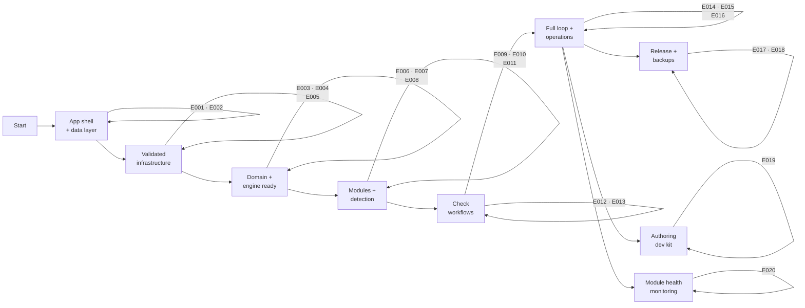

# Project Implementation Plan

**Product**: Binocular — self-hosted firmware-update watcher for offline devices
**Created**: 2026-06-10 | **Status**: Draft
**Total Epics**: 22 (P1: 14 · P2: 8) | **Waves**: 9

Informed by the prototype retrospective at `specs/prototype-retrospective.md`. Key consolidation decisions: device type is module-derived from the start (no standalone DeviceType entity); notification deduplication and HTML email are part of the initial notification epic; shadcn/ui is the component library from day one; PUID/PGID entrypoint is part of the foundation container epic; collapsible navigation is part of the SPA shell.

## Epic Checklist

### Wave 1 — Foundation

> No dependencies. Establishes the runnable application shell, container with PUID/PGID entrypoint, and the data layer so all later work has something concrete to validate.

- [X] E001 [P1] [TECHNICAL] {SAD:ADR-0001}{SAD:ADR-0002}{SAD:ADR-0008}{DOD:DDR-004} Application Skeleton & Container — layered FastAPI app, config, /healthz, non-root image with PUID/PGID entrypoint [→ Details](plan/E001.md)
- [X] E002 [P1] [TECHNICAL] [P] {SAD:ADR-0004}{DOD:DDR-003} Data Layer & Migrations — aiosqlite, raw SQL, numbered migrations, pre-migration backup [→ Details](plan/E002.md)

### Wave 2 — Validation & Frontend Shell

> Depends on E001/E002. CI pipeline validates every increment; SPA shell provides the UI framework with shadcn/ui from day one.

- [X] E003 [P1] [OPERATIONAL] [P] {DOD:DDR-001}{DOD:DDR-002} Continuous Integration Pipeline — lint, type-check, test, image build on every change [→ Details](plan/E003.md)
- [X] E004 [P1] [TECHNICAL] [P] {SAD:ADR-0003} Frontend SPA Shell — React/Vite/shadcn/ui app with collapsible nav, dark mode, version display [→ Details](plan/E004.md)
- [X] E005 [P1] [TECHNICAL] [P] {SAD:ADR-0006} Responsible Scraping Client — central polite httpx client with robots.txt, rate limiting, backoff [→ Details](plan/E005.md)

### Wave 3 — Domain & Module Engine

> Build the inventory model (device linked to module from the start), the module engine, and operability. Distinct areas → parallel.

- [X] E006 [P1] [PRODUCT] [P] {PRD:CAP-001}{SAD:ADR-0009} Device Inventory Management — module-linked inventory, stored versions, update confirmation [→ Details](plan/E006.md)
- [X] E007 [P1] [TECHNICAL] [P] {PRD:CAP-002}{SAD:ADR-0005} Module Engine & Contract — loader, error boundary, two-phase validation [→ Details](plan/E007.md)
- [X] E008 [P1] [PRODUCT] [P] {PRD:CAP-009}{SAD:ADR-0008}{DOD:DDR-002} Self-Hosted Operability — zero-config, secrets, optional basic auth [→ Details](plan/E008.md)

### Wave 4 — Module Management & Detection

> Module lifecycle UI, version comparison core, and the first official module. Distinct areas → parallel.

- [X] E009 [P1] [PRODUCT] [P] {PRD:CAP-003} Module Lifecycle Management — upload, update, delete modules via UI [→ Details](plan/E009.md)
- [X] E010 [P1] [PRODUCT] [P] {PRD:CAP-006} Update Detection & Comparison — determine newer-than-recorded reliably [→ Details](plan/E010.md)
- [X] E011 [P2] [PRODUCT] [P] {PRD:CAP-011} Official Sony Alpha Module — Sony Alpha detection with fixtures [→ Details](plan/E011.md)

### Wave 5 — Check Workflows & Scheduling

> Manual and scheduled check paths. Distinct entry points → parallel.

- [X] E012 [P1] [PRODUCT] [P] {PRD:CAP-005} Manual On-Demand Checks — single/bulk checks, side-by-side comparison [→ Details](plan/E012.md)
- [ ] E013 [P1] [PRODUCT] [P] {PRD:CAP-004}{SAD:ADR-0007} Automated Scheduled Checking — per-module interval jobs, restart-safe, user-configurable frequency [→ Details](plan/E013.md)

### Wave 6 — Notifications, Logging & Modules

> Completes the detect→compare→notify loop with deduplication and HTML email. Adds operational visibility and auto-seeding. Distinct areas → parallel.

- [ ] E014 [P1] [PRODUCT] [P] {PRD:CAP-007}{SAD:ADR-0007} Notification & Alerting — Apprise dispatch with HTML email, deduplication, Email/SMTP + Gotify [→ Details](plan/E014.md)
- [ ] E015 [P2] [PRODUCT] [P] {PRD:CAP-010} Activity Logging & Visibility — bounded activity log + in-UI viewer [→ Details](plan/E015.md)
- [ ] E016 [P2] [PRODUCT] [P] {PRD:CAP-011}{SAD:ADR-0005} Automatic Module Seeding & Additional Official Modules — discover and auto-register bundled official modules on startup; ship Panasonic Lumix MFT, Panasonic Lumix Lenses, and Godox Flashes modules [→ Details](plan/E016.md)

### Wave 7 — Release Pipeline & Backups

> Staged release pipeline for publishing images, plus backup/restore. Distinct areas → parallel.

- [ ] E017 [P2] [OPERATIONAL] [P] {DOD:DDR-001} Release & Publish Pipeline — multi-arch buildx, GHCR, SemVer, scan, SBOM [→ Details](plan/E017.md)
- [ ] E018 [P2] [OPERATIONAL] [P] {DOD:DDR-003} Backup & Restore Operations — scheduled snapshot job + restore runbook [→ Details](plan/E018.md)

### Wave 8 — Module Authoring & Dev Kit

> Module dev kit and AI-assisted authoring UX.

- [ ] E019 [P2] [PRODUCT] {PRD:CAP-013}{PRD:CAP-003} Module Dev Kit & AI-Assisted Authoring — authoring guide, standalone test harness, AI Module Kit, copy-errors-for-AI [→ Details](plan/E019.md)

### Wave 9 — Official Module Health Monitoring

> In-app notification when shipped official modules consistently fail.

- [ ] E020 [P2] [PRODUCT] {PRD:CAP-014} Official Module Health Monitoring — detect consistently failing official modules, in-app notification [→ Details](plan/E020.md)

## Dependency Diagram

## Execution Wave Summary

| Wave | Epics | All Parallel? | Notes |
|------|-------|---------------|-------|
| 1 | E001, E002 | No | Foundation skeleton + container + data layer. E002 depends on E001 lifespan. |
| 2 | E003, E004, E005 | Yes | Early CI, SPA shell with shadcn/ui, scraping client. Distinct areas. |
| 3 | E006, E007, E008 | Yes | Module-linked inventory, module engine, operability. |
| 4 | E009, E010, E011 | Yes | Module lifecycle UI, detection core, Sony Alpha module. |
| 5 | E012, E013 | Yes | Manual + scheduled checks. |
| 6 | E014, E015, E016 | Yes | Notifications (with HTML email + dedup), logging, module seeding + additional official modules. |
| 7 | E017, E018 | Yes | Release pipeline and backup operations. |
| 8 | E019 | N/A (single) | Module dev kit + AI-assisted authoring UX. |
| 9 | E020 | N/A (single) | Official module health monitoring. |

## Parallel Execution Guidance

### Independent Epics

- **Wave 2**: E003 (CI workflows under `.github/`), E004 (`frontend/`), E005 (`backend/src/scraping/`) have no shared mutable files.
- **Wave 3**: E006 (devices domain), E007 (module engine), E008 (operability/auth/config) are isolated.
- **Wave 4**: E009 (module UI/API), E010 (detection service), E011 (Sony module files + fixtures) are isolated.
- **Wave 5**: E012 (manual-check path), E013 (scheduler) are isolated.
- **Wave 6**: E014 (notifier), E015 (activity log), E016 (module seeding + additional modules) are isolated.
- **Wave 7**: E017 (release workflows), E018 (backup job/runbook) are isolated.

### Integration Risks

- **Migration ordering (E002 consumers)**: E006, E007, E015 each add migrations. Allocate non-overlapping numbered files to avoid `schema_version` collisions.
- **API router registration**: Each product epic mounts a router. Register routers from a single aggregator module.
- **Check-result contract (E010)**: E012, E013, E014, E015 all consume the detection result/event shape. Freeze that contract in E010.
- **Container build inputs**: E017 extends the same Dockerfile/workflow surface E003 introduces; sequence E017 after E003.

### Shared Resource Conflicts

- `backend/src/db/migrations/` — append-only numbered files; never renumber.
- App factory / router aggregator — single owner per change; coordinate additions.
- `Dockerfile` and `.github/workflows/` — E001 seeds, E003 wires CI, E017 extends to multi-arch publish; sequential on these files.

## PRD Capability Coverage

| Capability | Priority | Epic(s) |
|------------|----------|---------|
| CAP-001 Device Inventory & Lifecycle | P1 | E006 |
| CAP-002 Extension Module Engine & Authoring Contract | P1 | E007 |
| CAP-003 Module Lifecycle Management | P1 | E009, E019 |
| CAP-004 Automated Scheduled Checking | P1 | E013 |
| CAP-005 Manual On-Demand Checking | P1 | E012 |
| CAP-006 Update Detection & Comparison | P1 | E010 |
| CAP-007 Notification & Alerting | P1 | E014 |
| CAP-008 Responsible Scraping Enforcement | P1 | E005 |
| CAP-009 Self-Hosted Operability | P1 | E001, E008 |
| CAP-010 Activity Logging & Visibility | P2 | E015 |
| CAP-011 Official Starter Modules | P2 | E011, E016 |
| CAP-012 Responsive UI & Dark Mode | P2 | E004 |
| CAP-013 Module Authoring Guidance & AI-Assisted Dev Kit | P2 | E019 |
| CAP-014 Official Module Health Monitoring | P2 | E020 |

### SAD ADR Coverage

| ADR | Status | Epic(s) |
|-----|--------|---------|
| ADR-0001 Single-container monolith, core/extension separation | accepted | E001 |
| ADR-0002 Python 3.13 + FastAPI backend | accepted | E001 |
| ADR-0003 React/Vite/Tailwind SPA with shadcn/ui | accepted | E004 |
| ADR-0004 SQLite + aiosqlite + raw SQL | accepted | E002 |
| ADR-0005 Unsandboxed extension engine, two-phase validation | accepted | E007, E016 |
| ADR-0006 Centralized responsible-scraping client | accepted | E005 |
| ADR-0007 APScheduler + Apprise | accepted | E013 (scheduling), E014 (notifications) |
| ADR-0008 Trusted-LAN security, optional basic auth | accepted | E001, E008 |
| ADR-0009 Module-derived device type | accepted | E006 |

### DOD DDR Coverage

| DDR | Status | Epic(s) |
|-----|--------|---------|
| DDR-001 GitHub Actions → multi-arch GHCR via SemVer | accepted | E003 (CI base), E017 (release/publish) |
| DDR-002 Minimal homelab ops posture | accepted | E003 (logs/build gate), E008 (healthcheck/operability) |
| DDR-003 SQLite live-safe backups | accepted | E002 (pre-migration snapshot), E018 (scheduled backup + restore) |
| DDR-004 Linuxserver-style PUID/PGID entrypoint | accepted | E001 |

### Uncovered Items

- None. Every PRD capability, every `accepted` ADR, and every DDR maps to at least one epic.

## Shared Artifact Surface

### Shared Data Entities

| Entity | Introduced by | Consumed by |
|--------|---------------|-------------|
| Device (module_id FK) | E006 | E010, E012, E014 |
| Device (last_notified_version) | E014 | E010, E014 |
| Module, ModuleValidationResult | E007 | E009, E010, E011, E016, E019 |
| CheckResult / detection event | E010 | E012, E013, E014, E015 |
| NotificationChannel | E014 | E014 |
| ActivityLogEntry | E015 | E015 |
| Schedule | E013 | E013 |

### API Surfaces

| Surface | Introduced by | Consumed by |
|---------|---------------|-------------|
| `/healthz` | E001 | Container HEALTHCHECK, E003 |
| `/api/v1/devices` (module-linked) | E006 | E012 |
| `/api/v1/modules` | E009 | E006, E013, E019 |
| `/api/v1/checks` | E012 | UI |
| `/api/v1/notifications` | E014 | UI config |
| `/api/v1/activity` | E015 | UI |
| `/api/v1/schedules` | E013 | UI |
| `/api/v1/module-kit/` | E019 | Modules page UI |

### Libraries / Modules

| Module | Introduced by | Consumed by |
|--------|---------------|-------------|
| App factory + router aggregator, structlog config | E001 | All |
| DB connection, migration runner, repository base | E002 | E006, E007, E009, E010, E013, E014, E015, E018 |
| ScrapeClient | E005 | E007, E011, E016, E019 |
| Module engine + authoring contract | E007 | E009, E010, E011, E016, E019 |
| Scheduler service | E013 | E014, E015, E018 |
| Notifier service (with HTML email + dedup) | E014 | E020 |
| Secret/`_FILE` loader + basic-auth middleware | E008 | E014, E018 |
| shadcn/ui primitives | E004 | All frontend components |
| `cn()` utility (clsx + tailwind-merge) | E004 | All frontend components |
| Feature component modules (inventory/, logs/, modules/, settings/, layout/) | E004 | App.tsx router |
| AI Module Kit static files | E019 | Modules page UI |

## Wave Transition Protocol

Before starting Wave N+1, verify for every epic in Wave N:

- All epics passed their quality gates (lint, type-check, tests green; image builds).
- Shared artifacts listed under **Produces (shared)** are merged and importable.
- Dependency contracts required by the next wave are satisfiable (entities, endpoints, and library exports exist with stable shapes).
- New migrations use non-overlapping numbers and apply cleanly from an empty database.
- The technical context baseline is updated if an epic changed a shared contract.
