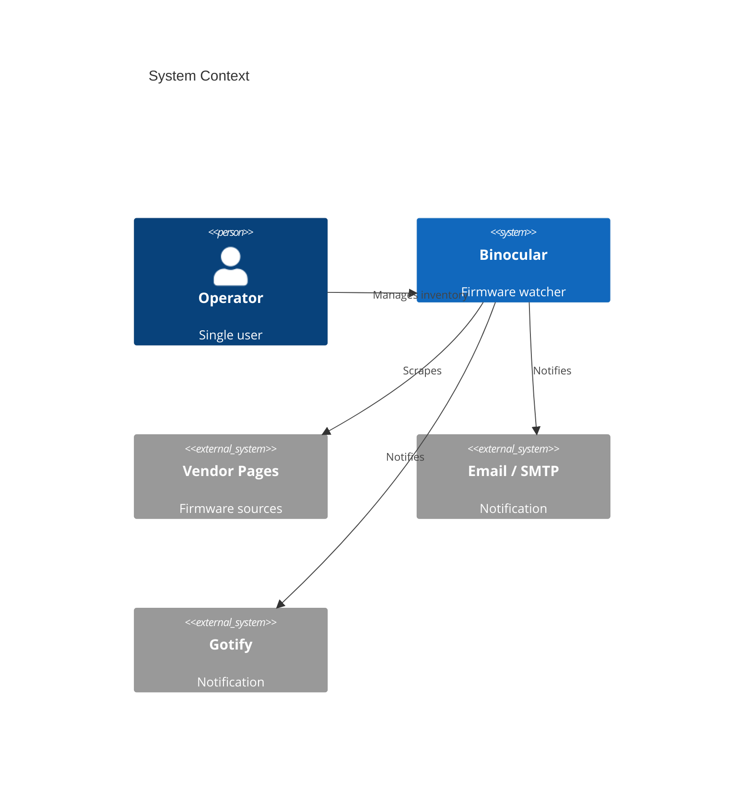
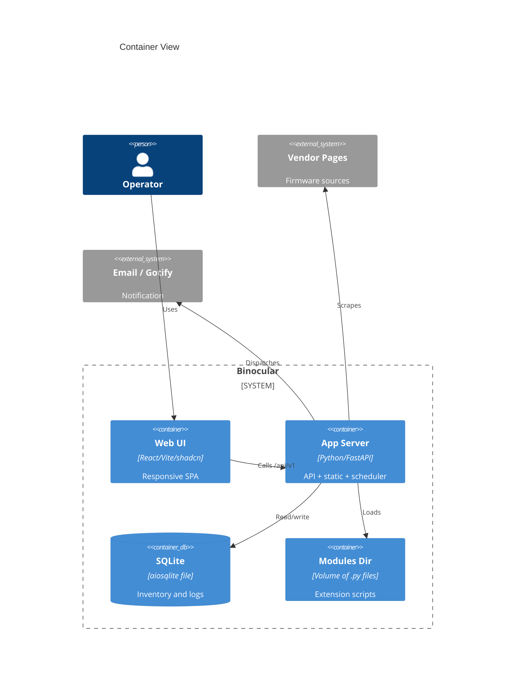
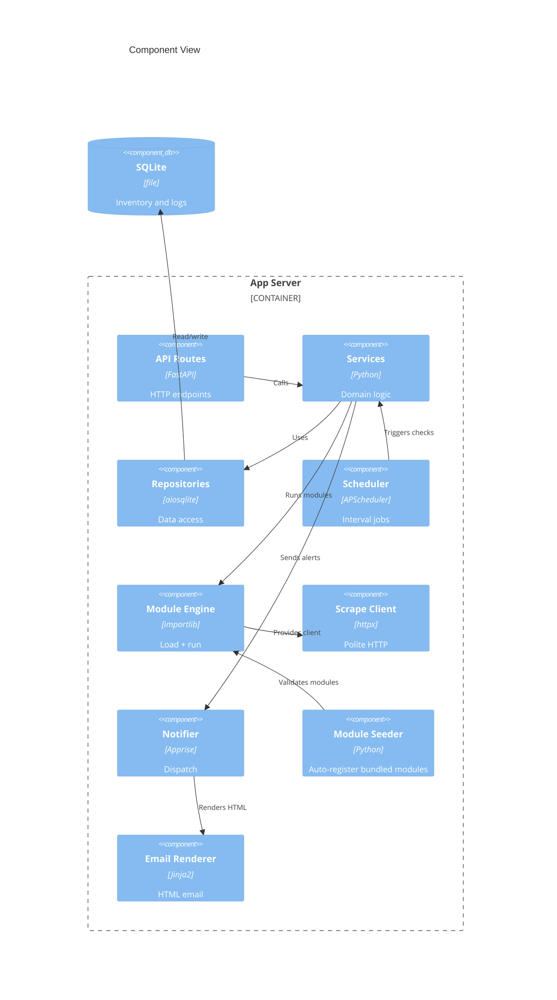
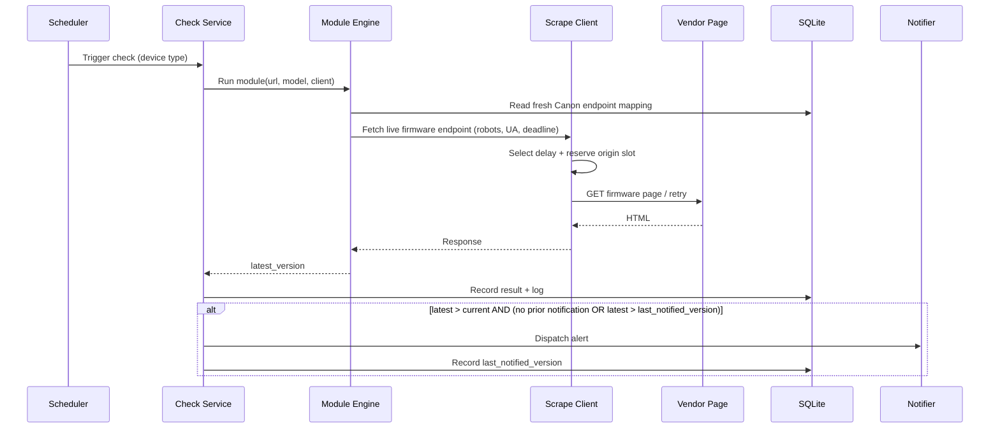
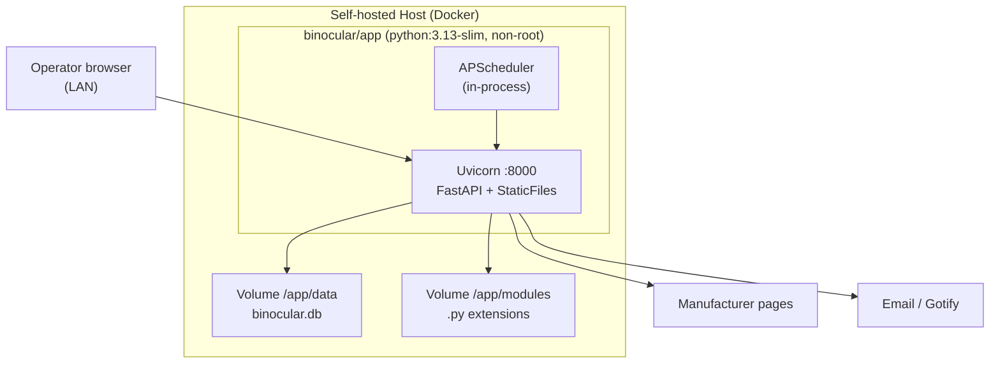

# Software Architecture Document: Binocular

> Date: 2026-09-07 | Status: Draft

## Purpose and Scope

Binocular is a self-hosted, single-user web application that automates firmware-update discovery for high-value **offline** devices (cameras, lenses, homelab hardware). It maintains a device inventory, runs user-managed extension modules that scrape manufacturer firmware pages on a schedule, compares detected versions against the user's recorded version, and dispatches notifications when an update is available.

The system boundary is a single deployable application running on a private, trusted LAN: one container exposing one HTTP port, persisting all state to one local data volume, with no external database, broker, account system, or cloud dependency. The architecture separates a stable **Core System** (inventory, scheduling, alerting, API, UI) from pluggable **Intelligence** (user-authored extension modules), so users extend device coverage without modifying core code.

## Technical Context

**Language/Version**: Python 3.13+ (backend); TypeScript 5.x / React 19 (frontend)  
**Primary Dependencies**: FastAPI, Uvicorn, aiosqlite, Pydantic, APScheduler, Apprise, httpx, structlog, Jinja2, BeautifulSoup4 (backend); React, Vite, Tailwind CSS 4.x (CSS-first config via `@tailwindcss/vite`), shadcn/ui, Radix UI primitives, React Router, TanStack Query, React Hook Form, class-variance-authority, clsx, tailwind-merge, tw-animate-css, lucide-react (frontend)  
**Storage**: SQLite single file (`binocular.db`) via aiosqlite with raw SQL and a numbered-migration runner; no ORM, no external DB server  
**Testing**: pytest + pytest-asyncio, httpx.AsyncClient and MockTransport, injected monotonic clocks/sleepers (backend); Vitest + React Testing Library, one Playwright smoke test (frontend); golden/fixture-based module correctness and integration tests, including multi-page Canon catalogue/product/firmware flows
**Target Platform**: Linux Docker container (`python:3.13-slim`), single port 8000; also runnable directly on a host with Python/Node runtimes  
**Project Type**: Web application — Python/FastAPI backend + React SPA, single-process monolith  
**Performance Goals**: Responsive UI on mobile and desktop; concurrent cross-origin checks via async I/O without blocking the UI; source-specific pacing across same-origin work; fresh Canon endpoint mappings permit 0-30 second warm verification while cold discovery may take 90-120 seconds; modest homelab hardware footprint
**Constraints**: Self-contained storage (no external DB), single-container/single-volume/zero-config/non-root operability, trusted-LAN single-user, no telemetry, polite-scraping mandatory, bounded cancellation-safe check execution, existing budgets preserved for origins without a longer valid crawl delay, unsandboxed extension execution
**Scale/Scope**: Single user, single instance; inventory of roughly 5–50+ devices; one background scheduler concurrent with UI reads

## System Scope and Context

Primary actor is the **self-hosting operator** (also the sole user). External systems are **manufacturer firmware pages** (scrape targets), and the **notification channels** Email/SMTP and Gotify. Module authors interact indirectly by supplying extension modules; there is no external account provider or cloud backend.

### C4 System Context

### C4 Container View

### C4 Component View

## Solution Strategy and Architecture Style

- **Single-container monolith**: FastAPI backend serves the React SPA as static files, runs the scheduler in-process, and persists to a single SQLite file. One port, one image, trivial backup.
- **Core/Extension separation**: The module engine provides a documented authoring contract for pluggable firmware-checking intelligence. Modules execute unsandboxed, in-process, with the host-provided scraping client.
- **Frontend component library strategy**: The SPA uses **shadcn/ui** (New York style, Zinc-based neutral palette with blue primary accent) as the canonical component library from day one. shadcn/ui provides composable, accessible primitives built on Radix UI. Styling uses Tailwind CSS v4's CSS-first configuration model (`@tailwindcss/vite` plugin). Dark mode uses `@custom-variant dark (&:is(.dark *))`. Utility composition via `cn()` helper (clsx + tailwind-merge). Components organized as: `components/ui/` (shadcn primitives), `components/inventory/`, `components/logs/`, `components/modules/`, `components/settings/`, `components/layout/`.
- **Source Code Location**: All project source code resides under `/src` within each application root — backend code under `backend/src/` and frontend code under `frontend/src/`.
- **Why this style fits**: It is the only style that satisfies the self-hosted, zero-infrastructure, single-volume, set-and-forget constraints while keeping the user-extensibility seam explicit.
- **Alternatives considered**: Microservices/multi-container (rejected — disproportionate operational overhead for one user) and serverless/cloud (rejected — violates self-hosted, offline-LAN, data-ownership constraints). Captured in {SAD:ADR-0001}.

## Key Runtime Flows and Failure Paths

### Primary Flow — Scheduled Firmware Check

### Failure Paths

- Module raises / times out → caught by the per-invocation error boundary (Exception + SystemExit, timeout via `asyncio.wait_for`); recorded as a failed check in the activity log; other modules and the core process continue. See {SAD:ADR-0005}.
- Vendor page changed / unparseable → module returns no version or errors → surfaced as a visible "scrape failed" status with last-success timestamp; never a silent miss.
- Vendor returns 429/5xx → every retry re-enters shared per-origin pacing and exponential backoff within the caller's end-to-end deadline; persistent failure logged. See {SAD:ADR-0012}.
- Source declares a valid `Crawl-delay` longer than the conservative default → the effective per-origin interval increases automatically and bounded multi-request budget accommodation applies; missing, invalid, or shorter declarations leave default pacing and budgets unchanged.
- Fresh Canon endpoint mapping → the module makes one live firmware request through the same `ScrapeClient`; the shared 30-second Canon origin slot remains authoritative, so warm verification completes in 0-30 seconds depending on queue position. Firmware versions are parsed only from that live response and are never cached as results.
- Canon endpoint mapping expired after 24 hours or missing → bypass it and perform the full catalogue → product → firmware discovery flow, which may take 90-120 seconds under Canon pacing. A cached endpoint transport, status, parsing, or model-identity failure invalidates the mapping, then permits one full discovery attempt; if recovery cannot produce a live result, the check visibly fails with its last-success timestamp intact.
- Concurrent Canon checks for the same model → coordinate one discovery, refresh, or warm-hit live firmware operation; waiters consume the validated mapping or shared live response, or the same visible failure. This coalescing is not a firmware-version cache. Distinct models continue to share the one Canon-origin pacing timeline.
- Check times out or is cancelled during robots lookup, pacing, backoff, redirect handling, or I/O → pending waits and retries stop, cancellation propagates after cleanup, and no subsequent background request is issued. See {SAD:ADR-0012}.
- Notification channel (SMTP/Gotify) failure → dispatch error logged in the activity log for operator visibility; check result still persisted.
- Already-notified version detected → no duplicate notification; last-notified version tracked per device; a new alert dispatches only when a version newer than the last-notified version appears.
- SQLite lock contention → `busy_timeout` (5s) wait; WAL allows concurrent reads during scheduler writes. See {SAD:ADR-0004}.
- Malformed module upload → rejected pre-save by two-phase validation (static AST + optional runtime proof) with structured per-phase results; never enters the modules directory. Validation errors are formatted for AI-friendly copy-paste.
- Official module consistently failing → in-app notification alerts the operator to check for a project update (CAP-014).

## Deployment and Infrastructure View

A multi-stage Docker build compiles the Vite frontend in a Node stage and copies `dist/` into the Python image, which serves it via FastAPI `StaticFiles` with an SPA catch-all — single port, single image. Two volumes (`/app/data`, `/app/modules`) hold all mutable state. The container runs as a non-root user with configurable UID/GID via `PUID`/`PGID` entrypoint; a `HEALTHCHECK` validates liveness. See {SAD:ADR-0001}, {SAD:ADR-0003}.

## Cross-Cutting Concerns

### Security

Trusted-LAN, single-user model: no authentication by default, with optional basic-auth middleware for operators who expose the UI more broadly. Extension modules execute in-process with **no sandbox** — an explicit, accepted arbitrary-code-execution trust boundary mitigated (not eliminated) by non-root container execution (with configurable UID/GID via `PUID`/`PGID` entrypoint) and operator vetting. Secrets (SMTP/Gotify credentials) load via environment variables / `_FILE` Docker-secret patterns and are never hardcoded; raw SQL uses parameterized queries exclusively. See {SAD:ADR-0008}, {SAD:ADR-0005}.

### Reliability

Set-and-forget operation: the scheduler runs in-process and resumes on restart; missed windows are retried on the next interval rather than replayed. Per-module error boundaries and end-to-end deadlines guarantee a broken module cannot crash the host or continue outbound work after timeout/cancellation. Honest-failure principle — failures surface as visible status with last-success timestamps, never silent misses. Scrape resilience uses shared normalized-origin pacing, source-declared crawl-delay selection, and retry backoff; source-aware budget accommodation is finite and leaves unaffected origins' budgets unchanged. See {SAD:ADR-0012}, {SAD:ADR-0007}.

### Observability

Structured logging via `structlog` across migration runner, connection lifecycle, repositories, API requests, and check execution, with contextual fields (`device_id`, `module_name`). Logs emit to stdout/stderr for `docker logs` and to a size-bounded rolling activity log persisted in SQLite and viewable in the UI. No external telemetry or analytics by design.

### Data Management

All state in SQLite (`binocular.db`) on the `/app/data` volume; backup = copy the file. Schema evolves via numbered SQL migrations tracked by a `schema_version` table, auto-applied on startup. The Canon endpoint cache is introduced by a forward-only, idempotent numbered migration with a composite model/family key, expiry metadata, and a refresh lease suitable for SQLite WAL concurrency; no migration stores firmware versions. WAL journaling, `foreign_keys=ON`, and `busy_timeout` set per connection. The activity log is rolling/size-bounded to prevent unbounded growth. Schema should be consolidated from the start to avoid fix migrations (prototype learning). See {SAD:ADR-0004}, {SAD:ADR-0014}.

### Integration Strategy

Outbound only: manufacturer firmware pages are scraped through the host-provided polite HTTP client, the single enforcement point for robots.txt, identifiable User-Agent, shared per-origin pacing, source-declared crawl delays, bounded retries/backoff, and cancellation; notifications dispatch through Apprise — Email/SMTP (as responsive, light-themed HTML via Jinja2 templates with mobile-friendly layout) and Gotify at launch. No inbound integrations or third-party APIs. See {SAD:ADR-0012}, {SAD:ADR-0007}.

The Canon Asia integration uses two independent official modules over one shared Canon origin. Each exact-matches the model in its fixed public catalogue (EOS R for cameras; RF and RF-S for lenses), follows the catalogue's product link verbatim, discovers that product page's firmware form action, and parses the returned HTML firmware rows. A `canon_firmware_endpoint_cache` SQLite table persists only the exact model identity, catalogue family, firmware action URL, discovery timestamp, and validation metadata; it never stores an authoritative firmware version. A mapping is fresh only when `now - discovered_at < 24 hours`, and survives restart. A fresh mapping sends one live firmware request through `ScrapeClient`; it is neither a robots nor a pacing bypass. Expired mappings are bypassed, and cached-endpoint transport, status, parsing, or model-identity failures invalidate the row and cause one full discovery fallback. Database-backed single-flight coordination coalesces concurrent same-model discovery, refresh, and warm-hit live firmware requests; callers share the live response, not a stored version, and all visibly receive recovery failure if it cannot produce a live result. Cold or expired discovery may take 90-120 seconds under the shared 30-second Canon delay; warm verification takes 0-30 seconds subject to the shared origin slot. Camera coverage is limited to verified EOS R catalogue membership: Cinema EOS and EOS R5 C are explicitly unsupported until a separate official catalogue/product/action flow is verified. Lens classification admits RF/RF-S lenses only and rejects adapters, extenders, cinema lenses, and unrelated mounts; RF-S catalogue membership is supported without claiming a positive RF-S firmware release. Unknown models, explicit no-firmware responses, ambiguous matches, changed structures, denied requests, deadlines, cancellation, and unrecoverable stale mappings all surface through the existing visible failure boundary.

### Operations

Distributed primarily as a Docker image (single port, two volumes, non-root with PUID/PGID configurable user via entrypoint, healthcheck), with a host-runtime fallback. Zero-config startup with sensible defaults; `BINOCULAR_DB_PATH` configurable. Dependencies pinned (lock file with hashes). A standalone module dev/test kit lets authors validate modules locally against the same polite HTTP client. A downloadable AI Module Kit (contract reference, starter template, working example, structured AI prompt) is served as static files by the backend.

## Quality Attributes

| Attribute | Target | Measurement | Notes |
|-----------|--------|-------------|-------|
| Performance | Concurrent cross-origin checks without UI blocking; same-origin attempts respect the effective delay; fresh Canon mappings complete in 0-30 seconds | Deterministic virtual-time multi-device checks | Cold or expired Canon discovery may take 90-120 seconds; no cache bypasses pacing |
| Reliability | A broken, timed-out, or cancelled module never crashes the core or issues later background requests; no silent missed updates | Fault injection plus deterministic deadline/cancellation and fixture regression tests | End-to-end budget includes pacing and retries |
| Security | No hardcoded secrets; non-root container; parameterized SQL | Static analysis + image inspection | ACE trust boundary accepted by design |
| Maintainability | mypy --strict (backend) and tsc strict (frontend) pass; pinned deps | CI type-check + lint (Ruff/Biome) | Single-maintainer OSS |
| Scalability | Single-user, single-instance workload served comfortably | Manual load on representative inventory | No horizontal scaling goal |
| Correctness | Detected latest == actual published latest; zero false positives/negatives for shipped modules | Golden/fixture-based module tests per release, including exact Canon model/classification, OS-package deduplication, cache expiry/fallback, restart, and same-model concurrency matrices | No field telemetry available; explicit no-firmware is distinct from unknown/unparseable; firmware versions are live-derived, never authoritative cache entries |

## Architecture Decision Records

Project-level architectural decisions are maintained as standalone MADR files under `specs/adrs/`. This table is a navigational index — full decision records live in the linked files.

| ADR ID | Title | Status | Date | Supersedes | File |
|--------|-------|--------|------|------------|------|
| ADR-0001 | Self-hosted single-container monolith with core/extension separation | accepted | 2026-05-31 | — | [0001-self-hosted-single-container-monolith-with-core-extension-separation.md](adrs/0001-self-hosted-single-container-monolith-with-core-extension-separation.md) |
| ADR-0002 | Python 3.13 and FastAPI for the backend | accepted | 2026-05-31 | — | [0002-python-311-and-fastapi-for-the-backend.md](adrs/0002-python-311-and-fastapi-for-the-backend.md) |
| ADR-0003 | React + Vite + Tailwind SPA with shadcn/ui Component Library, served by FastAPI as static files | accepted | 2026-06-08 | — | [0003-react-vite-tailwind-spa-served-by-fastapi-as-static-files.md](adrs/0003-react-vite-tailwind-spa-served-by-fastapi-as-static-files.md) |
| ADR-0004 | SQLite file storage with aiosqlite and raw SQL (no ORM) | accepted | 2026-05-31 | — | [0004-sqlite-file-storage-with-aiosqlite-and-raw-sql-no-orm.md](adrs/0004-sqlite-file-storage-with-aiosqlite-and-raw-sql-no-orm.md) |
| ADR-0005 | Unsandboxed extension module engine with two-phase validation | accepted | 2026-05-31 | — | [0005-unsandboxed-extension-module-engine-with-two-phase-validation.md](adrs/0005-unsandboxed-extension-module-engine-with-two-phase-validation.md) |
| ADR-0006 | Centralized responsible-scraping HTTP client provided to modules | superseded | 2026-05-31 | — | [0006-centralized-responsible-scraping-http-client-provided-to-modules.md](adrs/0006-centralized-responsible-scraping-http-client-provided-to-modules.md) |
| ADR-0007 | In-process scheduling with APScheduler and Apprise notifications with notification deduplication | accepted | 2026-06-07 | — | [0007-in-process-scheduling-with-apscheduler-and-apprise-notifications.md](adrs/0007-in-process-scheduling-with-apscheduler-and-apprise-notifications.md) |
| ADR-0008 | Trusted-LAN single-user security model with optional basic auth | accepted | 2026-05-31 | — | [0008-trusted-lan-single-user-security-model-with-optional-basic-auth.md](adrs/0008-trusted-lan-single-user-security-model-with-optional-basic-auth.md) |
| ADR-0009 | Module-Derived Device Type — Remove Standalone Device Type Field, Derive from Linked Module | accepted | 2026-06-04 | — | [0009-module-derived-device-type-remove-standalone-device-type-field.md](adrs/0009-module-derived-device-type-remove-standalone-device-type-field.md) |
| ADR-0010 | Environment-Variable Based Configuration and Database Seeding | accepted | 2026-06-12 | — | [0010-environment-variable-based-configuration-and-database-seeding.md](adrs/0010-environment-variable-based-configuration-and-database-seeding.md) |
| ADR-0011 | Real-Time Module Validation and Upload Progress Streaming | accepted | 2026-06-12 | — | [0011-real-time-module-validation-and-upload-progress-streaming.md](adrs/0011-real-time-module-validation-and-upload-progress-streaming.md) |
| ADR-0012 | Source-aware centralized scraping with shared per-origin pacing and bounded cancellation | accepted | 2026-09-06 | ADR-0006 | [0012-source-aware-centralized-scraping-with-shared-per-origin-pacing-and-bounded-cancellation.md](adrs/0012-source-aware-centralized-scraping-with-shared-per-origin-pacing-and-bounded-cancellation.md) |
| ADR-0013 | Module-Declared Source URL for Device-Creation Lookup | accepted | 2026-09-07 | — | [0013-module-declared-source-url-for-device-creation-lookup.md](adrs/0013-module-declared-source-url-for-device-creation-lookup.md) |
| ADR-0014 | Persisted Canon firmware endpoint discovery cache | accepted | 2026-09-07 | — | [0014-persisted-canon-firmware-endpoint-discovery-cache.md](adrs/0014-persisted-canon-firmware-endpoint-discovery-cache.md) |

<!-- Rows are managed by the ADR Author subagent. Do not embed full decision prose here. -->

## Risks, Assumptions, Constraints, and Open Questions

### Risks

- Unsandboxed extension modules run with host privileges — accepted ACE trust boundary; mitigated by non-root execution and operator vetting only.
- Manufacturer page changes break scrapers — highest operational risk; mitigated by visible failure status rather than silent misses.
- False negatives (missed updates) are invisible without telemetry — mitigated by fixture-based correctness validation at release.
- Notification-channel misconfiguration/outage goes unnoticed — mitigated by activity-log visibility.
- Scheduler shares the app process lifecycle — a restart pauses jobs until the next interval.
- Very long source-declared crawl delays can prevent a multi-request check from completing inside its finite cap — mitigated by visible bounded failure rather than violating source pacing.
- Canon Asia catalogue taxonomy, product links, form actions, or firmware fragments can drift independently — mitigated by captured fixtures for each stage, exact matching, and visible structural failures rather than inferred coverage.
- Cached Canon endpoint metadata can expire or drift — mitigated by 24-hour freshness, invalidation on endpoint failure, one paced full-discovery fallback, and visible failure rather than stale result reuse.

### Assumptions

- Deployment is on a private, trusted LAN with a single user/operator.
- A persistent volume is available for `/app/data` and `/app/modules`.
- The operator has or can configure SMTP and/or Gotify for notifications.
- Manufacturer firmware pages remain publicly reachable and scrapable.
- Canon coverage is regional and catalogue-defined: Canon Asia English EOS R plus RF/RF-S only; Cinema EOS/EOS R5 C is not supported without a separately verified official flow, and no positive RF-S firmware release is assumed.

### Constraints

- No external database server; all persistence in a single SQLite file.
- Single container, single port, single data volume, non-root, zero-config startup.
- No telemetry or central data collection.
- Modules must use the host-provided HTTP client for all outbound scraping.
- The scraping client must preserve default pacing and execution budgets unless a longer valid source delay requires bounded accommodation, and timeout/cancellation must prevent subsequent requests.
- Canon mappings persist only discovery metadata for 24 hours; cached mappings must make their live request through the centralized client and must invalidate/recover visibly on endpoint failure.

### Open Questions

- None. All prototype-era open questions have been resolved.

## Project Context Baseline Updates

*Managed section — rewritten by SDD planning agents. Do not edit manually.*

- SQLite persistence uses an application-owned startup migration runner with append-only numbered SQL files, `schema_version` tracking, required connection pragmas, and a fatal pre-migration backup gate before pending migrations apply.
- Domain repositories use a shared raw-SQL repository base with parameter binding and allowlisted dynamic identifiers; no ORM abstraction is introduced.
- Responsible scraping uses a host-owned async `httpx` client wrapper with robots.txt checks, identifiable User-Agent defaults, and one normalized-origin pacing timeline shared by concurrent checks and every retry. The effective interval is the greater of the conservative default and a valid applicable source `Crawl-delay`; bounded source-aware end-to-end deadlines include pacing/backoff and propagate cancellation so no later background requests issue, while unaffected origins retain existing budgets. Deterministic tests inject monotonic timing and scripted transports. See {SAD:ADR-0012}.
- Extension modules use a trusted in-process Python contract with importlib path loading, host ScrapeClient injection, per-invocation timeout/error boundaries, and two-phase static/runtime validation; validation is not a sandbox.
- Custom module uploads stream real-time validation progress updates (newline-delimited JSON events) to the frontend during the AST (Phase 1) and runtime (Phase 2) validation steps.
- The Modules page serves as the primary self-service onboarding path for module creation, with a "Create a Module" guidance section and a downloadable AI Module Kit (contract reference, starter template, working example, structured AI instructions) served as static backend assets. Validation error output includes an AI-friendly copy-paste feature.
- Bundled official starter modules are automatically discovered, validated, and seeded/upserted into the SQLite database on application startup.
- Device type is derived from the linked extension module; no standalone DeviceType entity. Devices reference modules directly via `module_id` FK; device type grouping is computed at query time. See {SAD:ADR-0009}.
- The application version is injected into the frontend bundle at Docker build time via a compile-time env var (populated from the latest git tag).
- Email notifications render as responsive HTML via Jinja2 templates with the application light color scheme.
- Notification deduplication tracks `last_notified_version` per device to suppress duplicate alerts.
- Configuration settings for basic authentication (mapped from `BINOCULAR_AUTH_ENABLED`) and notification channels (SMTP and Gotify details/credentials) can be defined via environment variables. If present, they are automatically seeded and synced into the SQLite database at startup.
- The backend provides an on-demand version search endpoint `/api/v1/checks/search-version` that executes the module runner to return the latest version for a given module and model name without persisting state or triggering notifications.
- Extension modules may declare an optional `SOURCE_URL` module-level constant naming the canonical source page they scrape. The loader extracts it (empty when absent), a `modules.source_url` column persists it, the modules API returns it, and the Add Device form renders it as a clickable link to help users look up exact model names. See {SAD:ADR-0013}.
- Canon official coverage is split into independently selectable camera and lens modules. Both use model-only exact catalogue lookup, verbatim product links, discovered firmware form actions, OS-package deduplication, official release-detail URLs, existing automatic seeding, visible failures, and ADR-0012's shared Canon-origin 30-second pacing with bounded timeout/cancellation. The verified baseline is Canon Asia English EOS R and RF/RF-S catalogues; Cinema EOS/EOS R5 C is explicitly unsupported pending a verified flow, and no positive RF-S firmware release is claimed.
- Canon modules persist fresh source-discovered model-to-firmware endpoint mappings in SQLite under ADR-0014. Entries expire after 24 hours, survive restart, coordinate same-model refreshes, and reduce a warm version search, manual check, or scheduled check to one live centralized firmware request (0-30 seconds subject to the shared Canon slot). Endpoint failures invalidate and recover through full discovery; versions are never cached as authoritative results, and cold/expired discovery may still take 90-120 seconds.
